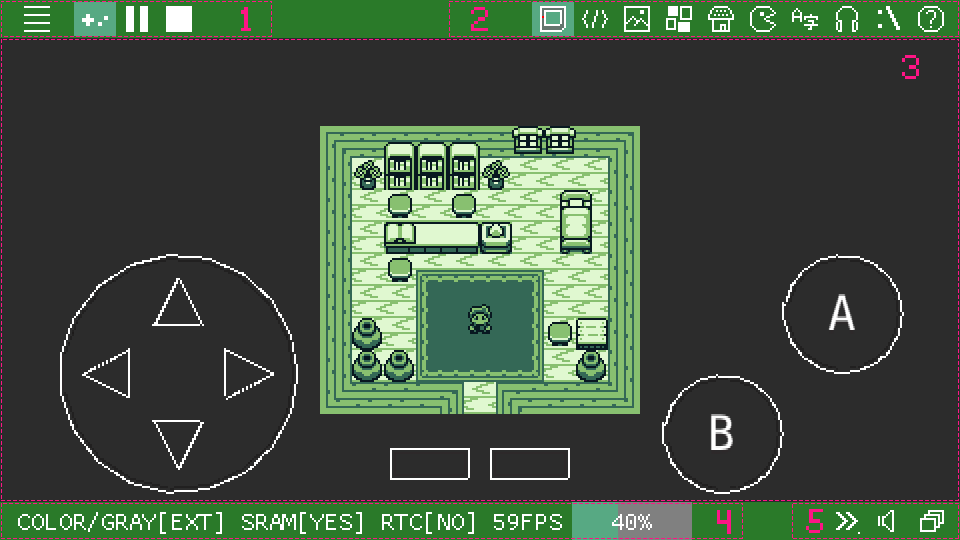

## Reference Manual

[**Manual**](https://paladin-t.github.io/kits/gbb/manual.html) | [Extensions](https://paladin-t.github.io/kits/gbb/extensions.html) | [Launching](https://paladin-t.github.io/kits/gbb/launching.html) | [Changelog](https://paladin-t.github.io/kits/gbb/changelog.html) | [About](https://paladin-t.github.io/kits/gbb/about.html)

## Table of Content

- [Fundamental](#fundamental)
  - [Specifications](#specifications)
  - [Usage](#usage)
  - [Project Structure](#project-structure)
- [Programming](#programming)
  - [Program Structure](#program-structure)
  - [Programming Paradigm](#programming-paradigm)
  - [Syntax](#syntax)
    - [Comment](#comment)
    - [Output](#output)
    - [Jump](#jump)
    - [Declaration and Expression](#declaration-and-expression)
    - [Data Types](#data-types)
    - [Function](#function)
    - [Conditional](#conditional)
    - [Loop](#loop)
    - [Sub](#sub)
    - [Thread](#thread)
    - [Peek and Poke](#peek-and-poke)
    - [Read Data](#read-data)
    - [Array](#array)
    - [Others](#others)
  - [Libraries](#libraries)
    - [Basic](#basic)
    - [Gamepad](#gamepad)
    - [Graphics](#graphics)
    - [Image](#image)
    - [Tiles](#tiles)
    - [Map](#map)
    - [Sprite](#sprite)
    - [Scene](#scene)
    - [Actor](#actor)
    - [Actor Controllers](#actor-controllers)
    - [GUI](#gui)
    - [Audio](#audio)
    - [System](#system)
    - [Palette](#palette)
    - [Physics](#physics)
    - [Persistence](#persistence)
    - [RTC](#rtc)
    - [Serial Port](#serial-port)
    - [Effects](#effects)
    - [Device](#device)
  - [Extension Features](#extension-features)
    - [Running Speed](#running-speed)
    - [Mouse and Touch](#mouse-and-touch)
    - [Shell Command](#shell-command)
    - [Debugging](#debugging)
- [Import and Export](#import-and-export)
  - [Import](#import)
  - [Export](#export)
- [Building](#building)
  - [Building a ROM](#building-a-rom)
  - [Building for HTML](#building-for-html)
  - [Building for Desktop](#building-for-desktop)

<!-- End Table of Content -->

[TOP](#reference-manual)

# Fundamental

## Specifications

* **CPU**: 4.19MHz/8.38MHz for classic/colored respectively
* **Threads**: up to 16 concurrent execution contexts
* **Display**: 160x144px
* **Code**: BASIC, supports multiple source pages
* **Gamepad**: 8 buttons (D-Pad + A/B + Select/Start)
* **Mouse and touch**: supported by **extension**
* **Tiles**: up to 256 units per page
* **Map**: up to 511 tiles in one dimension per page; two layers (graphics, attributes)
* **Sprite**: supports simple 8x8 and 8x16 sprites
* **Scene**: up to 511 tiles in one dimension per page; four layers (map, attributes, properties, actors)
* **Actor**: up to 8x8 tiles per frame; up to 1024 frames per page
* **Font**: supports TrueType; up to 16px; 1bpp or 2bpp
* **Audio**: 4 channels; supports importing from JSON, VGM, WAV, FxHammer
* **Palette**: 2bit (4 colors)
* **GUI**: supports label
* **Persistence**: supported
* **RTC**: supported
* **Serial port**: supported

[TOP](#reference-manual)

## Usage

Most of the shortcut keys are listed aside the corresponding GUI elements, besides that, it also accepts a number of implicit global shortcuts. See the following list for common shortcuts.

* **Ctrl+S**: save project
* **Ctrl+F4**: close project
* **Ctrl+Shift+R**: reload project
* **Ctrl+N**: new asset page
* **Ctrl+C**: copy
* **Ctrl+X**: cut
* **Ctrl+V**: paste
* **Del**: delete
* **Ctrl+Z**: undo
* **Ctrl+Y**: redo
* **Ctrl+A**: select all
* **F5**: compile and run
* **Shift+F5**: stop running
* **Ctrl+Shift+B**: build and export ROM
* **Ctrl+PgUp**: turn to previous page
* **Ctrl+PgDn**: turn to next page
* **Ctrl+1**: switch to code editor
* **Ctrl+2**: switch to tile editor
* **Ctrl+3**: switch to map editor
* **Ctrl+4**: switch to scene editor
* **Ctrl+5**: switch to actor editor
* **Ctrl+6**: switch to font editor
* **Ctrl+7**: switch to music editor
* **Ctrl+8**: switch to SFX editor
* **Ctrl+9**: switch to console
* **F1**: open the manual
* **F6**: take a screenshot
* **F7**: start recording GIF
* **F8**: stop recording

<!-- Use **Cmd** instead of **Ctrl** on MacOS except for **Ctrl+Shift+R**, **Ctrl+PgUp** and **Ctrl+PgDn** -->

The key bindings for operating a running program are configured in the application preferences.

**Recent/Library**


1. File menu and buttons
2. View buttons
3. Projects

**Code editor**


1. File menu and buttons
2. View buttons
3. Edit area
4. Context area
5. Extra area

Code editor accepts a number of additional implicit shortcuts.

* `Tab`: increase indent
* `Shift+Tab`/`Ctrl+Shift+Tab`: decrease indent
* `Ctrl+/`: toggle comment
* `Alt+Up`: move code line(s) up
* `Alt+Down`: move code line(s) down
* `Ctrl+W`: select word
* `Ctrl+F`: find word
* `F3`: find next
* `Shift+F3`: find previous
* `Ctrl+G`: goto line

<!-- Use **Cmd** instead of **Ctrl** on MacOS -->

**Assets editors**


1. File menu and buttons
2. View buttons
3. Edit area
4. Context area
5. Extra area

Each code, graphics and music asset page has its dedicated undo/redo stack that doesn't affect another.

**Running**



1. File menu and running buttons
2. View buttons
3. Emulator area
4. Running information

[TOP](#reference-manual)

## Project Structure

A GB BASIC project is saved as a ".gbb" file, which is in a text-based format and friendly to version control systems and external editors, with all assets encoded in printable UTF-8 characters or Base64 string, and uses Unix LF ('\n') for line ending. A project is consist of at least one page of source code, and zero or a few pages of other assets (tiles, maps, actors, music, etc). All these assets are organized and packed in sections one after another in a single file, except for external font that will not be packed. A project will appear on the main screen once it has been created or imported to GB BASIC.

GB BASIC also supports importing plain source code, which is consist of only one source code page without other assets.

[TOP](#reference-manual)

# Programming

## Program Structure

There's no explicit entry point for a GB BASIC program, it simply executes in a top-down direction from the very first executable statement. A typical game program includes a serial of one-shot instructions that initialize the program, then it enters a continuous loop state, a.k.a. an update routine, in which the program repeats a serial of instructions for acquiring input, updating in-game states, drawing objects, etc. In GB BASIC, it is necessary to put an `update` call at the end of a loop cycle, so that it knows that current frame is complete.

[TOP](#reference-manual)

## Programming Paradigm

GB BASIC is a programming language that was born in the modern era with retro flavours. It implements the following programming paradigms.

* Imperative paradigm
  * Non-structured programming
  * Concurrent processing approach
* Declarative paradigm
  * Data driven approach

The imperative paradigm is one of the historically early programming paradigms. It features close relation to machine architecture. In this paradigm, a programmer have to tell a computer system exact steps to do. In particular with the use of non-structured programming in GB BASIC, it is capable of creating Turing-complete algorithms. However GB BASIC is not "pure" non-structured, it has mixed with a few structured constructs of selection (`if`) and repetition (`for`, `while` and `repeat`) etc. Moreover GB BASIC implements a simple threading feature for being possible and easier of doing concurrent processing.

The declarative paradigm is a style of way to program a computer system with "what to do" rather than "how to do", in GB BASIC this is achieved with a few specialized statements that follow the data driven approach. This approach uses data instead of instructions to indicate a program's behaviour, those data are mostly produced within the asset editors in GB BASIC.

[TOP](#reference-manual)

## Syntax

Projects are programmed in a BASIC dialect in GB BASIC. The language implements a classic style syntax that supports code lines either with or without line numbers. A long code line can be separated into several short ones, and connected with underscores (`_`). Keywords and identifiers are case-insensitive by default, i.e. `foo`, `Foo` and `FOO` all mean the same, but it could be changed to case-sensitive in project's property.

The target running system of GB BASIC has quite restricted resources, so to satisfy such restrictions, the syntax is designed to be very compact, so that code and assets can be straightforward compiled and processed into the target format very fast and efficient.

[TOP](#reference-manual)

### Comment

Comments will not be compiled into final ROM, they are sidenotes that explain a program to a programmer. A comment starts with a `'` mark or a `REM` statement till the end of that line.

Comment example:

```bas
' Comment.
REM Comment after REMark.
```

### Output

* `print ...`: outputs numeric values to the screen as plain text
  * `...`: variadic data; numeric values separated by comma
* `print fmt, ...`: outputs text and numeric values to the screen as plain text
  * `fmt`: the format string, accepts the following "Escapes" for value interpretation
  * `...`: variadic data; numeric values separated by comma

Every `print` outputs a newline by default after all contents have been printed, to let the next `print` starts from the same line instead of a new line, put a semicolon (`;`) at the end of the `print`.

| Escapes | Note |
|---|---|
| `%d` | Integer (DEC) |
| `%x` | Integer (HEX) |
| `%c` | Character |
| `%%` | Percent sign |

* `locate x, y`: puts the cursor to the specific location on the screen for text output
  * `x`: the x location in pixels
  * `y`: the y location in pixels

### Jump

* `goto lno|lbl|#pg:lno|#pg:lbl`: performs an unconditional jump to transfer the execution to the specific location

Jump example:

```bas
loop:
  print "Hello"
  goto loop
```

### Declaration and Expression

* `let foo = 42`: declares a variable and assigns a value to it

An expression is a syntactic entity that may be evaluated to determine its value. It is a combination of one or more constants, variables, functions and operators that GB BASIC interprets (according to the particular rules of precedence and of association) and computes to produce ("to return", in a stateful environment) another value. See the following table for all supported operators and their usages. High priorities (with larger numbers) are evaluated before low ones (with smaller numbers).

| Operators | Priority | Note | Example |
|---|---|---|---|
| `+` | 3 | Add | `a + b` |
| `-` | 3 | Minus | `a - b` |
| `*` | 4 | Multiply | `a * b` |
| `/` | 4 | Divide | `a / b` |
| `mod` | 4 | - | `a mod b` |
| `-` | 6 | Negative | `-a` |
| `=` | 2 | Equal to | `a = b` |
| `<` | 2 | Less than | `a < b` |
| `<=` | 2 | Less than or equal to | `a <= b` |
| `>` | 2 | Greater than | `a > b` |
| `>=` | 2 | Greater than or equal to | `a >= b` |
| `<>` | 2 | Not equal | `a <> b` |
| `and` | 1 | Logic and | `a and b` |
| `or` | 1 | Logic or | `a or b` |
| `not` | 6 | Logic not | `not a` |
| `band` | 5 | Bitwise and | `a band b` |
| `bor` | 5 | Bitwise or | `a bor b` |
| `bxor` | 5 | Bitwise xor | `a bxor b` |
| `bnot` | 5 | Bitwise not | `bnot a` |
| `lshift` | 5 | Left shift | `a lshift b` |
| `rshift` | 5 | Right shift | `a rshift b` |
| `sgn` | - | Sign of a number (1, -1 or 0) | `sgn(a)` |
| `abs` | - | Absolute value | `abs(a)` |
| `sqr` | - | Squared value | `sqr(a)` |
| `sqrt` | - | Square root | `sqrt(a)` |
| `sin` | - | Sine value | `sin(a)` |
| `cos` | - | Cosine value | `cos(a)` |
| `pow` | - | Exponential value | `pow(a, b)` |
| `min` | - | Minimum value | `min(a, b)` |
| `max` | - | Maximum value | `max(a, b)` |

### Data Types

There are two fundamental data types in GB BASIC, string and integer. Besides, it also supports byte, boolean, ID and nothing, which are just type aliases of integer, the meaning of existence of these aliases is that they distinguish different semantic components.

* String
  * is used by `print`, `text`, `label`, etc. for formatting
* Integer (16bit signed)
  * denotes most of the data in GB BASIC
* Byte (8bit signed/unsigned)
  * is used by `data` statements to denote inline data sequences
* Boolean
  * contains two values, `false` and `true`
* ID
  * denotes particular object instance
* Nothing
  * contains one value, `nothing`, for "no available object", etc.

Memory of values are managed by GB BASIC itself rather than by a programmer, this rule applies to all the data types in the language. In other words the data types including ID are value-types, though the object referenced by an ID is not automatically managed, thus a programmer is often in charge of creating and deleting objects properly.

### Function

* `call func[, ...]`: calls the specific native function
  * `func`: the native function to call; can be one of the following "Functions"
  * `...`: optional variadic arguments; numeric values separated by comma

| Functions | Alternative | Note |
|---|---|---|
| `call wait_frames n` | `wait n` | Waits for `n` frames on the current thread |
| `call raise` | - | Raises an error |

<!-- Extra kernels can provide more native functions. -->

* `def fn f(...) = ...`: defines a user function; use `=f(...)` to call a user function

Function example:

```bas
def fn f(x, y) = sqr(x) + abs(y)
let a = f(1 + abs(-2), f(1, -3))
```

### Conditional

* `if/then`: one-line conditional statement with one branch
* `if/then/else`: one-line conditional statement with two branches

Single-line conditional example:

```bas
if 1 then print "Ok"
if 0 then print "Oops" else print "Ok"
```

```bas
if 1 then goto somewhere
if 1 goto somewhere
if 1 then somewhere
```

* `if/then/end if`: multiline conditional statement with one branch
* `if/then/else/end if`: multiline conditional statement with two branches
* `if/then/else if*/else/end if`: multiline conditional statement with multiple branches

Multiline conditional example:

```bas
if 0 then
  print "Oops"
else if 1 then
  if 1 then
    print "Ok"
  end if
else
  print "Oops"
end if
```

Conditional statements support both modern and retro syntax.

| Modern syntax | Retro syntax |
|---|---|
| `else if` | `elseif` |
| `end if` | `endif` |

* `=iif(cond, a, b)`: gets one of the two specific values according to the condition
  * `cond`: the condition expression
  * `a`: the expression that results the first value
  * `b`: the expression that results the second value
  * returns the first value if the condition results `true`, otherwise returns the second one

* `on cond goto|gosub lno|lbl|#pg:lno|#pg:lbl[, ...]`: performs a branched jump according to the condition
  * `cond`: the condition expression; jumps to the first (No. 0) branch if the condition results `0`, to the second (No. 1) branch if it results `1`...
  * `...`: optional variadic labels; locations separated by comma

Branched jump example:

```bas
let a = 0
on a goto lbl0, lbl1, lbl2
goto lblElse
lbl0:
  print "0"
  end
lbl1:
  print "1"
  end
lbl2:
  print "2"
  end
lblElse:
  print "Else"
```

<!-- * `on error goto|gosub lno|lbl|#pg:lno|#pg:lbl`
* `off error` -->

### Loop

* `for/to[/step]/next`: repeats a section of code a number of times with a control variable which has a differing value each time through the loop

`For` loop example:

```bas
for i = 0 to 4 step 1
  print "i=%d", i
next
```

* `while/end while`: repeats a section of code while a control condition results `true`

`While` loop example:

```bas
let a = 0
while a < 5
  print "a=%d", a
  a = a + 1
end while
```

`While` statements support both modern and retro syntax.

| Modern syntax | Retro syntax |
|---|---|
| `end while` | `wend` |

* `repeat/until`: repeats a section of code until a control condition results `true`

`Repeat` loop example:

```bas
let a = 0
repeat
  print "a=%d", a
  a = a + 1
until a = 5
```

* `exit`: exits the current loop structure, and continues to execute its following code

### Sub

* `gosub lno|lbl|#pg:lno|#pg:lbl`: pushes the execution point to the stack, then performs an unconditional jump to transfer the execution to the specific location

* `return`: pops the top execution point from the stack, then returns the execution to the point

Sub example:

```bas
loop:
  gosub lbl
  goto loop

lbl:
  print "Hello"
  return
```

* `pop n`: pops a number of execution points from the stack without returning
* `pop`: pops one execution point from the stack without returning

### Thread

* `=start lno|lbl|#pg:lno|#pg:lbl[, ...]`: starts a thread from the specific location
  * `...`: optional variadic arguments; numeric values separated by comma
  * returns the started thread ID, or `nothing` if fails
* `=arg`: gets and pops the value of the head parameter passed from outside into the current thread
  * returns the current parameter value
* `join id`: joins the specific thread; will return when the thread is finished
  * `id`: the thread ID
* `kill id`: terminates the specific thread
  * `id`: the thread ID
* `wait id`: lets the current thread idle and wait for one dispatching cycle
  * `id`: the thread ID
* `lock`: retains and locks exclusive dispatching permission to the current thread, until it is unlocked or terminated
* `unlock`: releases and unlocks exclusive dispatching permission obtained by the current thread

Thread example:

```bas
let id = start lbl, 22, 7
update
join id
print "!!!"
end

lbl:
  let a = arg
  let b = arg
  print "Args: %d, %d", a, b
  for i = 0 to 4
    print "i=%d", i
    wait 10
  next
  print "End"
```

### Peek and Poke

* `=peek(pos)`: gets the value at the specific bus address
  * `pos`: the address to access
  * returns the value in byte
* `poke(pos, val)`: sets the value at the specific bus address
  * `pos`: the address to access
  * `val`: the value in byte

### Read Data

* `data ...`: declares a number of numeric values as inline data sequence
  * `...`: variadic data; numeric values separated by comma
* `data repeat val, num`: declares a number of identical numeric values as inline data sequence
  * `val`: the identical value
  * `num`: the data count to repeat
* `read ...`: reads a number of numeric values from declared inline data sequence from the current reading position, moves the reading position one step forward for each read operation
  * `...`: variadic variables separated by comma
* `restore lno|lbl|#pg:lno|#pg:lbl`: restores the reading position of inline data sequence to the specific location

### Array

GB BASIC supports array of number up to 4 dimensions; index is 0-based in each dimension, therefore the array accessing behaviour in it is closer to most modern programming languages.

* `dim bar[3, 2]`: defines an array

### Others

* `swap var0, var1`: swaps the values of the two variables
  * `var0`: passed by reference; the first variable
  * `var1`: passed by reference; the second variable

* `sleep(ms)`: sleeps for the specific milliseconds; this statement blocks all threads
  * `ms`: the milliseconds

* `end`: ternimates the current program

[TOP](#reference-manual)

## Libraries

### Basic

* `=len(str)`: gets the length of the specific string
  * `str`: the string to measure
  * returns the length of the string
* `=len(arr)`: gets the length of all the dimensions of the specific array
  * `arr`: the array to measure
  * returns the length of the array

* `=asc(ch)`: gets the ASCII code of the specific character
  * `ch`: the character to examine, none-ASCII characters (with values greater than 255) are not accepted
  * returns the ASCII code

* `randomize`: seeds the randomizer
* `randomize seed`: seeds the randomizer with the specific seed
  * `seed`: the seed number
* `=rnd`: generates a random number
  * returns random value, with range of values from 0 to 10000
* `=rnd(hi)`: generates a random number not greater than the specific high value
  * returns random value, with range of values from 0 to `hi`
* `=rnd(lo, hi)`: generates a random number between the specific pair of low and high values
  * returns random value, with range of values from `lo` to `hi`

### Gamepad

* `=btn()`: gets whether any key is being pressed
  * returns `true` if any key is being pressed, otherwise `false`
* `=btn(key)`: gets whether the specific key is being pressed
  * `key`: the key code; can be one of the following "Gamepad buttons" constants
  * returns `true` if the key is being pressed, otherwise `false`
* `=btnd()`: gets whether any key has just been pressed
  * returns `true` if any key has just been pressed, otherwise `false`
* `=btnd(key)`: gets whether the specific key has just been pressed
  * `key`: the key code; can be one of the following "Gamepad buttons" constants
  * returns `true` if the specific key has just been pressed, otherwise `false`
* `=btnu()`: gets whether any key has just been released
  * returns `true` if any key has just been released, otherwise `false`
* `=btnu(key)`: gets whether the specific key has just been released
  * `key`: the key code; can be one of the following "Gamepad buttons" constants
  * returns `true` if the specific key has just been released, otherwise `false`

| Gamepad buttons | Value | Note |
|---|---|---|
| `UP_BTN` | 0x04 | Up |
| `DOWN_BTN` | 0x08 | Down |
| `LEFT_BTN` | 0x02 | Left |
| `RIGHT_BTN` | 0x01 | Right |
| `A_BTN` | 0x10 | A |
| `B_BTN` | 0x20 | B |
| `SELECT_BTN` | 0x40 | Select |
| `START_BTN` | 0x80 | Start |

* `on btn(key) goto|gosub|start lno|lbl|#pg:lno|#pg:lbl`: registers a callback for when the specific key is being pressed
  * `key`: the key code; can be one of the "Gamepad buttons" constants
* `on btnd(key) goto|gosub|start lno|lbl|#pg:lno|#pg:lbl`: registers a callback for when the specific key has just been pressed
  * `key`: the key code; can be one of the "Gamepad buttons" constants
* `on btnu(key) goto|gosub|start lno|lbl|#pg:lno|#pg:lbl`: registers a callback for when the specific key has just been released
  * `key`: the key code; can be one of the "Gamepad buttons" constants
* `off btn(key)`: unregisters a callback for when the specific key is being pressed
  * `key`: the key code; can be one of the "Gamepad buttons" constants
* `off btnd(key)`: unregisters a callback for when the specific key has just been pressed
  * `key`: the key code; can be one of the "Gamepad buttons" constants
* `off btnu(key)`: unregisters a callback for when the specific key has just been released
  * `key`: the key code; can be one of the "Gamepad buttons" constants

A gamepad callback is a routine that takes zero parameter.

### Graphics

* `color fore_col, back_col, mode`: sets the color mode for graphics primitives
  * `fore_col`: the foreground color; can be one of the following "2bpp colors" constants
  * `back_col`: the background color; can be one of the following "2bpp colors" constants
  * `mode`: the color mode; can be one of the following "Paint modes" constants

| 2bpp colors | Value | Note |
|---|---|---|
| `WHITE` | 0 | The lightest color |
| `SILVER` | 1 | - |
| `GRAY` | 2 | - |
| `BLACK` | 3 | The dimmest color |

| Paint modes | Note |
|---|---|
| `SOLID_MODE` | Overwrites the existing pixels |
| `OR_MODE` | Performs a logical OR |
| `XOR_MODE` | Performs a logical XOR |
| `AND_MODE` | Performs a logical AND |

* `=point(x, y)`: reads the pixel value on the screen at the specific position
  * `x`: the x position in pixels
  * `y`: the y position in pixels
  * returns the pixel value on the screen
* `plot x, y`: plots a pixel at the specific position
  * `x`: the x position in pixels
  * `y`: the y position in pixels

* `line x0, y0, x1, y1`: draws a line according to the specific points
  * `x0`: the x position in pixels of the first point
  * `y0`: the y position in pixels of the first point
  * `x1`: the x position in pixels of the second point
  * `y1`: the y position in pixels of the second point
* `rect x0, y0, x1, y1`: draws a rectangle according to the specific points
  * `x0`: the x position in pixels of the first point
  * `y0`: the y position in pixels of the first point
  * `x1`: the x position in pixels of the second point
  * `y1`: the y position in pixels of the second point
* `rectfill x0, y0, x1, y1`: fills a rectangle according to the specific points
  * `x0`: the x position in pixels of the first point
  * `y0`: the y position in pixels of the first point
  * `x1`: the x position in pixels of the second point
  * `y1`: the y position in pixels of the second point

* `text ...`: outputs numeric values to the screen as graphical text
  * `...`: variadic data; numeric values separated by comma
* `text fmt, ...`: outputs text and numeric values to the screen as graphical text
  * `fmt`: the format string, accepts the `print` "Escapes" for value interpretation
  * `...`: variadic data; numeric values separated by comma

| Graphics layers | Note |
|---|---|
| `MAP_LAYER` | For background |
| `WINDOW_LAYER` | For overlay |
| `SPRITE_LAYER` | For active objects |

### Image

* `image(first, x, y, w, h, layer = MAP_LAYER) = read|data ...|builtin|#pg`: draws an image
  * `first`: index of the first image tile to write
  * `x`: the x position in tiles to put the image
  * `y`: the y position in tiles to put the image
  * `w`: the width of the image in tiles
  * `h`: the height of the image in tiles
  * `layer`: the layer to put the image; can be either `MAP_LAYER` or `WINDOW_LAYER` of the "Graphics layers" constants

There is no dedicated builtin editor for producing image assets. Since image data is actually just tiles, it accepts all kinds of tiles data.

### Tiles

* `fill tile(first, n) = read|data ...|builtin|#pg`: fills the tiles area in VRAM
  * `first`: index of the first tile to write
  * `n`: the tile count

* `=get tile len(#pg)`: gets the tile count of the specific asset page
  * `#pg`: the tiles asset page to measure
  * returns the tile count

The tiles editor can produce assets used for tiles, press **Ctrl+2/Cmd+2** in edit mode to switch to the tiles tab. Besides creating from scratch, GB BASIC allows importing external images and other formats as tiles.

Tiles data for a `fill tile` operation can also come from inline code. This data is arranged one tile after another, line by line; each line contains 8 pixels, since each pixel in GB BASIC is 2bpp, a line is encoded by 2 bytes, where a bit from the first byte encodes the lower bit of a pixel, and the corresponding bit from the second byte encodes the higher part.

### Map

* `map on`: turns on the map layer
* `map off`: turns off the map layer

* `map x, y`: puts the map in VRAM on the screen at the specific position
  * `x`: the x position in pixels
  * `y`: the y position in pixels

* `fill map(first, n) = read|data ...|builtin|#pg`: fills the map area in VRAM; this is identical to a `fill tile` operation
  * `first`: index of the first map tile to write
  * `n`: the tile count
* `def map(x, y, w, h) = read|data ...|builtin|#pg`: defines the map area in VRAM
  * `x`: the x position in tiles in both the source tile map and hardware background map tile coordinates, with range of values from 0 to 255
  * `y`: the y position in tiles in both the source tile map and hardware background map tile coordinates, with range of values from 0 to 255
  * `w`: the width of area to set in tiles, with range of values from 1 to 255
  * `h`: the height of area to set in tiles, with range of values from 1 to 255

* `=get map width(#pg)`: gets the width of the specific map asset page
  * `#pg`: the map asset page to measure
  * returns the width
* `=get map height(#pg)`: gets the height of the specific map asset page
  * `#pg`: the map asset page to measure
  * returns the height

* `=get map(x, y)`: gets the tile value of the current map at the specific position
  * `x`: the x position in tiles
  * `y`: the y position in tiles
  * returns the tile value
* `set map(x, y) = val`: sets the tile value of the current map at the specific position
  * `x`: the x position in tiles
  * `y`: the y position in tiles
  * `val`: the tile value

The map editor can produce assets used for map, press **Ctrl+3/Cmd+3** in edit mode to switch to the map tab. Besides creating from scratch, GB BASIC allows importing external formats as map.

Map data for a `def map` operation can also come from inline code. This data is arranged one tile after another, from left to right and top to down.

### Sprite

* `sprite on`: turns on the sprite layer
* `sprite off`: turns off the sprite layer

* `sprite id, x, y`: draws the sprite in VRAM to the screen at the specific position
  * `id`: the sprite ID
  * `x`: the x position in pixels
  * `y`: the y position in pixels

* `fill sprite(first, n) = read|data ...|builtin|#pg`: fills the sprite area in VRAM
  * `first`: index of the first sprite tile to write
  * `n`: the tile count
* `def sprite(id) = t`: defines a sprite in VRAM
  * `id`: the sprite ID
  * `t`: the tile index

* `=get sprite(id)`: gets the tile value of the specific sprite
  * `id`: the sprite ID
  * returns the tile value
* `set sprite(id) = val`: sets the tile value of the specific sprite
  * `id`: the sprite ID
  * `val`: the tile value

* `=get sprite property(id, prop)`: gets the specific sprite's property
  * `id`: the sprite ID
  * `prop`: the property type; can be one of the following "Sprite properties" constants
  * returns the property value
* `set sprite property(id, prop) = val`: sets the specific sprite's property
  * `id`: the sprite ID
  * `prop`: the property type; can be one of the following "Sprite properties" constants
  * `val`: the property value

| Sprite properties | Value type | Default value | Note |
|---|---|---|---|
| `PALETTE_PROP` | Boolean | `false` (OBJ0PAL) | Whether to use colors come from OBJ0PAL or OBJ1PAL |
| `FLIPX_PROP` | Boolean | `false` | Whether to flip horizontally |
| `FLIPY_PROP` | Boolean | `false` | Whether to flip vertically |
| `PRIORITY_PROP` | Boolean | `false` | Whether to draw the sprite below the background and window |
| `VISIBILITY_PROP` | Boolean | `true` | Whether the sprite is visible |

There is no dedicated builtin editor for producing sprite assets. Since sprite data is actually just tile slices, it accepts all kinds of tiles data as its content, and indexes this data for appearance.

### Scene

* `camera x, y`: puts the camera to the specific position that counts for putting maps and sprites
  * `x`: the x position in pixels
  * `y`: the y position in pixels

* `viewport x, y`: gets the viewport position that is calculated with both map and camera offsets
  * `x`: passed by reference; a variable to store the x position in pixels
  * `y`: passed by reference; a variable to store the y position in pixels

* `def scene(w, h, base_tile = 0) = read|data ...|builtin|#pg|name`: defines a scene with map, attribute and/or property layers
  * `w`: the width of the scene in tiles
  * `h`: the height of the scene in tiles
  * `base_tile`: the start index for map tiles
* `load scene(map_base_tile = 0, sprite_base_tile = 0, sprite_base_id = 0, clear_actors = true) = #pg|name`: loads a scene with map, attribute, property, actor and definition layers from the specific asset page
  * `map_base_tile`: the start index for map tiles
  * `sprite_base_tile`: the start index for sprite tiles
  * `sprite_base_id`: the start ID for sprite objects
  * `clear_actors`: whether to clear actors before loading

* `=get scene width(#pg|name)`: gets the width of the specific asset page
  * `#pg|name`: the scene asset page to measure
  * returns the width
* `=get scene height(#pg|name)`: gets the height of the specific asset page
  * `#pg|name`: the scene asset page to measure
  * returns the height

* `=get scene property(x, y, prop)`: gets the scene property at the specific position
  * `x`: the x position in tiles
  * `y`: the y position in tiles
  * `prop`: the property type; can be one of the following "Blocking properties" constants
  * returns the property value
* `=get scene property(prop)`: gets the specific scene property
  * `prop`: the property type; can be one of the following "Scene properties" constants
  * returns the property value
* `set scene property(prop) = val`: sets the specific scene property
  * `prop`: the property type; can be one of the following "Scene properties" constants
  * `val`: the property value

| Scene properties | Value type | Note |
|---|---|---|
| `CLAMP_CAMERA_PROP` | Boolean | Whether to clamp camera inside the scene |
| `GRAVITY_PROP` | Integer (8bit unsigned) | Downward gravity value |
| `JUMP_GRAVITY_PROP` | Integer (8bit unsigned) | Upward gravity (jump) |
| `JUMP_MAX_COUNT_PROP` | Integer (8bit unsigned) | Max count the player can jump |
| `JUMP_MAX_TICKS_PROP` | Integer (8bit unsigned) | Max ticks the player can respond to jump instructions |
| `CLIMB_VELOCITY_PROP` | Integer (8bit unsigned) | Gravity for clambing |

| Blocking properties | Value type | Note |
|---|---|---|
| `BLOCKING_PROP` | Integer (8bit unsigned) | Readonly. Get full blocking information at the specific position |
| `BLOCKING_X_PROP` | Integer (8bit unsigned) | Readonly. Get blocking information in x-axis at the specific position |
| `BLOCKING_LEFT_PROP` | Integer (8bit unsigned) | Readonly. Get blocking information in left at the specific position |
| `BLOCKING_RIGHT_PROP` | Integer (8bit unsigned) | Readonly. Get blocking information in right at the specific position |
| `BLOCKING_Y_PROP` | Integer (8bit unsigned) | Readonly. Get blocking information in y-axis at the specific position |
| `BLOCKING_UP_PROP` | Integer (8bit unsigned) | Readonly. Get blocking information in up at the specific position |
| `BLOCKING_DOWN_PROP` | Integer (8bit unsigned) | Readonly. Get blocking information in down at the specific position |

* `on scene move goto|gosub lno|lbl|#pg:lno|#pg:lbl`: registers a callback for when the scene (camera) has been moved
* `off scene move`: unregisters a callback for when the scene (camera) has been moved

A scene's `move` callback is a routine that takes zero parameter.

The scene editor can produce assets used for scene, press **Ctrl+4/Cmd+4** in edit mode to switch to the scene tab. Besides creating from scratch, GB BASIC allows importing external formats as scene.

Scene data for a `def scene` operation can also come from inline code. This data is arranged with a header byte for layers mask (with range of values of the following "Scene layers" constants), then one layer after another according to the order of map, attributes and properties.

<!-- | Scene layers | Value |
|---|---|
| Map layer | 0x00 |
| Attribute layer | 0x01 |
| Property layer | 0x02 |
| Actor layer | 0x04 |
| Definition layer | 0x08 |
| All layers | 0x0F | -->
| Scene layers | Value |
|---|---|
| Map layer | 0x00 |
| Attribute layer | 0x01 |
| Property layer | 0x02 |

### Actor

* `=new actor()`: creates a new actor object
  * returns the created actor ID, or `nothing` if fails
* `del actor()`: deletes all the active actor objects
* `del actor(id)`: deletes the specific actor object
  * `id`: the actor ID

* `fill actor(first, n) = read|data ...|builtin|#pg|name`: fills the actor area in VRAM; this is identical to a `fill sprite` operation
  * `first`: index of the first sprite tile to write
  * `n`: the tile count
<!-- * `def actor(id, x, y, base_tile, base_sprite) = read|data ...|builtin|#pg|name` -->
* `def actor(id, x, y, base_tile = 0, base_sprite = 0) = builtin|#pg|name`: defines an actor with the specific data
  * `id`: the specific actor ID to define
  * `x`: the x position in pixels
  * `y`: the y position in pixels
  * `base_tile`: the start index for sprite tiles
  * `base_sprite`: the start ID for sprite objects

* `=get actor property(id, prop)`: gets the specific actor's property
  * `id`: the actor ID
  * `prop`: the property type; can be one of the following "Actor properties" constants
  * returns the property value
* `set actor property(id, prop) = val`: sets the specific actor's property
  * `id`: the actor ID
  * `prop`: the property type; can be one of the following "Actor properties" constants
  * `val`: the property value
* `set actor property(id, prop) = read|data ...|builtin|#pg|name`: sets the specific actor's property
  * `id`: the actor ID
  * `prop`: the property type; can be one of the following "Actor properties" constants

| Actor properties | Value type | Note |
|---|---|---|
| `ACTIVE_PROP` | Boolean | Whether the actor is active |
| `HIDDEN_PROP` | Boolean | Whether the actor is hidden or visible |
| `PINNED_PROP` | Boolean | Whether the actor is pinned on screen |
| `FOLLOWING_PROP` | Boolean | Whether the actor is being followed by scene camera |
| `ANIMATION_LOOP_PROP` | Boolean | Whether to loop the actor's animation |
| `ANIMATION_AUTO_PROP` | Boolean | Whether to flip the actor's animation horizontally; overridable by the flip property |
| `ANIMATION_PAUSED_PROP` | Boolean | Whether the actor's animation is paused |
| `MOVEMENT_INTERRUPT_PROP` | Boolean | Whether to interrupt the actor's movement |
| `HFLIP_PROP` | Boolean | Whether to flip the actor horizontally |
| `VFLIP_PROP` | Boolean | Whether to flip the actor vertically |
| `POSITION_PROP` | Point (16bit unsigned integer for x, y) | The actor's position |
| `POSITION_X_PROP` | Integer (16bit unsigned) | The actor's position in x-axis |
| `POSITION_Y_PROP` | Integer (16bit unsigned) | The actor's position in y-axis |
| `DIRECTION_PROP` | "Directions" (8bit unsigned integer) | The actor's direction |
| `BOUNDS_PROP` | Bounding box (8bit unsigned integer for left, right, top, bottom) | The actor's bounding box |
| `BOUNDS_LEFT_PROP` | Integer (8bit unsigned) | The left value of the actor's bounding box |
| `BOUNDS_RIGHT_PROP` | Integer (8bit unsigned) | The right value of the actor's bounding box |
| `BOUNDS_TOP_PROP` | Integer (8bit unsigned) | The top value of the actor's bounding box |
| `BOUNDS_BOTTOM_PROP` | Integer (8bit unsigned) | The bottom value of the actor's bounding box |
| `BASE_PROP` | Integer (8bit unsigned) | The actor's base sprite index |
| `FRAMES_PROP` | Asset | The actor's animation frames |
| `FRAME_PROP` | Integer (8bit unsigned) | The actor's frame cursor |
| `ANIMATIONS_PROP` | Asset | The actor's animations |
| `ANIMATION_PROP` | Integer (8bit unsigned) | The actor's animation cursor |
| `ANIMATION_INTERVAL_PROP` | Integer (8bit unsigned) | The actor's animation interval; defaults to 15 |
| `DEACTIVE_DISTANCE_PROP` | Integer (8bit unsigned) | The actor's deactive distance |
| `MOVE_SPEED_PROP` | Integer (8bit unsigned) | The actor's move speed; defaults to 1 |
| `ANGLE_PROP` | Integer (8bit unsigned) | The actor's rotation angle |
| `BEHAVIOUR_PROP` | "Actor behaviours" | The actor's behaviour/controller |
| `COLLISION_GROUP_PROP` | Integer (8bit unsigned) | The actor's collision group |
| `DETACH_OBSOLETE_THREAD_PROP` | Boolean | If set to `true`, the actor will detach obsolete threads |

| Directions | Note |
|---|---|
| `DOWN_DIR` | Downward direction |
| `RIGHT_DIR` | Rightward direction |
| `UP_DIR` | Upward direction |
| `LEFT_DIR` | Leftward direction |
| `NONE_DIR` | None direction |

* `=len actor(id)`: gets the total frame count of the specific actor
  * `id`: the actor ID
  * returns the actor's frame count
* `=get actor width(id)`: gets the width of the specific actor
  * `id`: the actor ID
  * returns the width
* `=get actor height(id)`: gets the height of the specific actor
  * `id`: the actor ID
  * returns the height

* `=find actor(template|#pg|name[, start])`: finds any actor that matches the specific condition
  * `template`: the template type; can be one of the following "Actor template" constants
  * `start`: the start actor ID; this is used to implement iteration over actors
  * returns the first matched actor ID, or `nothing` for not found
* `=find actor(bhvr[, start])`: finds any actor that matches the specific condition
  * `bhvr`: the behaviour type; can be one of the following "Actor behaviours" constants
  * `start`: the start actor ID; this is used to implement iteration over actors
  * returns the first matched actor ID, or `nothing` for not found

| Actor template | Note |
|---|---|
| `ANY_TEMPLATE` | Used with the `find` statement to select any active actor |

* `move actor(id, wait = false) to x, y`: moves the actor to the specific position
  * `id`: the actor ID
  * `wait`: whether to wait for the current movement to finish before completing this moving
  * `x`: the x position in pixels
  * `y`: the y position in pixels
* `move actor(id, wait = false) dx, dy`: moves the actor with the relative offset
  * `id`: the actor ID
  * `wait`: whether to wait for the current movement to finish before completing this moving
  * `dx`: the x offset in pixels
  * `dy`: the y offset in pixels
* `move actor(id)`: stops moving the actor
  * `id`: the actor ID

* `control actor id, bhvr`: applies the specific actor controller to the actor
  * `id`: the actor ID
  * `bhvr`: the behaviour type; can be one of the following "Actor behaviours" constants

* `play actor id, anim`: plays the specific animation of the actor
  * `id`: the actor ID
  * `anim`: the animation index

* `=start actor id, lno|lbl|#pg:lno|#pg:lbl`: starts a thread from the specific location, and assigns it to the specific actor as an update routine
  * `id`: the actor ID
* `join actor id`: joins the specific thread assigned to the specific actor; will return when the thread is finished
  * `id`: the actor ID
* `kill actor id`: terminates the specific thread assigned to the specific actor
  * `id`: the actor ID
* `wait actor id`: lets the current thread assigned to the specific actor idle and wait for one dispatching cycle
  * `id`: the actor ID

* `on actor(id) hits start lno|lbl|#pg:lno|#pg:lbl`: registers a callback for when the specific actor hits something
  * `id`: the actor ID
* `off actor(id) hits`: unregisters a callback for when the specific actor hits something
  * `id`: the actor ID

An actor's `hits` callback is a routine that takes two parameters for the first and second actors that are colliding with each other by default, it can also accept another hit direction parameter when the `ACTOR_HIT_WITH_DIRECTION` feature is enabled, the direction is from the second actor against the first one.

The actor editor can produce assets used for actor, press **Ctrl+5/Cmd+5** in edit mode to switch to the actor tab. Besides creating from scratch, GB BASIC allows importing external formats as actor.

Actor data (frame, animations, animation) can also come from inline code. These data is arranged as following respectively. For frame data: it comes one sprite unit after another; in every unit, it is arranged as y offset from previous unit, x offset from previous unit, tile index, properties; it comes with an end mark (-128) at the end of the current frame. For animations data: it starts with a base index and frame count to fill in; then it comes one frame after another; in every frame, it is arranged as begin frame index plus end frame index. For animation data: it comes with an index pointing to the desired motion.

### Actor Controllers

The following actor controllers are appliable to an actor to indicate its behaviours and interactions with other objects or a scene.

| Actor behaviours | Note |
|---|---|
| `NONE_BEHAVIOUR` | An actor with this value behaves nothing |
| `PLATFORMER_PLAYER_BEHAVIOUR` | An actor with this value behaves as a player controlled platformer character |
| `PLATFORMER_IDLE_BEHAVIOUR` | An actor with this value behaves as an idle platformer character |
| `PLATFORMER_MOVE_BEHAVIOUR` | An actor with this value behaves as a moving platformer character |
| `TOPDOWN_PLAYER_BEHAVIOUR` | An actor with this value behaves as a player controlled topdown character |
| `TOPDOWN_IDLE_BEHAVIOUR` | An actor with this value behaves as an idle topdown character |
| `TOPDOWN_MOVE_BEHAVIOUR` | An actor with this value behaves as a moving topdown character |

<!-- Extra kernels can provide more controllers. -->

### GUI

* `window on`: turns on the window layer
* `window off`: turns off the window layer

* `window x, y`: puts the window in VRAM on the screen at the specific position
  * `x`: the x position in pixels
  * `y`: the y position in pixels

* `fill window(first, n) = read|data ...|builtin|#pg`: fills the window area in VRAM; this is identical to a `fill tile` operation
  * `first`: index of the first map tile to write
  * `n`: the tile count
* `def window(x, y, w, h) = read|data ...|builtin|#pg`: defines the window area in VRAM
  * `x`: the x position in tiles in both the source tile map and hardware background window tile coordinates, with range of values from 0 to 255
  * `y`: the y position in tiles in both the source tile map and hardware background window tile coordinates, with range of values from 0 to 255
  * `w`: the width of area to set in tiles, with range of values from 1 to 255
  * `h`: the height of area to set in tiles, with range of values from 1 to 255

* `=get window width(#pg)`: gets the width of the specific window (map) asset page
  * `#pg`: the window (map) asset page to measure
  * returns the width
* `=get window height(#pg)`: gets the height of the specific window (map) asset page
  * `#pg`: the window (map) asset page to measure
  * returns the height

* `=get window(x, y)`: gets the tile value of the current window at the specific position
  * `x`: the x position in tiles
  * `y`: the y position in tiles
  * returns the tile value
* `set window(x, y) = val`: sets the tile value of the current window at the specific position
  * `x`: the x position in tiles
  * `y`: the y position in tiles
  * `val`: the tile value

Window data for a `def window` operation can also come from inline code. This data is arranged one tile after another, from left to right and top to down.

* `def label(base_tile, width, height, margin_x = 0, margin_y = 0) = layer, x, y, blit_interval = 10`
  * `layer`: the layer to put the label; can be either `MAP_LAYER` or `WINDOW_LAYER` of the "Graphics layers" constants
* `label #pg, ...`: outputs numeric values to the screen as a GUI label's content
  * `#pg`: the font page for the current label
  * `...`: variadic data; numeric values separated by comma
* `label #pg, fmt, ...`: outputs text and numeric values to the screen as a GUI label's content
  * `#pg`: the font page for the current label
  * `fmt`: the format string, accepts the `print` "Escapes" for value interpretation
  * `...`: variadic data; numeric values separated by comma

The font editor can produce assets used for `label`, press **Ctrl+6/Cmd+6** in edit mode to switch to the font tab. External font files will not be encoded and packed in project.

### Audio

The audio system supports four channels, including two duty (square wave), one wave (custom waveform) and one noise generators.

* `sound on`: turns on the sound feature for music or SFX
* `sound off`: turns off the sound feature

* `play #pg`: plays music of the specific asset page
  * `#pg`: the music page for the current label
* `play name`: plays music of the specific asset page or builtin asset with their name
<!-- * `play bank, addr` -->
* `stop`: stops the current music playback

The music editor can produce assets used for music, press **Ctrl+7/Cmd+7** in edit mode to switch to the music tab. Besides creating from scratch, GB BASIC allows importing external formats as music.

The music editor accepts the following shortcuts to input notes. Press the literal keys for the upper blue notes, and **Alt**+keys for the lower red ones.


* `sound #pg[, priority]`: plays SFX of the specific asset page
  * `#pg`: the SFX page for the current label
  * `priority`: the sound priority; can be one of the following "Sound priorities" constants
* `sound name[, priority]`: plays SFX of the specific asset page or builtin asset with their name
  * `priority`: the sound priority; can be one of the following "Sound priorities" constants
<!-- * `sound bank, addr[, priority]` -->
* `sound ...[, priority]`: plays SFX of the specific inline data
  * `...`: variadic SFX data; numeric values separated by comma
  * `priority`: the sound priority; can be one of the following "Sound priorities" constants

| Sound priorities | Value |
|---|---|
| `MINIMAL_PRIORITY` | 1 |
| `NORMAL_PRIORITY` | 4 |
| `HIGH_PRIORITY` | 8 |

* `beep`: plays a simple beep sound

The SFX editor can produce assets used for SFX, press **Ctrl+8/Cmd+8** in edit mode to switch to the SFX tab.

### System

* `=ticks`: gets the system time that increments once per Frame; will wrap around every ~18 minutes
  * returns the system time
* `update`: updates all game events; consider calling this from the main thread to obtain the latest input, actor and scene status
* `poll`: polls all game events; consider calling this from a non-main thread to obtain the latest input, actor and scene status, generally this is not required when `update` is called from the main thread
* `debug(full = false)`: outputs the thread context(s) to the screen as plain text message
  * `full`: `true` to debug all threads, `false` for the current thread

### Palette

* `=rgb(r, g, b)`: creates an RGB color value from red, green and blue components
  * `r`: 8bit unsigned integer; the red component, with range of values from 0 to 255
  * `g`: 8bit unsigned integer; the green component, with range of values from 0 to 255
  * `b`: 8bit unsigned integer; the blue component, with range of values from 0 to 255
  * returns the RGB color value

* `palette val`: sets the palette with four colors packed in one value; for classic device only
  * `val`: the four colors that each one takes 2 bits and, can be one of the "2bpp colors" constants; the bit order is `C3<<6 bor C2<<4 bor C1<<2 bor C1`
* `palette idx, val`: sets the palette with a color value for the specific index; for classic device only
  * `idx`: the palette index, with range of values from 0 to 3
  * `val`: the color value; can be one of the "2bpp colors" constants
* `palette layer, plt, entry, val`: sets the palette with an RGB value for the specific slot; for colored device only
  * `layer`: the layer to operate; can be one of the "Graphics layers" constants
  * `plt`: the palette index to modify, with range of value from 0 to 7
  * `entry`: the color index to modify, with range of value from 0 to 3
  * `val`: the RGB color value

### Physics

* `=hits(rect(x0, y0, x1, y1), rect(x2, y2, x3, y3))`: checks whether the two specific rectangles collide with each other
  * `x0`: the x position in pixels of the first point of the first rectangle
  * `y0`: the y position in pixels of the first point of the first rectangle
  * `x1`: the x position in pixels of the second point of the first rectangle
  * `y1`: the y position in pixels of the second point of the first rectangle
  * `x2`: the x position in pixels of the first point of the second rectangle
  * `y2`: the y position in pixels of the first point of the second rectangle
  * `x3`: the x position in pixels of the second point of the second rectangle
  * `y3`: the y position in pixels of the second point of the second rectangle
  * returns `true` for collision, otherwise `false`
* `=hits(rect(x0, y0, x1, y1), point(x, y))`: checks whether the specific rectangle and point collide with each other
  * `x0`: the x position in pixels of the first point
  * `y0`: the y position in pixels of the first point
  * `x1`: the x position in pixels of the second point
  * `y1`: the y position in pixels of the second point
  * `x`: the x position in pixels of the point
  * `y`: the y position in pixels of the point
  * returns `true` for collision, otherwise `false`
* `=hits(point(x, y), rect(x0, y0, x1, y1))`: checks whether the specific point and rectangle collide with each other
  * `x`: the x position in pixels of the point
  * `y`: the y position in pixels of the point
  * `x0`: the x position in pixels of the first point
  * `y0`: the y position in pixels of the first point
  * `x1`: the x position in pixels of the second point
  * `y1`: the y position in pixels of the second point
  * returns `true` for collision, otherwise `false`

### Persistence

This feature is only available on a cartridge with an SRAM chip. All the bytes will be set to zero on the first initialization.

| SRAM type | Total size | File count (banks) | Usable size per file |
|---|---|---|---|
| 0x00 | 0KB | 0 | 0B |
| 0x01 | 2KB | 1 | 2046B |
| 0x02 | 8KB | 1 | 8190B |
| 0x03 | 32KB | 4 | 8190B |
| 0x04 | 128KB | 16 | 8190B |

* `=fopen(handle)`: opens the specific file
  * `handle`: the file number to operate, with range of value determined by "SRAM type"
  * returns `true` for succeeded, otherwise `false`
* `=fclose(handle)`: closes the specific file
  * `handle`: the file number to operate, with range of value determined by "SRAM type"
  * returns `true` for succeeded, otherwise `false`

* `=fread(handle, addr)`: reads one byte from the specific file
  * `handle`: the file number to operate, with range of value determined by "SRAM type"
  * `addr`: the address to read, starts from 0, the length is determined by "SRAM type"
  * returns the read byte, it will return `0` if any error occur
* `=fwrite(handle, addr, val)`: writes one byte to the specific file
  * `handle`: the file number to operate, with range of value determined by "SRAM type"
  * `addr`: the address to read, starts from 0, the length is determined by "SRAM type"
  * `val`: the byte to write
  * returns `true` for succeeded, otherwise `false`

### RTC

GB BASIC supports RTC module for retrieving real-world time. This feature is only available on a cartridge with an RTC chip.

The `RTC_ENABLED` must be on to use the RTC feature.

### Serial Port

* `serial on`: turns on the serial port
* `serial off`: turns off the serial port

* `=sread(wait = true)`: reads one byte from the serial port
  * `wait`: `true` to wait if the program is in the receiving state, `false` to return immediately
  * returns the read byte or `SERIAL_ERROR` (for sending, error) when `wait` is `true`; otherwise returns the read byte or `SERIAL_BUSY` (for receiving) or `SERIAL_ERROR` (for sending, error) in "Serial statuses"
* `=swrite(val, wait = true)`: writes one byte to the serial port
  * `val`: the byte to write
  * `wait`: `true` to wait if the program is in the sending state, `false` to return immediately
  * returns the written byte or SERIAL_ERROR (for receiving, error) when `wait` is true; otherwise returns the written byte or `SERIAL_BUSY` (for sending) or `SERIAL_ERROR` (for receiving, error) in "Serial statuses"

| Serial statuses | Note |
|---|---|
| `SERIAL_IDLE` | The serial device is ready for operation |
| `SERIAL_BUSY` | The serial device is busy doing operation |
| `SERIAL_ERROR` | The serial device got error with some operation |

### Effects

| Effect types | Note |
|---|---|
| `WOBBLE_EFFECT` | Wobble effect |
| `PARALLAX_EFFECT` | Parallax scrolling effect |

* `fx WOBBLE_EFFECT, val`: enables the wobble effect
  * `val`: the wobble value, with range of value from 0 to 15
* `fx WOBBLE_EFFECT`: disables the wobble effect

* `fx PARALLAX_EFFECT, lo0, hi0, sft0, ...`: enables the parallax effect
  * `lo0`: the low value of the parallax section
  * `hi0`: the high value of the parallax section
  * `sft0`: the shift speed
  * `...`: optional variadic arguments; for the second and third group of values
* `fx PARALLAX_EFFECT`: disables the parallax effect

### Device

* `screen on`: turns on the screen
* `screen off`: turns off the screen

* `screen mode`: sets the screen mode
  * `mode`: the screen mode; can be one of the following "Screen modes" constants

| Screen modes | Note |
|---|---|
| `TEXT_MODE` | For [print](#output) |
| `DRAW_MODE` | For [graphics primitives](#graphics) |
| `GRAPHICS_MODE` | For [map](#map), [scene](#scene), [actor](#actor), [GUI](#gui), etc. |

* `=option(what, val)`: sets a device setting
  * `what`: the setting type; can be one of the following "Option keys" constants
  * `val`: the option value, with data type determined by "Option keys"

| Option keys | Value type | Default value | Note |
|---|---|---|---|
| `FAST_CPU_ENABLED` | Boolean | Determined by device | Whether to enable the fast CPU mode for the current program, only available on a colored device |
| `AUTO_ACTOR_SPRITE` | Boolean | `true` | Whether to allocate sprites automatically for actors |
| `SRAM_BANK` | Integer (8bit unsigned) | `0` | Select the SRAM bank |
| `SRAM_ENABLED` | Boolean | `false` | Whether to enable the SRAM |
| `VRAM_BANK` | "VRAM banks" (8bit unsigned integer) | `VRAM_BANK0` | Select the VRAM bank |
| `VRAM_USAGE` | "VRAM usages" (8bit unsigned integer) | `VRAM_TILES` | Select the VRAM usage |
| `SCREEN_ENABLED` | Boolean | `true` | Whether to enable the screen |
| `SCREEN_MODE` | Integer (8bit unsigned) | Not specified | Will load the default font into VRAM when set this to `TEXT_MODE` |
| `MAP_ENABLED` | Boolean | `true` | Whether to enable the map layer |
| `WINDOW_ENABLED` | Boolean | `false` | Whether to enable the window layer |
| `SPRITE_ENABLED` | Boolean | `false` | Whether to enable the sprite layer |
| `SPRITE8X16_ENABLED` | Boolean | `false` | Whether to enable the 8x16 sprite mode or 8x8 mode |
| `LABEL_BLIT_INTERVAL` | Integer (8bit unsigned) | `10` | Interval between character blits for label |
| `LABEL_NEXT_BTN` | Integer (8bit unsigned) | `A_BTN bor B_BTN` | Specify the binded button to emit characters for label |
| `SOUND_ENABLED` | Boolean | `false` | Whether to enable the sound hardware |
| `SERIAL_ENABLED` | Boolean | `false` | Whether to enable the serial port |
| `RTC_SEC` | Integer (8bit unsigned) | Determined by clock | Select the second state of the RTC device for writing |
| `RTC_MIN` | Integer (8bit unsigned) | Determined by clock | Select the minute state of the RTC device for writing |
| `RTC_HR` | Integer (8bit unsigned) | Determined by clock | Select the hour state of the RTC device for writing |
| `RTC_DAY` | Integer (8bit unsigned) | Determined by clock | Select the day state of the RTC device for writing |
| `RTC_ENABLED` | Integer (8bit unsigned) | `false` | Select the enabled state of the RTC device for writing |
| `RTC_START` | Integer (8bit unsigned) | Determined by clock | Select the start state of the RTC device for writing |
| `RTC_LATCH` | Integer (8bit unsigned) | Determined by clock | Select the latch state of the RTC device for writing |

For `VRAM_BANK`. This feature is for colored device only.

| VRAM banks | Note |
|---|---|
| `VRAM_BANK0` | Select regular map and normal tiles |
| `VRAM_BANK1` | Select map attributes and extra tile bank |

For `VRAM_USAGE`. This feature is for colored device only.

| VRAM usages | Note |
|---|---|
| `VRAM_TILES` | Select regular map and normal tiles |
| `VRAM_ATTRIBUTES` | Select map attributes and extra tile bank |

* `=query(what)`: queries a device setting
  * `what`: the status type; can be one of the following "Query keys" constants

| Query keys | Value type | Default value | Note |
|---|---|---|---|
| `IS_CGB` | Boolean | Determined by device | Whether the current program is running on a colored device |
| `IS_SGB` | Boolean | Determined by device | Whether the current program is running on a super device |
| `IS_AGB` | Boolean | Determined by device | Whether the current program is running on an advanced device |
| `IS_GBB` | Boolean | Determined by device | Whether the current program is running on a GB BASIC enhanced device |
| `MAX_THREADS` | Integer (8bit unsigned) | `16` | The max thread count |
| `ACTIVE_THREADS` | Integer (8bit unsigned) | `1` (main thread) | The active thread count |
| `FREE_THREADS` | Integer (8bit unsigned) | `15` | The free thread count |
| `SRAM_BANKS` | Integer (8bit unsigned) | Determined by cartridge | The SRAM bank count |
| `SRAM_LENGTH` | Integer | Determined by cartridge | The SRAM space length per bank |
| `VRAM_BANKS` | Integer (8bit unsigned) | Determined by device | The VRAM bank count |
| `MAP_X` | Integer (16bit signed) | `0` | The map position in x-axis |
| `MAP_Y` | Integer (16bit signed) | `0` | The map position in y-axis |
| `CAMERA_X` | Integer (16bit signed) | `0` | The camera position in x-axis |
| `CAMERA_Y` | Integer (16bit signed) | `0` | The camera position in y-axis |
| `MAX_ACTORS` | Integer (8bit unsigned) | `21` | The max actor count |
| `ACTIVE_ACTORS` | Integer (8bit unsigned) | `0` | The active actor count |
| `FREE_ACTORS` | Integer (8bit unsigned) | `21` | The free actor count |
| `SERIAL_STATUS` | Integer (8bit unsigned) | Determined by device | The status of the serial port |
| `RTC_SEC` | Integer (8bit unsigned) | Determined by clock | Select the second state of the RTC device for reading |
| `RTC_MIN` | Integer (8bit unsigned) | Determined by clock | Select the minute state of the RTC device for reading |
| `RTC_HR` | Integer (8bit unsigned) | Determined by clock | Select the hour state of the RTC device for reading |
| `RTC_DAY` | Integer (8bit unsigned) | Determined by clock | Select the day state of the RTC device for reading |
| `SYS_TIME` | Integer (16bit signed) | Determined by device | The system time that increments once per Frame; will wrap around every ~18 minutes |
| `DIV_REG` | Integer (8bit unsigned) | Determined by device | The value of the divider register |

[TOP](#reference-manual)

## Extension Features

### Running Speed

REM WIP

### Mouse and Touch

* `=touch()`: gets whether any touch pointer is being pressed
  * returns `true` if any touch pointer is being pressed, otherwise `false`
* `=touch(x, y)`: gets whether any touch pointer is being pressed
  * `x`: passed by reference; a variable to store the x position in pixels
  * `y`: passed by reference; a variable to store the y position in pixels
  * returns `true` if any touch pointer is being pressed, otherwise `false`
* `=touchd()`: gets whether any touch pointer has just been pressed
  * returns `true` if any touch pointer has just been pressed, otherwise `false`
* `=touchd(x, y)`: gets whether any touch pointer has just been pressed
  * `x`: passed by reference; a variable to store the x position in pixels
  * `y`: passed by reference; a variable to store the y position in pixels
  * returns `true` if any touch pointer has just been pressed, otherwise `false`
* `=touchu()`: gets whether any touch pointer has just been released
  * returns `true` if any touch pointer has just been released, otherwise `false`
* `=touchu(x, y)`: gets whether any touch pointer has just been released
  * `x`: passed by reference; a variable to store the x position in pixels
  * `y`: passed by reference; a variable to store the y position in pixels
  * returns `true` if any touch pointer has just been released, otherwise `false`

* `on touch goto|gosub|start lno|lbl|#pg:lno|#pg:lbl`: registers a callback for when the touch pointer is being pressed
* `on touchd goto|gosub|start lno|lbl|#pg:lno|#pg:lbl`: registers a callback for when the touch pointer has just been pressed
* `on touchu goto|gosub|start lno|lbl|#pg:lno|#pg:lbl`: registers a callback for when the touch pointer has just been released
* `off touch`: unregisters a callback for when the touch pointer is being pressed
* `off touchd`: unregisters a callback for when the touch pointer has just been pressed
* `off touchu`: unregisters a callback for when the touch pointer has just been released

A touch callback is a routine that takes two parameters for x and y of the touch position.

### Shell Command

* `shell cmd`: executes the specific shell command
  * `cmd`: the shell command string

### Debugging

* `shell ">debug fmt", ...`: executes a specialized command for debug
  * `fmt`: the format string, accepts the `print` "Escapes" for value interpretation
  * `...`: variadic data; numeric values separated by comma

This is a specialized version of the `shell` command for outputing some values in a running program to the GB BASIC window, i.e. `shell ">debug %d", n`.

[TOP](#reference-manual)

# Import and Export

GB BASIC can import from a number of external file formats as assets; it can also export assets to external data.

## Import

Click the import button when available as following, then select a specific source to import an asset from external file.


[TOP](#reference-manual)

## Export

Click the export button when available as following, then select a specific destination to export an asset to external file.


[TOP](#reference-manual)

# Building

GB BASIC can build a project into ROM that is runnable under different environments including real hardwares.

## Building a ROM

Click the file menu, then select "Export", "ROM..." to build the current project and export the ROM, or press **Ctrl+Shift+B/Cmd+Shift+B** for short.

[TOP](#reference-manual)

## Building for HTML

REM WIP

[TOP](#reference-manual)

## Building for Desktop

REM WIP

[TOP](#reference-manual)
