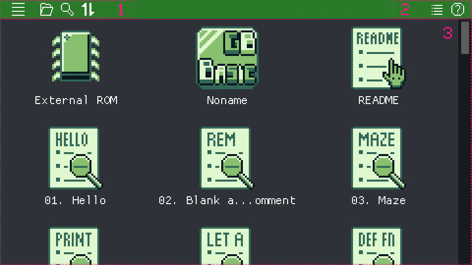

## Reference Manual

[**Manual**](https://paladin-t.github.io/kits/gbb/manual.html) | [Extensions](https://paladin-t.github.io/kits/gbb/extensions.html) | [Launching](https://paladin-t.github.io/kits/gbb/launching.html) | [Troubleshooting](https://paladin-t.github.io/kits/gbb/troubleshooting.html) | [Changelog](https://paladin-t.github.io/kits/gbb/changelog.html) | [About](https://paladin-t.github.io/kits/gbb/about.html)

## Table of Content

- [Fundamental](#fundamental)
  - [Specifications](#specifications)
  - [Usage](#usage)
  - [Project Structure](#project-structure)
  - [Compiler and VM](#compiler-and-vm)
    - [Compiler Architecture](#compiler-architecture)
    - [VM Architecture](#vm-architecture)
- [Programming](#programming)
  - [Program Structure](#program-structure)
  - [Programming Paradigm](#programming-paradigm)
  - [Syntax](#syntax)
    - [Comment](#comment)
    - [Output](#output)
    - [Jump](#jump)
    - [Declaration and Expression](#declaration-and-expression)
    - [Data Types](#data-types)
      - [Memory Management](#memory-management)
      - [Number Calculation](#number-calculation)
      - [Trigonometric Functions](#trigonometric-functions)
    - [Native Functions](#native-functions)
    - [Macro Definitions](#macro-definitions)
      - [Macro Function](#macro-function)
      - [Macro Expression](#macro-expression)
      - [Macro Constant](#macro-constant)
      - [Macro Identifier Alias](#macro-identifier-alias)
    - [Conditional](#conditional)
    - [Loop](#loop)
    - [Sub](#sub)
    - [Thread](#thread)
    - [Block and Scope](#block-and-scope)
      - [Code Block](#code-block)
      - [Macro Scope](#macro-scope)
    - [Peek and Poke](#peek-and-poke)
    - [Array](#array)
    - [Read Data](#read-data)
    - [Stack Operations](#stack-operations)
      - [Macro Stack Reference](#macro-stack-reference)
    - [Others](#others)
  - [Libraries](#libraries)
    - [Basic](#basic)
    - [System](#system)
    - [Gamepad](#gamepad)
    - [Graphics](#graphics)
    - [Image](#image)
    - [Tiles](#tiles)
    - [Map](#map)
    - [Sprite](#sprite)
    - [Scene](#scene)
    - [Actor](#actor)
    - [Actor Controllers](#actor-controllers)
    - [Emote](#emote)
    - [Projectile](#projectile)
    - [Trigger](#trigger)
    - [Objects](#objects)
    - [GUI](#gui)
      - [Window](#window)
      - [Widgets](#widgets)
      - [Label Widget](#label-widget)
      - [ProgressBar Widget](#progressbar-widget)
      - [Menu Widget](#menu-widget)
      - [Text Measurement](#text-measurement)
    - [Audio](#audio)
    - [Palette](#palette)
    - [Scroll](#scroll)
    - [Effects](#effects)
    - [Collisions](#collisions)
    - [Persistence](#persistence)
    - [RTC](#rtc)
    - [Serial Port](#serial-port)
    - [Device](#device)
  - [Extension Features](#extension-features)
    - [Platform Detection](#platform-detection)
    - [Mouse and Touch](#mouse-and-touch)
    - [Keyboard Input](#keyboard-input)
    - [Streaming](#streaming)
    - [Shell Command](#shell-command)
      - [Emulation Control](#emulation-control)
      - [Debugging](#debugging)
      - [Setting Mouse Cursor](#setting-mouse-cursor)
      - [Syncing Modules](#syncing-modules)
- [Import and Export](#import-and-export)
  - [Import](#import)
  - [Export](#export)
- [Building](#building)
  - [Building a ROM](#building-a-rom)
  - [Building for HTML](#building-for-html)
  - [Building for Desktop](#building-for-desktop)
- [Appendix](#appendix)
  - [Lookup Priority of Labeled Destination](#lookup-priority-of-labeled-destination)
  - [Cheat Sheet of Objects](#cheat-sheet-of-objects)
  - [Cheat Sheet of Collision Rules](#cheat-sheet-of-collision-rules)
  - [Cheat Sheet of GUI Widgets](#cheat-sheet-of-gui-widgets)
  - [Cheat Sheet of Devices](#cheat-sheet-of-devices)
  - [ASCII Table](#ascii-table)

<!-- End Table of Content -->

[TOP](#reference-manual)

# Fundamental

## Specifications

* **CPU**: 4.19MHz/8.38MHz for classic/colored respectively
* **Threads**: up to 16 concurrent execution contexts
* **Display**: 160x144
* **Code**: BASIC, supports multiple source pages
* **Gamepad**: 8 buttons (D-Pad + A/B + Select/Start)
* **Mouse and touch**: supported by **extension**
* **Keyboard input**: supported by **extension**
* **Tiles**: up to 256 units per page
* **Map**: up to 255 tiles in one dimension per page; two layers (graphics, attributes)
* **Sprite**: supports 8x8 and 8x16 sprites
* **Scene**: up to 255 tiles in one dimension per page; four layers (map, attributes, properties, actors)
* **Actor/projectile**: up to 8x8 tiles per frame; up to 1024 frames per page
* **Font**: supports TrueType (.ttf) and bitmap-based (.png .jpg .bmp .tga); up to 16px; 1bpp or 2bpp
* **Audio**: 4 channels; supports importing from JSON, VGM, WAV, FxHammer
* **Palette**: 2bit (4 colors) per tile, palette of map and actor is configurable for colored device
* **GUI**: supports label, progress bar, menu, etc.
* **Persistence**: supported
* **RTC**: supported
* **Serial port**: supported

[TOP](#reference-manual)

## Usage

Most of the shortcut keys are listed aside the corresponding GUI elements, besides that, it also accepts a number of implicit global shortcuts. See the following list for common shortcuts.

* **Ctrl+S**: save project
* **Ctrl+F4**: close project
* **Ctrl+Shift+R**: reload project
* **Ctrl+N**: new asset page
* **Ctrl+C**: copy
* **Ctrl+X**: cut
* **Ctrl+V**: paste
* **Del**: delete
* **Ctrl+Z**: undo
* **Ctrl+Y**: redo
* **Ctrl+A**: select all
* **F5**: compile and run
* **Shift+F5**: stop running
* **Ctrl+Shift+B**: build and export ROM
* **Ctrl+PgUp**: turn to previous page
* **Ctrl+PgDn**: turn to next page
* **Ctrl+1**: switch to code editor
* **Ctrl+2**: switch to tile editor
* **Ctrl+3**: switch to map editor
* **Ctrl+4**: switch to scene editor
* **Ctrl+5**: switch to actor/projectile editor
* **Ctrl+6**: switch to font editor
* **Ctrl+7**: switch to music editor
* **Ctrl+8**: switch to SFX editor
* **Ctrl+9**: switch to console
* **Ctrl+Alt+1**: resize the window to x1 size
* **Ctrl+Alt+2**: resize the window to x2 size
* **Ctrl+Alt+3**: resize the window to x3 size
* **Ctrl+Alt+4**: resize the window to x4 size
* **Ctrl+Alt+=**: centralize the window
* **Alt+Enter**: toggle fullscreen
* **F1**: open the manual
* **F6**: take a screenshot
* **F7**: start recording GIF
* **F8**: stop recording

**Tips:** _Use **Cmd** instead of **Ctrl** on MacOS._

The key bindings for operating a running program are configured in the application preferences.

**Recent/library**



1. File menu and buttons
2. View buttons
3. Projects: All recent projects will be placed here

**Code editor**


1. File menu and buttons: Create new asset pages, build and run project, undo and redo, etc.
2. View buttons: Switch to other asset editors, etc.
3. Edit area: Where to write code
4. Context area: Switch to other asset pages, stat. etc.
5. Extra area: Import, export, project properties, etc.

Code editor accepts a number of additional implicit shortcuts.

* **Tab**: increase indent
* **Shift+Tab/Ctrl+Shift+Tab**: decrease indent
* **Ctrl+U**: to lower case
* **Ctrl+Shift+U**: to upper case
* **Ctrl+//Ctrl+'**: toggle comment
* **Alt+Up**: move code line(s) up
* **Alt+Down**: move code line(s) down
* **Ctrl+W**: select word
* **Ctrl+F**: find word
* **F3**: find next
* **Shift+F3**: find previous
* **Ctrl+G**: goto line
* **Ctrl+\\**: toggle splitted view

**Tips:** _Use **Cmd** instead of **Ctrl** on MacOS._

**Assets editors**


1. File menu and buttons: Create new asset pages, build and run project, undo and redo, etc.
2. View buttons: Switch to other asset editors, etc.
3. Edit area: Where to paint, etc.
4. Context area: Switch to other asset pages, stat. etc.
5. Extra area: Import, export, layers, etc.

Each code, graphics and music asset page has its dedicated undo/redo stack that doesn't affect another.

**Running**


1. File menu and running buttons: Run, pause, resume, stop, etc.
2. View buttons: Switch to other asset editors, etc.
3. Emulator area: Where the emulation runs
4. Running information: Device and cartridge information, FPS, etc.
5. Extra area: Change running speed, mute and unmute, etc.

[TOP](#reference-manual)

## Project Structure

A GB BASIC project is saved as a ".gbb" file, which is in a text-based format and friendly to version control systems and external editors, with all assets encoded in printable UTF-8 characters or Base64 string, and uses Unix LF ('\n') for line ending. A project consists of at least one page of source code, and none or a few pages of other assets (tiles, maps, actors, music, etc). All these assets are organized and packed in sections one after another in a single file. A project will appear on the main screen once it has been created or imported to GB BASIC.

GB BASIC also supports importing plain source code, which consists of only one source code page without other assets.

[TOP](#reference-manual)

## Compiler and VM

### Compiler Architecture

The following diagram gives a high-level overview of the compiler architecture and asset pipeline.


* The compiler compiles source code into VM instructions, the asset pipeline processes assets into binary data
  * Banking is automatically determined for instructions and asset data
* The kernel (VM) loads and executes compiled instructions, loads and makes use of processed asset data
* The kernel runs on top of a real hardware, emulator or simulator

### VM Architecture

The VM layer of GB BASIC is based on the [GBVM](https://github.com/untoxa/gbvm) project. The following diagram gives a complete overview of the VM architecture.


* Compiled instructions can be stored in different ROM banks if necessary
* The kernel supports up to 16 threads with concurrent contexts
  * Threads share the same physical memory
* Every thread has its own registers (not accessible from code) and stacks (accessible from code)
* All threads share a same area of RAM for globals (accessible from code)

The following diagram gives a detailed overview of the VM RAM layout.


* Each thread context has its own stack for:
  * thread parameters (optional),
  * thread locals, stack entries,
  * evaluation intermediates,
  * function parameters, return points, etc.
* The basic growth and accessible unit from code is 16-bit

[TOP](#reference-manual)

# Programming

## Program Structure

GB BASIC programs do not have a designated entry point; they begin execution from the first executable statement on the initial code page and proceed linearly. When the end of a code page is reached, the program concludes as if an `end` statement were present at the page's termination. Control can migrate between code pages, allowing for non-linear execution.

A game program typically consists of an initialization sequence where one-time setup instructions are executed. Following this, the program enters a persistent loop, often referred to as the update routine. Within this loop, the program cycles through a series of operations, including capturing user input, advancing the game's state, and rendering objects.

In GB BASIC, there are two update modes, manual mode and auto mode. In manual mode, programmers are in charge of explicitly invoking an `update` call at the close of each loop iteration to signal the completion of the current frame and allow the runtime to update internal states. In contrast, auto mode, as its name implies, does not require `update` call or in-code update loop, as the runtime handles these operations automatically.

By default, GB BASIC operates in the manual mode. The command `auto update on` enables the auto mode, while `auto update off` disables it.

[TOP](#reference-manual)

## Programming Paradigm

GB BASIC is a programming language that was born in the modern era with retro flavours. It implements the following programming paradigms.

* Imperative paradigm
  * Non-structured programming
  * Concurrent processing approach
* Declarative paradigm
  * Data driven approach

The imperative paradigm is one of the historically early programming paradigms. It features close relation to machine architecture. In this paradigm, a programmer have to tell a computer system exact steps to do. In particular with the use of non-structured programming in GB BASIC, it is capable of creating Turing-complete algorithms. However GB BASIC is not "pure" non-structured, it has mixed with a few structured constructs of selection (`if` and `select case`) and repetition (`for`, `while` and `repeat`) etc. Moreover GB BASIC implements a simple threading feature for being possible and easier of doing concurrent processing.

The declarative paradigm is a style of way to program a computer system with "what to do" rather than "how to do", in GB BASIC this is achieved with a few specialized statements that follow the data driven approach. This approach uses data instead of instructions to indicate a program's behaviour, those data are mostly produced within the asset editors in GB BASIC.

[TOP](#reference-manual)

## Syntax

Projects are programmed in a BASIC dialect. The language implements a classic style syntax that supports code lines either with or without line numbers. A long line can be separated into several short ones, and connected with underscores (`_`). Keywords and identifiers are case-insensitive by default, i.e. `foo`, `Foo` and `FOO` all mean the same, but it could be changed to case-sensitive in project's property.

The target running system of GB BASIC has quite restricted resources, so to satisfy such restrictions, the syntax is designed to be very compact, so that code and assets can be straightforward compiled and processed into the target format very fast and efficient.

This document uses elements such as identifiers, delimiters, and symbols to represent code. Additionally, it uses some symbols that do not appear in formal code to denote additional rules, for example:

* `=`: used in prefix form to denote a function call with a return value, i.e. `=foo()`
* `=?`: used in parameter list to denote a default value when it's omitted, i.e. `foo(a, b=1, c=2)`
* `[]`: denotes optional parameters, i.e. `foo(a[, b[, c]])`
* `...`: indicates a variable number of arguments, i.e. `foo(a, b, ...)`
* `|`: represents "or", i.e. `foo|bar`
* `/`: represents structured syntax that code elements should match, i.e. `foo/end foo`
* `*`: represents a repetition of a code element, i.e. `foo*`
* `#pg`: represents a code page or asset page
* `#pg:n`: represents a code page or asset page with a specific sub index
* `"{builtin}"`: represents name of a builtin entry
* `"{name}"`: represents asset name

[TOP](#reference-manual)

### Comment

Comments will not be compiled into final ROM, they are sidenotes that explain a program to a programmer. A comment starts with a `'` mark or a `REM` statement till the end of that line.

Comment example:

```bas
' Comment.
REM Comment after REMark.
```

### Output

* `print ...`: outputs numeric values to the screen as plain text
  * `...`: variadic data; numeric values separated by comma
* `print fmt[, ...]`: outputs text and numeric values to the screen as plain text
  * `fmt`: the format string, accepts the following "Escapes" for value interpretation
  * `...`: optional variadic data; numeric values separated by comma

Every `print` outputs a newline by default after all contents have been printed, to let the next `print` starts from the same line instead of a new line, put a semicolon (`;`) at the end of the `print`.

| Escapes  | Can be applied to                         | Note                                            |
|----------|-------------------------------------------|-------------------------------------------------|
| `%d`     | `print`, `text`, `label`, `menu`, `shell` | Integer (DEC)                                   |
| `%x`     | `print`, `text`, `label`, `menu`, `shell` | Integer (HEX)                                   |
| `%c`     | `print`, `text`, `label`, `menu`, `shell` | Character                                       |
| `%%`     | `print`, `text`, `label`, `menu`, `shell` | Percent sign                                    |
| `\uXXXX` | `print`, `text`, `label`, `menu`, `shell` | Embedded character code, `XXXX` is in HEX       |
| `\#`     | `print`, `text`, `label`, `menu`, `shell` | The current stack pointer of the current thread |
| `\\`     | `print`, `text`, `label`, `menu`, `shell` | Backslash                                       |
| `\r`     | `label`                                   | Carriage return                                 |
| `\n`     | `label`                                   | New line                                        |
| `\f`     | `label`                                   | New page                                        |

The "Escapes" rules apply to one or more of the following: `print fmt[, ...]`, `text fmt[, ...]`, `label #pg|"{name}", fmt[, ...]`, `menu #pg|"{name}", fmt0[, fmt1, ..., fmtN][, ...]`, and `shell ">fmt"[, ...]`.

* `locate x, y`: puts the cursor to the specific location on the screen for text output
  * `x`: the x location in pixels
  * `y`: the y location in pixels

* `cls`: clears the screen

These statements run under the `TEXT_MODE`.

### Jump

* `goto lno|lbl|#pg:lno|#pg:lbl`: performs an unconditional jump to transfer the execution to the specific location
  * objectives:
    * `lno`: line number
    * `lbl`: code line label
    * `#pg:lno`: code page index and line number
    * `#pg:lbl`: code page index and code line label

Jump example:

```bas
loop:
  print "Hello"
  goto loop
```

**See also:** _[Lookup Priority of Labeled Destination](#lookup-priority-of-labeled-destination)._

### Declaration and Expression

* `let foo`: declares a variable without assignment
* `let bar = 42`: declares a variable and assigns a value to it

Each variable declaration takes one word (two bytes) of allocated space in memory.

An expression is a syntactic entity that may be evaluated to determine its value. It is a combination of one or more constants, variables, functions and operators that GB BASIC interprets (according to the particular rules of precedence and of association) and computes to produce ("to return", in a stateful environment) another value. See the following table for all supported operators and their usages. High priorities (with larger numbers) are evaluated before low ones (with smaller numbers).

| Operators | Priority | Note                          | Example       |
|-----------|----------|-------------------------------|---------------|
| `+`       | 3        | Add                           | `a + b`       |
| `-`       | 3        | Minus                         | `a - b`       |
| `*`       | 4        | Multiply                      | `a * b`       |
| `/`       | 4        | Divide                        | `a / b`       |
| `mod`     | 4        | Modulo (remainder)            | `a mod b`     |
| `-`       | 6        | Negative                      | `-a`          |
| `=`       | 2        | Equal to                      | `a = b`       |
| `<`       | 2        | Less than                     | `a < b`       |
| `<=`      | 2        | Less than or equal to         | `a <= b`      |
| `>`       | 2        | Greater than                  | `a > b`       |
| `>=`      | 2        | Greater than or equal to      | `a >= b`      |
| `<>`      | 2        | Not equal                     | `a <> b`      |
| `and`     | 1        | Logic and                     | `a and b`     |
| `or`      | 1        | Logic or                      | `a or b`      |
| `not`     | 6        | Logic not                     | `not a`       |
| `band`    | 5        | Bitwise and                   | `a band b`    |
| `bor`     | 5        | Bitwise or                    | `a bor b`     |
| `bxor`    | 5        | Bitwise xor                   | `a bxor b`    |
| `bnot`    | 5        | Bitwise not                   | `bnot a`      |
| `lshift`  | 5        | Left shift                    | `a lshift b`  |
| `rshift`  | 5        | Right shift                   | `a rshift b`  |
| `sgn`     | -        | Sign of a number (-1, 0 or 1) | `sgn(a)`      |
| `abs`     | -        | Absolute value                | `abs(a)`      |
| `sqr`     | -        | Squared value                 | `sqr(a)`      |
| `sqrt`    | -        | Square root                   | `sqrt(a)`     |
| `sin`     | -        | Sine value                    | `sin(a)`      |
| `cos`     | -        | Cosine value                  | `cos(a)`      |
| `atan2`   | -        | Atan2 value                   | `atan2(a, b)` |
| `pow`     | -        | Exponential value             | `pow(a, b)`   |
| `min`     | -        | Minimum value                 | `min(a, b)`   |
| `max`     | -        | Maximum value                 | `max(a, b)`   |

### Data Types

There are two fundamental data types in GB BASIC, String and Integer. Besides, it also supports Byte, Boolean, ID and Nothing, which are just type aliases of Integer, the purpose of these aliases is that they indicate different semantic meanings.

* String
  * is used by `print`, `text`, `label`, etc. for literal text or formatting
* Integer (16-bit signed)
  * denotes most of the numeric data in GB BASIC
* Byte (8-bit signed/unsigned)
  * is used by `data` statements to denote inline data sequences
* Boolean
  * has two values, `false` and `true`
* ID
  * denotes particular object instance
* Nothing
  * has one value, `nothing`, representing "no available object", etc.

#### Memory Management

All the data types including ID are value-types in the language. In other words memory of variables per se are managed by GB BASIC itself rather than by a programmer. But the object "value" referenced by an ID "variable" is not always automatically managed.

Thus a programmer is in charge of creating and deleting objects properly, or there will be memory leak. In particular, "actor" should be deleted when it's no longer in use; however "projectile" will be automatically collected when it's no longer alive; and "trigger" is array based, it will be collected when scene unloads, system shuts down, or shrunk manually.

Do not assume that the allocated ID values of threads, actors, and projectiles remain constant across different versions of GB BASIC.

#### Number Calculation

The runtime of GB BASIC emulates an 8-bit CPU with limited processing power, making floating-point calculations costly. To optimize running speed, GB BASIC represents all numeric data as integers, specifically 16-bit signed integers. But what about operations like speed accumulation? To address this, GB BASIC employs scaled integers. For example, an actor's movement speed is scaled by 1/16. Therefore, a movement speed value of 16 for an actor indicates a speed of 1x, a value of 1 signifies 1/16x, and 32 represents 2x, and so on.

#### Trigonometric Functions

Due to the integer nature of GB BASIC, the domain of angle values and related trigonometric functions is mapped from "0° to 360°" to "0 to 256", and the range of sine and cosine trigonometric functions is mapped from "-1.0 to 1.0" to "-127 to 127".

| Degree | GB BASIC representation | Sine | Cosine |
|--------|-------------------------|------|--------|
|   0°   |   0                     |    0 |  127   |
|   1°   |   0                     |    3 |  127   |
|   2°   |   1                     |    6 |  127   |
| ...    | ...                     |  ... |  ...   |
|  90°   |  64                     |  127 |    0   |
| ...    | ...                     |  ... |  ...   |
| 180°   | 128                     |    0 | -127   |
| ...    | ...                     |  ... |  ...   |
| 270°   | 192                     | -127 |    0   |
| ...    | ...                     |  ... |  ...   |
| 358°   | 254                     |   -6 |  127   |
| 359°   | 255                     |   -3 |  127   |
| 360°   |   0 (256)               |    0 |  127   |

The `=deg(angle)` function provides a convenient way to map angles with a domain of 0° to 360° to an internal representation ranging from 0 to 256.

### Native Functions

* `call func[, ...]`: calls the specific native function
  * `func`: the native function to call, the name is case-sensitive; can be one of the following "Functions"
  * `...`: optional variadic arguments; numeric values separated by comma

| Functions                 | Short syntax | Note                                                                                                           |
|---------------------------|--------------|----------------------------------------------------------------------------------------------------------------|
| `call clear_text`         | `cls`        | Clears the screen for the `TEXT_MODE`                                                                          |
| `call wait_for n`         | `wait n`     | Waits for `n` frames on the current thread                                                                     |
| `call wait_until_confirm` | -            | Waits until the A/Start button has been pressed; or anywhere of the screen has been tapped (extension feature) |
| `call error`              | -            | Raises an error                                                                                                |
| `call camera_shake n, d`  | -            | Shake camera for `n` frames with ["Camera shake directions"](#scene) specified by `d`                          |

<!-- Extra kernels can provide more native functions. -->

### Macro Definitions

GB BASIC supports defining macros using `def`, which can be used to define functions, expressions, constants, and [stack references](#macro-stack-reference) (which will be described later).

#### Macro Function

* `def fn f(...) = ...`: defines a user function
  * `f`: the user defined function name
  * `...`: the function expression
* `=f(...)`: call a user defined function, where `f` is the user defined function name
  * `...`: arguments passed to the function

Function example:

```bas
def fn f(x, y) = sqr(x) + abs(y)
let a = f(1 + abs(-2), f(1, -3))
```

By default, `fn` functions, like other symbols, are defined in the global scope. Additionally, GB BASIC supports defining local lexical scopes using `begin def/end def`, where an `fn` function is only valid within that specific scope. See the [Macro Scope](#macro-scope) section for detail.

#### Macro Expression

* `def e = ...`: defins an alias of expression, i.e. `def meaningful = foo * (bar + (22 / 7)) mod baz`
  * `e`: the macro name
  * `...`: the expression

A macro expression has higher priority than arithmetical operators. For example, the follows code results in `9`, rather than `7`:

```bas
def e = 2 + 1
print 3 * e ' Expands into `3 * (2 + 1)`.
```

By default, expression alias defined by macro `def ... = ...`, like other symbols, are defined in the global scope. Additionally, GB BASIC supports defining local lexical scopes using `begin def/end def`, where a `def ... = ...` macro is only valid within that specific scope. See the [Macro Scope](#macro-scope) section for detail.

#### Macro Constant

* `def c = N`: defines a macro constant, i.e. `def meaningful = 42`
  * `c`: the macro name
  * `N`: numeric constant

Unlike variable or array declaration, the macro constant definition doesn't allocate any memory space.

By default, macro constants defined by `def ... = ...`, like other symbols, are defined in the global scope. Additionally, GB BASIC supports defining local lexical scopes using `begin def/end def`, where a `def ... = ...` macro is only valid within that specific scope. See the [Macro Scope](#macro-scope) section for detail.

In addition to user-defined macro constants, the system also provides several builtin macros that reflect cartridge properties.

| Macro names              | Description                                       | Value             |
|--------------------------|---------------------------------------------------|-------------------|
| `IS_COLORED_CARTRIDGE`   | Whether the cartridge supports color              | `true` or `false` |
| `IS_EXTENSION_CARTRIDGE` | Whether the cartridge supports extension features | `true` or `false` |
| `CARTRIDGE_HAS_SRAM`     | Whether the cartridge has SRAM                    | `true` or `false` |
| `CARTRIDGE_HAS_RTC`      | Whether the cartridge has Real-Time Clock         | `true` or `false` |

These predefined macros are automatically determined at compile time and can be used like regular macro constants. Their values are resolved during compilation and remain fixed throughout the program.

#### Macro Identifier Alias

* `def a = b`: defins an identifier alias of variable or array, i.e. `def meaningful = foo`
  * `a`: the macro name
  * `b`: the variable or array name

Unlike variable or array declaration, the macro definition of identifier alias doesn't allocate any memory space.

By default, identifner alias defined by macro `def ... = ...`, like other symbols, are defined in the global scope. Additionally, GB BASIC supports defining local lexical scopes using `begin def/end def`, where a `def ... = ...` macro is only valid within that specific scope. See the [Macro Scope](#macro-scope) section for detail.

### Conditional

Single-line conditional syntax as follows:

* `if/then`: one-line conditional statement with one branch
* `if/then/else`: one-line conditional statement with two branches

```bas
if 1 then print "Ok"
if 0 then print "Oops" else print "Ok"
```

* `if/then N[/else]`: is short for `if/then goto N[/else]`
* `if/goto N[/else]`: is short for `if/then goto N[/else]`

```bas
if 1 then goto somewhere
if 1 then somewhere
if 1 goto somewhere
```

Multiline conditional syntax as follows:

* `if/then/end if`: multiline conditional statement with one branch
* `if/then/else/end if`: multiline conditional statement with two branches
* `if/then/else if*/else/end if`: multiline conditional statement with multiple branches

```bas
if 0 then
  print "Oops"
else if 1 then
  if 1 then
    print "Ok"
  end if
else
  print "Oops"
end if
```

Multi-case selection syntax as follows:

* `select case*/end select`: multi-case selection statement
* `select case*/else/end select`: multi-case selection statement

```bas
select case foo
  case 1
    print "Value"
  case 2, 3
    print "Values"
  case 4 to 5
    print "Range"
  case >= 6
    print "Comparison"
  else
    print "Others"
end select
```

A `select case` statement conditionally executes sections of code depending on the value of a variable. A case condition can be a single value, a number of values, a range of values or a comparison. When the case is determined by a range of values, the smaller number must come before the larger one; when the case is determined by a comparison, it supports `=`, `<`, `<=`, `>`, `>=` and `<>` operators. The condition variable to be determined cannot be a macro costant or stack reference macro.

`If` and `select case` statements support both modern and retro syntax.

| Modern syntax | Retro syntax |
|---------------|--------------|
| `else if`     | `elseif`     |
| `end if`      | `endif`      |
| `end select`  | `endselect`  |

Ternary conditional operator syntax as follows:

* `=iif(cond, a, b)`: gets one of the two specific values according to the condition
  * `cond`: the condition expression
  * `a`: the expression that results the first value
  * `b`: the expression that results the second value
  * returns the first value if the condition results `true`, otherwise returns the second one

Branched jump syntax as follows:

* `on cond goto|gosub lno|lbl|#pg:lno|#pg:lbl[, ...]`: performs a branched jump according to the condition
  * `cond`: the condition expression; jumps to the first (No. 0) branch if the condition results `0`, to the second (No. 1) branch if it results `1`, and so on...
  * objectives:
    * `lno`: line number
    * `lbl`: code line label
    * `#pg:lno`: code page index and line number
    * `#pg:lbl`: code page index and code line label
  * `...`: optional variadic labels; locations separated by comma

A branch chunk is a routine that takes zero parameter.

```bas
let a = 0
on a goto lbl0, lbl1, lbl2
goto lblElse
lbl0:
  print "0"
  end
lbl1:
  print "1"
  end
lbl2:
  print "2"
  end
lblElse:
  print "Else"
```

### Loop

* `for/to[/step]/next`: repeats a section of code a number of times with a control variable which has a differing value each time through the loop

`For` loop example:

```bas
for i = 0 to 4 step 1
  print "i=%d", i
next
```

* `while/end while`: repeats a section of code while a control condition results `true`

`While` loop example:

```bas
let a = 0
while a < 5
  print "a=%d", a
  a = a + 1
end while
```

`While` statements support both modern and retro syntax.

| Modern syntax | Retro syntax |
|---------------|--------------|
| `end while`   | `wend`       |

* `repeat/until`: repeats a section of code until a control condition results `true`

`Repeat` loop example:

```bas
let a = 0
repeat
  print "a=%d", a
  a = a + 1
until a = 5
```

* `exit`: exits the current loop structure, and continues to execute its following code

### Sub

* `gosub lno|lbl|#pg:lno|#pg:lbl`: pushes the execution point to the stack, then performs an unconditional jump to transfer the execution to the specific location
  * objectives:
    * `lno`: line number
    * `lbl`: code line label
    * `#pg:lno`: code page index and line number
    * `#pg:lbl`: code page index and code line label
* `return`: pops the top execution point from the stack, then returns the execution to the point

Sub example:

```bas
loop:
  gosub lbl
  goto loop

lbl:
  print "Hello"
  return
```

**See also:** _[Lookup Priority of Labeled Destination](#lookup-priority-of-labeled-destination)._

### Thread

* `=start lno|lbl|#pg:lno|#pg:lbl[, ...]`: starts a thread from the specific location
  * objectives:
    * `lno`: line number
    * `lbl`: code line label
    * `#pg:lno`: code page index and line number
    * `#pg:lbl`: code page index and code line label
  * `...`: optional variadic arguments; numeric values separated by comma
  * returns the started thread ID (non-zero), or `nothing` (zero) if fails
* `join id`: joins the specific thread; will return when the thread is finished
  * `id`: the thread ID
* `kill id`: terminates the specific thread
  * `id`: the thread ID
* `kill`: terminates all the other threads except for the current one
* `wait n`: waits for `n` frames on the current thread
  * `n`: the specific frame count to wait
* `lock`: retains and locks exclusive dispatching permission to the current thread, until it is unlocked or terminated
* `unlock`: releases and unlocks exclusive dispatching permission obtained by the current thread

<!-- * `raise code[, ...]`: raises a runtime exception
  * `code`: the exception code
  * `...`: optional variadic arguments; numeric values separated by comma -->

<!-- * `=arg`: **obsolete**, use `=stack(n)` or `=stack0|stack1|...|stackN` instead; gets and pops the value of the head argument passed to the current thread from its caller
  * returns the value of the current argument -->

**Tips:** _Accessing global variables on different concurrent threads is **unsafe**, consider stack references instead. See [Stack Operations](#stack-operations) for details._

Thread example:

```bas
let id = start lbl, 22, 7
update
join id
print "!!!"
end

lbl:
  print "Args: %d, %d", stack1, stack0
  for i = 0 to 4
    print "i=%d", i
    wait 10
  next
  print "End"
```

**See also:** _[Lookup Priority of Labeled Destination](#lookup-priority-of-labeled-destination)._

### Block and Scope

#### Code Block

* `begin do/end do`: marks the beginning and end of a code block

These statements don't execute any specific instructions at runtime, they simply help organize code.

Code block example:

```bas
begin do
  ' Do something.
end do

' Do something else.
```

`Begin do/end do` statements support both modern and retro syntax.

| Modern syntax | Retro syntax |
|---------------|--------------|
| `begin do`    | `begindo`    |
| `end do`      | `enddo`      |

#### Macro Scope

* `begin def/end def`: marks the beginning and end of a local lexical scope for macro definitions like function `def fn f(...) = ...`, expression `def e = (a + b) * (22 / 7)`, constant `def c = 42`, alias `def a = b` and stack reference `def s = stackN`

Scoping example:

```bas
' Scope for function macro.
def fn f() = 1
print "f()=%d", f() ' Call the global function.

begin def
  def fn f() = 2
  print "f()=%d", f() ' Call the local function.
end def

print "f()=%d", f() ' Call the global function.
```

```bas
' Scope for expression macro.
def e = 3 - 2
print "e=%d", e ' Evaluate the global expression.

begin def
  def e = 4 / 2
  print "e=%d", e ' Evaluate the local expression.
end def

print "e=%d", e ' Evaluate the global expression.
```

```bas
' Scope for macro constant.
def c = 1
print "c=%d", c ' Get the global macro.

begin def
  def c = 2
  print "c=%d", c ' Get the local macro.
end def

print "c=%d", c ' Get the global macro.
```

```bas
' Scope for identifier alias.
let x = 1
let y = 2
def z = x
print "z=%d", z ' Get the global variable.

begin def
  def z = y
  print "z=%d", z ' Get the local variable.
end def

print "z=%d", z ' Get the global variable.
```

```bas
' Scope for stack reference macro.
let foo = 1
let bar = 2
print "foo=%d,bar=%d", foo, bar ' Get the global variables.
let id = start lbl, 22, 7 ' Start the thread.
update
join id
print "foo=%d,bar=%d", foo, bar ' Get the global variables.
end

lbl:
  begin def
    def foo = stack0
    def bar = stack1
    print "foo=%d,bar=%d", foo, bar ' Get the stack variables.
  end def
  end
```

`Begin def/end def` statements support both modern and retro syntax.

| Modern syntax | Retro syntax |
|---------------|--------------|
| `begin def`   | `begindef`   |
| `end def`     | `enddef`     |

### Peek and Poke

* `=peek(pos)`: gets the value at the specific bus address
  * `pos`: the address to access
  * returns the value in byte
* `poke(pos, val)`: sets the value at the specific bus address
  * `pos`: the address to access
  * `val`: the value in byte
* `=peek int(pos)`: gets the value at the specific bus address wordwise
  * `pos`: the address to access
  * returns the value in word (two bytes)
* `poke int(pos, val)`: sets the value at the specific bus address wordwise
  * `pos`: the address to access
  * `val`: the value in word (two bytes)

### Array

GB BASIC supports array of number with up to 4 dimensions. The index is 0-based in each dimension, making its array access behaviour similar to most modern programming languages.

* `dim bar[N[, ...]]`: defines an array with up to 4 dimensions

Each array element takes one word (two bytes) of allocated space in memory.

### Read Data

* `data val[, ...]`: declares a number of byte values as inline data sequence
  * `val`: the 8-bit byte value
  * `...`: variadic data; byte values separated by comma
* `data int val[, ...]`: declares a number of 16-bit integer values for inline data sequence in little-endian, i.e. `data int 0x1234`
  * `val`: the 16-bit integer value
  * `...`: variadic data; integer values separated by comma
* `data repeat val, num`: declares a number of identical numeric values as inline data sequence
  * `val`: the identical value
  * `num`: the data count to repeat

* `read var[, ...]`: reads a number of byte values from declared inline data sequence from the current reading position, moves the reading position one step forward for each read operation
  * `var`: the variable
  * `...`: variadic variables separated by comma
* `read int var[, ...]`: reads a number of 16-bit integer values from inline data sequence in little-endian, i.e. `read int foo`
  * `var`: the variable
  * `...`: variadic variables separated by comma
* `read array`: reads a number of bytes from declared inline data sequence from the current reading position, stores the bytes into the specified array, moves the reading position according to the array size
  * `array`: the array to store the bytes, where each element is an `int` that takes two bytes
* `read n`: skips a number of bytes in the declared inline data sequence from the current reading position, moves the reading position according to the number of bytes to skip
  * `n`: the constant number of bytes to skip

* `restore "{builtin}"|lno|lbl|#pg:lno|#pg:lbl`: restores the reading position of inline data sequence to the specific location
  * objectives:
    * `"{builtin}"`: the name of a builtin entry
    * `lno`: line number
    * `lbl`: code line label
    * `#pg:lno`: code page index and line number
    * `#pg:lbl`: code page index and code line label
* `restore array`: restores the reading position of inline data sequence to the start address of the specific array
  * `array`: the source data array, where each element is an `int` that takes two bytes

GB BASIC also supports to declare 16-bit integer values other than 8-bit ones with the `int` statement, this statement is only used with in a `data` or `read` to declare or read two bytes as one word.

The values following all `data` statements are arranged in increasing order from code page 0 to the following pages, and from the first line to the following lines. Regardless of whether the `data` statement is inside a conditional or loop statement, the sequence of values is processed once and only once. The maximum supported size for the `data` sequence declared in code is approximately 16KB.

### Stack Operations

* `reserve`: reserves a slot on the stack of the current thread
* `reserve n`: reserves a number of slots on the stack of the current thread
  * `n` the number of slots to be reserved

* `push`: pushes a `0` to the stack of the current thread
* `push val`: pushes a value to the stack of the current thread
  * `val`: the value to push

* `=pop`: pops a value from the stack of the current thread
  * returns the popped value
* `=pop n`: pops a number of values from the stack of the current thread
  * `n`: the number of values to be popped
  * returns the last popped value

* `=top`: gets the top value of the stack of the current thread, does not change the stack frames
  * returns the top value

* `=stack(n)`: gets the `n`th value of the stack in the order of bottom-up or top-down of the current thread, does not change the stack frames
  * `n`: the integer reference constant, if `n` is greater than or equal to `0` then gets the "stack **bottom** + `n`" value, otherwise `n` is less than `0` then gets the "stack **top** + `n`" value
  * returns the value
* `=stack0|stack1|...|stackN`: gets the specific Nth value of the stack relative to its **bottom** of the current thread, does not change the stack frames; not applicable to `for` loop or `select case` statements
  * returns the value
* `stack0|stack1|...|stackN = ...`: sets the specific Nth value of the stack relative to its **bottom** of the current thread, does not change the stack frames

Alghough the `stack(n)` operation doesn't change the stack frames, outer statements such as assignment or printing may reserve stack space. So consider using positive `n` only within an expression.

**Tips:** _Accessing global variables on different concurrent threads is **unsafe**. For instance, if one thread is reading the value of a global variable while another thread is writing to it, the reading thread may not obtain the correct value as intended. To address this issue, thread locks can be used, or the above mentioned stack operations, `stack(n)` or `stackN`, can be employed to manipulate thread local variables instead of global ones. The specific solution depends on the actual problem._

#### Macro Stack Reference

* `def ... = stack0|stack1|...|stackN`: defines a stack reference with an alias, i.e. `def meaningful = stack0`

Unlike variable or array declaration, the stack reference definition doesn't allocate any memory space.

By default, `stack` references defined by `def ... = stackN`, like other symbols, are defined in the global scope. Additionally, GB BASIC supports defining local lexical scopes using `begin def/end def`, where a `def ... = stackN` reference is only valid within that specific scope. See the [Macro Scope](#macro-scope) section for detail.

### Others

* `=pack(b0, b1)`: packs the two bytes into a 16-bit integer
  * `b0`: the first byte
  * `b1`: the second byte
  * returns the packed 16-bit integer; the bit order is `(B1 LSHIFT 8) BOR (B0)`
* `unpack(val, b0, b1)`: unpacks the 16-bit integer into two bytes and stores them into the two variables
  * `val`: the 16-bit integer to unpack
  * `b0`: the first variable; the bits are extracted as `val BAND 0xFF`
  * `b1`: the second variable; the bits are extracted as `(val RSHIFT 8) BAND 0xFF`
* `=pack(n0, n1, n2, n3)`: packs the four nibbles (4 bits per nibble) into a 16-bit integer
  * `n0`: the first nibble
  * `n1`: the second nibble
  * `n2`: the third nibble
  * `n3`: the fourth nibble
  * returns the packed 16-bit integer; the bit order is `(B3 LSHIFT 12) BOR (B2 LSHIFT 8) BOR (B1 LSHIFT 4) BOR (B0)`
* `unpack(val, n0, n1, n2, n3)`: unpacks the 16-bit integer into four nibbles (4 bits per nibble) and stores them into the four variables
  * `val`: the 16-bit integer to unpack
  * `n0`: the first variable; the bits are extracted as `val BAND 0x0F`
  * `n1`: the second variable; the bits are extracted as `(val RSHIFT 4) BAND 0x0F`
  * `n2`: the third variable; the bits are extracted as `(val RSHIFT 8) BAND 0x0F`
  * `n3`: the fourth variable; the bits are extracted as `(val RSHIFT 12) BAND 0x0F`

* `swap var0, var1`: swaps the values of the two variables
  * `var0`: passed by reference; the first variable
  * `var1`: passed by reference; the second variable
* `inc var`: increases the value of the specific variable; this is equivalent to `var = var + 1` but simpler
  * `var`: passed by reference; the variable to operate
* `dec var`: decreases the value of the specific variable; this is equivalent to `var = var - 1` but simpler
  * `var`: passed by reference; the variable to operate

* `sleep(ms)`: sleeps for the specific milliseconds; this statement blocks all threads
  * `ms`: the milliseconds

* `end`: ternimates the current program

* `reset`: performs a warm reset by reloading and re-executing the program; this statement restarts the whole program immediately

[TOP](#reference-manual)

## Libraries

### Basic

* `=len(str)`: gets the length of the specific string
  * `str`: the string to measure
  * returns the length of the string
* `=len(arr)`: gets the length of all the dimensions of the specific array
  * `arr`: the array to measure
  * returns the length of the array

* `=asc(ch)`: gets the ASCII code of the specific character
  * `ch`: the character constant to examine, none-ASCII characters (with values greater than 255) are not accepted
  * returns the ASCII code
  * **see also:** _[ASCII Table](#ascii-table)_

* `=deg(angle)`: maps the specific angle from degree to GB BASIC representation
  * `angle`: the angle constant to map
  * returns the mapped angle

* `randomize`: seeds the randomizer
* `randomize seed`: seeds the randomizer with the specific seed
  * `seed`: the seed number
* `=rnd`: generates a random number
  * returns random value, with range of values from 0 to 100
* `=rnd(hi)`: generates a random number not greater than the specific high value
  * returns random value, with range of values from 0 to `hi`
* `=rnd(lo, hi)`: generates a random number between the specific pair of low and high values
  * returns random value, with range of values from `lo` to `hi`

### System

* `auto update on`: turns on the auto update mechanism
* `auto update off`: turns off the auto update mechanism, GB BASIC operates in this way by default

* `update`: updates all game status and events manually
* `=time`: gets the system time that increments once per Frame; will wrap around every ~18 minutes
  * returns the system time

* `dbginfo(full = false)`: outputs the thread context(s) to the debug layer via shell (extension feature)
  * `full`: `true` to debug all threads, `false` for the current thread

* `do nothing`: emits a "NOP" instruction that does nothing but takes a VM cycle

<!-- * `filler(rest = 0)`: fill the rest space of the current bank with NOP instructions
  * `rest`: the amount of bytes to leave after filling

The data following all `filler` statements are arranged in increasing order from code page 0 to the following pages, and from the first line to the following lines. Regardless of whether the `data` statement is inside a conditional or loop statement, the data is processed once and only once. -->

* `memcpy(dst, bank, src, n)`: copies arbitrary data from an address in memory into another place
  * `dst`: the destination address
  * `bank`: the source ROM bank, `-1` for no bank switching
  * `src`: the source address
  * `n`: the count of bytes to copy
* `memcpy(dst, n) = read|data ...`: copies arbitrary data from an inline data sequence into another place in memory
  * `dst`: the destination address
  * `n`: the count of integer to copy
* `memcpy(dst, n[, offset]) = "{builtin}"`: copies arbitrary data from a builtin entry in ROM into another place in memory
  * `dst`: the destination address
  * `n`: the count of bytes to copy
  * `offset`: the offset of the source data in bytes
  * objectives:
    * `"{builtin}"`: the name of a builtin entry
* `memcpy(dst[, n][, offset]) = with tile #pg|"{name}"`: copies arbitrary data from a tiles asset into another place in memory
  * `dst`: the destination address
  * `n`: the count of bytes to copy, omit to use the whole tiles asset size
  * `offset`: the offset of the source data in bytes
  * objectives:
    * `#pg`: tiles page index
    * `name`: tiles asset name
* `memcpy(dst[, n][, offset]) = with map #pg|#pg:n|"{name}"`: copies arbitrary data from a map asset into another place in memory
  * `dst`: the destination address
  * `n`: the count of bytes to copy, omit to use the whole map asset size
  * `offset`: the offset of the source data in bytes
  * objectives:
    * `#pg`: map page index
    * `#pg:n`: map page index and tile index
    * `name`: tiles asset name

* `memset(dst, val, n)`: sets the values of a range of memory space
  * `dst`: the destination address
  * `val`: the value in byte
  * `n`: the count of bytes to set

* `memadd(dst, val, n)`: adds the specific value to each byte of a range of space
  * `dst`: the destination address
  * `val`: the value in signed byte to be added to each destination byte
  * `n`: the count of bytes to add

* `=bankof(id)`: gets the bank of the specific identifier
  * `id`: the variable/array identifier
  * returns the bank of the identifier; must always be `0` for identifiers allocated in RAM heap
* `=addressof(id)`: gets the address of the specific identifier
  * `id`: the variable/array identifier
  * returns the address of the identifier
* `=bankof("{builtin}")`: gets the bank of the specific builtin entry
  * objectives:
    * `"{builtin}"`: the name of a builtin entry
  * returns the bank of the entry
* `=addressof("{builtin}")`: gets the address of the specific builtin entry
  * objectives:
    * `"{builtin}"`: the name of a builtin entry
  * returns the address of the entry

### Gamepad

* `=btn()`: gets whether any key is being pressed
  * returns `true` if any key is being pressed, otherwise `false`
* `=btn(key)`: gets whether the specific key is being pressed
  * `key`: the key code; can be one of the following "Gamepad buttons" constants
  * returns `true` if the key is being pressed, otherwise `false`
* `=btnd()`: gets whether any key has just been pressed
  * returns `true` if any key has just been pressed, otherwise `false`
* `=btnd(key)`: gets whether the specific key has just been pressed
  * `key`: the key code; can be one of the following "Gamepad buttons" constants
  * returns `true` if the specific key has just been pressed, otherwise `false`
* `=btnu()`: gets whether any key has just been released
  * returns `true` if any key has just been released, otherwise `false`
* `=btnu(key)`: gets whether the specific key has just been released
  * `key`: the key code; can be one of the following "Gamepad buttons" constants
  * returns `true` if the specific key has just been released, otherwise `false`

| Gamepad buttons | Value  | Note   |
|-----------------|--------|--------|
| `UP_BTN`        | `0x04` | Up     |
| `DOWN_BTN`      | `0x08` | Down   |
| `LEFT_BTN`      | `0x02` | Left   |
| `RIGHT_BTN`     | `0x01` | Right  |
| `A_BTN`         | `0x10` | A      |
| `B_BTN`         | `0x20` | B      |
| `SELECT_BTN`    | `0x40` | Select |
| `START_BTN`     | `0x80` | Start  |

* `on btn(key) goto|gosub|start lno|lbl|#pg:lno|#pg:lbl`: registers a callback for when the specific key is being pressed
  * `key`: the key code; can be one of the "Gamepad buttons" constants
  * objectives:
    * `lno`: line number
    * `lbl`: code line label
    * `#pg:lno`: code page index and line number
    * `#pg:lbl`: code page index and code line label
* `on btnd(key) goto|gosub|start lno|lbl|#pg:lno|#pg:lbl`: registers a callback for when the specific key has just been pressed
  * `key`: the key code; can be one of the "Gamepad buttons" constants
  * objectives:
    * `lno`: line number
    * `lbl`: code line label
    * `#pg:lno`: code page index and line number
    * `#pg:lbl`: code page index and code line label
* `on btnu(key) goto|gosub|start lno|lbl|#pg:lno|#pg:lbl`: registers a callback for when the specific key has just been released
  * `key`: the key code; can be one of the "Gamepad buttons" constants
  * objectives:
    * `lno`: line number
    * `lbl`: code line label
    * `#pg:lno`: code page index and line number
    * `#pg:lbl`: code page index and code line label
* `off btn(key)`: unregisters a callback for when the specific key is being pressed
  * `key`: the key code; can be one of the "Gamepad buttons" constants
* `off btnd(key)`: unregisters a callback for when the specific key has just been pressed
  * `key`: the key code; can be one of the "Gamepad buttons" constants
* `off btnu(key)`: unregisters a callback for when the specific key has just been released
  * `key`: the key code; can be one of the "Gamepad buttons" constants

A gamepad callback is a routine that takes zero parameter.

All button callbacks by `goto`, `gosub` and `start` work with the manual update mode, and only callbacks by `start` work with the auto update mode.

### Graphics

* `color fore_col, back_col, mode`: sets the color mode for graphics primitives
  * `fore_col`: the foreground color; can be one of the following "2bpp colors" constants
  * `back_col`: the background color; can be one of the following "2bpp colors" constants
  * `mode`: the color mode; can be one of the following "Paint modes" constants

| 2bpp colors | Value | Note               |
|-------------|-------|--------------------|
| `WHITE`     | `0`   | The lightest color |
| `SILVER`    | `1`   | -                  |
| `GRAY`      | `2`   | -                  |
| `BLACK`     | `3`   | The dimmest color  |

| Paint modes  | Note                           |
|--------------|--------------------------------|
| `SOLID_MODE` | Overwrites the existing pixels |
| `OR_MODE`    | Performs a logical OR          |
| `XOR_MODE`   | Performs a logical XOR         |
| `AND_MODE`   | Performs a logical AND         |

* `=point(x, y)`: reads the pixel value on the screen at the specific position
  * `x`: the x position in pixels
  * `y`: the y position in pixels
  * returns the pixel value on the screen

* `plot x, y`: plots a pixel at the specific position
  * `x`: the x position in pixels
  * `y`: the y position in pixels

* `line x0, y0, x1, y1`: draws a line according to the specific points
  * `x0`: the x position in pixels of the first point
  * `y0`: the y position in pixels of the first point
  * `x1`: the x position in pixels of the second point
  * `y1`: the y position in pixels of the second point

* `rect x0, y0, x1, y1`: draws a rectangle according to the specific points
  * `x0`: the x position in pixels of the first point
  * `y0`: the y position in pixels of the first point
  * `x1`: the x position in pixels of the second point
  * `y1`: the y position in pixels of the second point
* `rectfill x0, y0, x1, y1`: fills a rectangle according to the specific points
  * `x0`: the x position in pixels of the first point
  * `y0`: the y position in pixels of the first point
  * `x1`: the x position in pixels of the second point
  * `y1`: the y position in pixels of the second point

* `text ...`: outputs numeric values to the screen as graphical text
  * `...`: variadic data; numeric values separated by comma
* `text fmt[, ...]`: outputs text and numeric values to the screen as graphical text
  * `fmt`: the format string, accepts the `print` "Escapes" for value interpretation
  * `...`: optional variadic data; numeric values separated by comma

| Graphics layers | Note               |
|-----------------|--------------------|
| `MAP_LAYER`     | For background     |
| `WINDOW_LAYER`  | For overlay        |
| `SPRITE_LAYER`  | For active objects |

### Image

* `image(first, x, y, w, h, layer = MAP_LAYER) = with tile read|data ...|"{builtin}"|#pg|#pg:n|"{name}"`: draws an image from tiles data
  * `first`: index of the first image tile to write to
  * `x`: the x position in tiles to put the image
  * `y`: the y position in tiles to put the image
  * `w`: the width of the image in tiles
  * `h`: the height of the image in tiles
  * `layer`: the layer to put the image; can be either `MAP_LAYER` or `WINDOW_LAYER` of the "Graphics layers" constants
  * objectives:
    * `"{builtin}"`: the name of a builtin entry
    * `#pg`: tiles page index
    * `#pg:n`: tiles page index and tile index
    * `name`: tiles asset name

The `image(...) = with tile ...` function simply draws tiles to the tiles and map area in VRAM.

* `image(first, x, y, layer = MAP_LAYER) = with map #pg|"{name}"`: draws an image from map data and its corresponding tiles
  * `first`: index of the first image tile to write to
  * `x`: the x position in pixels to put the image
  * `y`: the y position in pixels to put the image
  * `layer`: the layer to put the image; can be either `MAP_LAYER` or `WINDOW_LAYER` of the "Graphics layers" constants
  * objectives:
    * `#pg`: map page index
    * `name`: tiles asset name

The `image(...) = with map ...` function draws map and its corresponding tiles to VRAM. It has similar affect with the following code. When a map's "Optimize" option is turned on, the unused tiles are trimmed from the end.

```bas
map on ' Or `window on`, the following map related lines similarly operate either map or window depend on the target layer.

let w = get map width(#pg)
let h = get map height(#pg)
let n = w * h ' In final code, `n` depends on the tiles asset itself and the map's "Optimize" option.
fill tile(first, n) = #pg_t ' `#pg_t` is the map's referenced tiles asset.

map x, y

option VRAM_USAGE, VRAM_ATTRIBUTES ' These two lines only execute when the map's attributes layer is enabled.
def map(0, 0, w, h, first) = #pg:1

option VRAM_USAGE, VRAM_TILES
def map(0, 0, w, h, first) = #pg:0
```

Drawing images will automatically turn on the map or window layer.

### Tiles

* `fill tile(first, n) = read|data ...|"{builtin}"|#pg|#pg:n|"{name}"`: fills the tiles area in VRAM
  * `first`: index of the first tile to write to
  * `n`: the tile count
  * objectives:
    * `"{builtin}"`: the name of a builtin entry
    * `#pg`: tiles page index
    * `#pg:n`: tiles page index and tile index
    * `name`: tiles asset name

* `=get tile len(#pg)`: gets the tile count of the specific asset page
  * objectives:
    * `#pg`: tiles page index
  * returns the tile count

The tiles editor can produce tiles assets, press **Ctrl+2/Cmd+2** in edit mode to switch to the tiles tab. GB BASIC allows importing external images and other formats as tiles, besides creating from scratch.

Tiles data for a `fill tile` operation can also come from inline code. This data is arranged one tile after another, line by line; each line has 8 pixels, since each pixel in GB BASIC is 2bpp, a line is encoded by 2 bytes, where a bit from the first byte encodes the lower bit of a pixel, and the corresponding bit from the second byte encodes the higher part.

### Map

* `map on`: turns on the map layer
* `map off`: turns off the map layer

* `map x, y`: puts the map in VRAM on the screen at the specific position
  * `x`: the x position in pixels
  * `y`: the y position in pixels

* `fill map(first, n) = read|data ...|"{builtin}"|#pg|#pg:n|"{name}"`: fills the map area in VRAM; this is equivalent to a `fill tile` operation
  * `first`: index of the first map tile to write to
  * `n`: the tile count
  * objectives:
    * `"{builtin}"`: the name of a builtin entry
    * `#pg`: tiles page index
    * `#pg:n`: tiles page index and tile index
    * `name`: tiles asset name
* `def map(x, y, w, h, base_tile = 0[, pitch][, offset]) = read|data ...|"{builtin}"|#pg|#pg:n|"{name}"`: defines the map area in VRAM
  * `x`: the x position in tiles in both the source tile map and hardware background map tile coordinates, with range of values from 0 to 255
  * `y`: the y position in tiles in both the source tile map and hardware background map tile coordinates, with range of values from 0 to 255
  * `w`: the width of area to set in tiles, with range of values from 1 to 255
  * `h`: the height of area to set in tiles, with range of values from 1 to 255
  * `base_tile`: the start index for map tiles
  * `pitch`: the number of tiles in a row of the map, omit to use the source width
  * `offset`: the offset value in bytes to be added to the source data address, omit to let the compiler determine
  * objectives:
    * `"{builtin}"`: the name of a builtin entry
    * `#pg`: map page index
    * `#pg:n`: map page index and map layer
    * `name`: tiles asset name

In order to transfer map data in a way where the coordinates are not aligned, an offset from the source data address can be passed in `-(x + y * pitch)`; i.e. to draw source tiles start from (0, 0) to the destination area starts from (8, 7), then offset the source address with `-(8 + 7 * map_width)`.

* `=get map width(#pg|"{name}")`: gets the width in tiles of the specific map asset page
  * objectives:
    * `#pg`: map page index
    * `name`: map asset name
  * returns the width in tiles
* `=get map height(#pg|"{name}")`: gets the height in tiles of the specific map asset page
  * objectives:
    * `#pg`: map page index
    * `name`: map asset name
  * returns the height in tiles

* `=get map(x, y)`: gets the tile value of the current map at the specific position
  * `x`: the x position in tiles
  * `y`: the y position in tiles
  * returns the tile value
* `set map(x, y) = val`: sets the tile value of the current map at the specific position
  * `x`: the x position in tiles
  * `y`: the y position in tiles
  * `val`: the tile value

The map editor can produce map assets, press **Ctrl+3/Cmd+3** in edit mode to switch to the map tab. GB BASIC allows importing external formats as map, besides creating from scratch.

The hardware VRAM's map area is limited to 32x32 tiles. Although a map asset can be defined larger than this size in the asset editor, using the aforementioned map statements to fill the map will cause data to exceed this area. For complex scenes, consider using the [Scene](#scene) feature to support large maps, map scrolling, scene property definitions, object definitions, and more.

Map data for a `def map` operation can also come from inline code. This data is arranged one tile after another, from left to right and top to down.

### Sprite

* `sprite on`: turns on the sprite layer
* `sprite off`: turns off the sprite layer

* `sprite id, x, y`: draws the sprite in VRAM to the screen at the specific position
  * `id`: the sprite ID
  * `x`: the x position in pixels
  * `y`: the y position in pixels

The position should be calculated as follows for plain sprites:

* x = Object's horizontal position on the screen + 8
* y = Object's vertical position on the screen + 16

For example, `sprite id, 8, 16` puts a sprite at the top-left corner of the screen, and `sprite id, 160, 152` puts a sprite at the bottom-right corner of the screen.

* `fill sprite(first, n) = read|data ...|"{builtin}"|#pg|#pg:n|"{name}"`: fills the sprite area in VRAM
  * `first`: index of the first sprite tile to write to
  * `n`: the tile count
  * objectives:
    * `"{builtin}"`: the name of a builtin entry
    * `#pg`: tiles page index
    * `#pg:n`: tiles page index and tile index
    * `name`: tiles asset name
* `def sprite(id) = t`: defines a sprite in VRAM
  * `id`: the sprite ID
  * `t`: the tile index

* `=get sprite(id)`: gets the tile value of the specific sprite
  * `id`: the sprite ID
  * returns the tile value
* `set sprite(id) = val`: sets the tile value of the specific sprite
  * `id`: the sprite ID
  * `val`: the tile value

* `=get sprite property(id, prop)`: gets the specific sprite's property
  * `id`: the sprite ID
  * `prop`: the property type; can be one of the following "Sprite properties" constants
  * returns the property value
* `set sprite property(id, prop) = val`: sets the specific sprite's property
  * `id`: the sprite ID
  * `prop`: the property type; can be one of the following "Sprite properties" constants
  * `val`: the property value

| Sprite properties | Value type | Default value     | Note                                                       | Access     |
|-------------------|------------|-------------------|------------------------------------------------------------|------------|
| `PALETTE_PROP`    | Boolean    | `false` (OBJ0PAL) | Whether to use colors come from OBJ0PAL or OBJ1PAL         | Read/write |
| `HFLIP_PROP`      | Boolean    | `false`           | Whether to flip horizontally                               | Read/write |
| `VFLIP_PROP`      | Boolean    | `false`           | Whether to flip vertically                                 | Read/write |
| `PRIORITY_PROP`   | Boolean    | `false`           | Whether to draw the sprite below the background and window | Read/write |
| `HIDDEN_PROP`     | Boolean    | `false`           | Whether the sprite is hidden or visible                    | Read/write |

There is no dedicated builtin editor for producing sprite assets. Since sprite data is actually just tile slices, it accepts all kinds of tiles data as its content, and indexes this data for appearance.

### Scene

The elements of a scene consist of map layers and placed objects.

* `camera x, y`: puts the camera to the specific position that counts for putting maps and sprites
  * `x`: the x position in pixels
  * `y`: the y position in pixels

| Camera shake directions | Note                                       |
|-------------------------|--------------------------------------------|
| `CAMERA_SHAKE_X`        | For the [camera_shake](#function) function |
| `CAMERA_SHAKE_Y`        | For the [camera_shake](#function) function |

* `viewport x, y`: gets the viewport position that is calculated with both map and camera offsets
  * `x`: passed by reference; a variable to store the x position in pixels
  * `y`: passed by reference; a variable to store the y position in pixels

* `def scene(w, h, base_tile = 0) = read|data ...|"{builtin}"|#pg|"{name}"`: defines a scene with map, attribute and property layers
  * `w`: the width of the scene in tiles
  * `h`: the height of the scene in tiles
  * `base_tile`: the start index for map tiles
  * objectives:
    * `"{builtin}"`: the name of a builtin entry
    * `#pg`: scene page index
    * `name`: scene asset name
* `def scene() = nothing`: undefines a scene; this operation only resets the scene status, but does not resets graphics elements and objects

* `load scene(map_base_tile = 0, sprite_base_tile = 0, clear_objects = true) = #pg|"{name}"`: loads a scene with map, attribute, property, actor and definition layers from the specific asset page; it also resets all effects
  * `map_base_tile`: the start index for map tiles
  * `sprite_base_tile`: the start index for sprite tiles
  * `clear_objects`: whether to clear all objects including actors, triggers, projectiles and widgets before loading
  * objectives:
    * `#pg`: scene page index
    * `name`: scene asset name
* `load scene() = nothing`: unloads a scene; this operation resets the scene status, and deletes all objects including actors, triggers, projectiles and widgets; it also resets all effects

A `def scene` operation can only fill map, attribute and property data to scene; a `load scene` does it further to fill actors, triggers, and definitions from an asset page. They are similar but `load scene` should be preferred for most cases.

* `=get scene width(#pg|"{name}")`: gets the width in tiles of the specific asset page
  * objectives:
    * `#pg`: scene page index
    * `name`: scene asset name
  * returns the width in tiles
* `=get scene height(#pg|"{name}")`: gets the height in tiles of the specific asset page
  * objectives:
    * `#pg`: scene page index
    * `name`: scene asset name
  * returns the height in tiles

* `=get scene property(x, y, prop)`: gets the scene property at the specific position
  * `x`: the x position in tiles
  * `y`: the y position in tiles
  * `prop`: the property type; can be one of the following "Blocking properties" constants
  * returns the property value
* `=get scene property(prop)`: gets the specific scene property
  * `prop`: the property type; can be one of the following "Scene properties" constants
  * returns the property value
* `set scene property(prop) = val`: sets the specific scene property
  * `prop`: the property type; can be one of the following "Scene properties" constants
  * `val`: the property value

| Scene properties         | Value type               | Note                                                             | Access     |
|--------------------------|--------------------------|------------------------------------------------------------------|------------|
| `IS_16x16_GRID`          | Boolean                  | Whether the scene grid is 16x16 or 8x8 for controlling           | Read/write |
| `IS_16x16_PLAYER`        | Boolean                  | Whether the player is approximately 16x16 or 8x8 for controlling | Read/write |
| `CLAMP_CAMERA_PROP`      | Boolean                  | Whether to clamp camera inside the scene                         | Read/write |
| `GRAVITY_PROP`           | Integer (8-bit unsigned) | Downward gravity value                                           | Read/write |
| `JUMP_GRAVITY_PROP`      | Integer (8-bit unsigned) | Upward gravity (jump)                                            | Read/write |
| `JUMP_MAX_COUNT_PROP`    | Integer (8-bit unsigned) | Max count the player can jump                                    | Read/write |
| `JUMP_MAX_TICKS_PROP`    | Integer (8-bit unsigned) | Max ticks the player can respond to jump instructions            | Read/write |
| `CLIMB_VELOCITY_PROP`    | Integer (8-bit unsigned) | Gravity for clambing                                             | Read/write |
| `WIDTH_PROP`             | Integer (8-bit unsigned) | Width of scene                                                   | Read/write |
| `HEIGHT_PROP`            | Integer (8-bit unsigned) | Height of scene                                                  | Read/write |
| `CAMERA_DEADZONE_PROP`   | Integer (8-bit unsigned) | Camera deadzone in both directions                               | Write-only |
| `CAMERA_DEADZONE_X_PROP` | Integer (8-bit unsigned) | Camera deadzone in x-axis                                        | Read/write |
| `CAMERA_DEADZONE_Y_PROP` | Integer (8-bit unsigned) | Camera deadzone in y-axis                                        | Read/write |

| Blocking properties   | Value type               | Note                                                        | Access    |
|-----------------------|--------------------------|-------------------------------------------------------------|-----------|
| `BLOCKING_PROP`       | Integer (8-bit unsigned) | Get full blocking information at the specific position      | Read-only |
| `BLOCKING_X_PROP`     | Integer (8-bit unsigned) | Get blocking information in x-axis at the specific position | Read-only |
| `BLOCKING_LEFT_PROP`  | Integer (8-bit unsigned) | Get blocking information in left at the specific position   | Read-only |
| `BLOCKING_RIGHT_PROP` | Integer (8-bit unsigned) | Get blocking information in right at the specific position  | Read-only |
| `BLOCKING_Y_PROP`     | Integer (8-bit unsigned) | Get blocking information in y-axis at the specific position | Read-only |
| `BLOCKING_UP_PROP`    | Integer (8-bit unsigned) | Get blocking information in up at the specific position     | Read-only |
| `BLOCKING_DOWN_PROP`  | Integer (8-bit unsigned) | Get blocking information in down at the specific position   | Read-only |

The scene editor can produce scene assets, press **Ctrl+4/Cmd+4** in edit mode to switch to the scene tab. GB BASIC allows importing external formats as scene, besides creating from scratch.

Scene data for a `def scene` operation can also come from inline code. This data is arranged with a header byte for layers mask (with range of values of the following "Scene layers" constants), then one layer after another according to the order of map, attributes and properties.

<!--
| Scene layers     | Value  |
|------------------|--------|
| Map layer        | `0x00` |
| Attribute layer  | `0x01` |
| Property layer   | `0x02` |
| Actor layer      | `0x04` |
| Definition layer | `0x08` |
| All layers       | `0x0F` |
-->
| Scene layers    | Value  |
|-----------------|--------|
| Map layer       | `0x00` |
| Attribute layer | `0x01` |
| Property layer  | `0x02` |

### Actor

The drawing elements of an actor consist of hardware sprites and their associated tiles.

* `=new actor()`: creates a new actor object
  * returns the created actor ID, or `nothing` if fails
* `del actor(id)`: deletes the specific actor object
  * `id`: the actor ID
* `del actor()`: deletes all the active actor objects

* `fill actor(first, n) = read|data ...|"{builtin}"|#pg|#pg:n|"{name}"`: fills the actor area in VRAM; this is equivalent to a `fill sprite` operation
  * `first`: index of the first sprite tile to write to
  * `n`: the tile count
  * objectives:
    * `"{builtin}"`: the name of a builtin entry
    * `#pg`: tiles page index
    * `#pg:n`: tiles page index and tile index
    * `name`: tiles asset name
<!-- * `def actor(id, x, y, base_tile = 0) = read|data ...|"{builtin}"|#pg|"{name}"` -->
* `def actor(id, x, y, base_tile = 0) = "{builtin}"|#pg|"{name}"`: defines an actor with the specific (definition) data
  * `id`: the specific actor ID to define
  * `x`: the x position in pixels
  * `y`: the y position in pixels
  * `base_tile`: the start index for sprite tiles
  * objectives:
    * `"{builtin}"`: the name of a builtin entry
    * `#pg`: actor page index
    * `name`: actor asset name

* `=get actor property(id, prop)`: gets the specific actor's property
  * `id`: the actor ID
  * `prop`: the property type; can be one of the following "Actor properties" constants
  * returns the property value
* `set actor property(id, prop) = val`: sets the specific actor's property
  * `id`: the actor ID
  * `prop`: the property type; can be one of the following "Actor properties" constants
  * `val`: the property value
* `set actor property(id, prop) = read|data ...|"{builtin}"|#pg|"{name}"`: sets the specific actor's property
  * `id`: the actor ID
  * `prop`: the property type; can be one of the following "Actor properties" constants
  * objectives:
    * `"{builtin}"`: the name of a builtin entry
    * `#pg`: actor page index
    * `name`: actor asset name
* `set actor property(id, prop) = l, r, t, b`: sets the specific actor's property, in particular for `BOUNDS_PROP`
  * `id`: the actor ID
  * `prop`: the property type; can be one of the following "Actor properties" constants
  * `l`: the left edge of the bounds
  * `r`: the right edge of the bounds
  * `t`: the top edge of the bounds
  * `b`: the bottom edge of the bounds
* `set actor property(id, prop) = base, read|data ...|"{builtin}"|#pg|"{name}"`: sets the specific actor's property, in particular for `FRAMES_PROP`
  * `id`: the actor ID
  * `prop`: the property type; must be `FRAMES_PROP` here
  * `base`: the base tile
  * objectives:
    * `"{builtin}"`: the name of a builtin entry
    * `#pg`: actor page index
    * `name`: actor asset name

| Actor properties              | Value type                                                       | Note                                                           | Access     |
|-------------------------------|------------------------------------------------------------------|----------------------------------------------------------------|------------|
| `ACTIVE_PROP`                 | Boolean                                                          | Whether the actor is active                                    | Read-only  |
| `ENABLED_PROP`                | Boolean                                                          | Whether the actor is enabled for refreshing when scene scrolls | Read/write |
| `HIDDEN_PROP`                 | Boolean                                                          | Whether the actor is hidden or visible                         | Read/write |
| `PINNED_PROP`                 | Boolean                                                          | Whether the actor is pinned on screen                          | Read/write |
| `PERSISTENT_PROP`             | Boolean                                                          | Whether the actor is persistent in scene                       | Read/write |
| `FOLLOWING_PROP`              | Boolean                                                          | Whether the actor is being followed by scene camera            | Read/write |
| `ANIMATION_LOOP_PROP`         | Boolean                                                          | Whether to loop the actor's animation                          | Read/write |
| `ANIMATION_PAUSED_PROP`       | Boolean                                                          | Whether the actor's animation is paused                        | Read/write |
| `MOVEMENT_INTERRUPT_PROP`     | Boolean                                                          | Whether to interrupt the actor's movement                      | Read/write |
| `POSITION_PROP`               | Point (16-bit unsigned integer for x, y)                         | The actor's position                                           | Write-only |
| `POSITION_X_PROP`             | Integer (16-bit unsigned)                                        | The actor's position in x-axis                                 | Read/write |
| `POSITION_Y_PROP`             | Integer (16-bit unsigned)                                        | The actor's position in y-axis                                 | Read/write |
| `DIRECTION_PROP`              | "Directions" (8-bit unsigned integer)                            | The actor's direction                                          | Read/write |
| `ANGLE_PROP`                  | Integer (8-bit unsigned)                                         | The actor's facing angle                                       | Read-only  |
| `BOUNDS_PROP`                 | Bounding box (8-bit signed integer for left, right, top, bottom) | The actor's bounding box                                       | Write-only |
| `BOUNDS_LEFT_PROP`            | Integer (8-bit signed)                                           | The left value of the actor's bounding box                     | Read/write |
| `BOUNDS_RIGHT_PROP`           | Integer (8-bit signed)                                           | The right value of the actor's bounding box                    | Read/write |
| `BOUNDS_TOP_PROP`             | Integer (8-bit signed)                                           | The top value of the actor's bounding box                      | Read/write |
| `BOUNDS_BOTTOM_PROP`          | Integer (8-bit signed)                                           | The bottom value of the actor's bounding box                   | Read/write |
| `BASE_TILE_PROP`              | Integer (8-bit unsigned)                                         | The actor's base tile index                                    | Read/write |
| `FRAMES_PROP`                 | Asset                                                            | The actor's animation frames                                   | Write-only |
| `FRAME_INDEX_PROP`            | Integer (8-bit unsigned)                                         | The actor's current frame index                                | Read/write |
| `ANIMATION_INTERVAL_PROP`     | Integer (8-bit unsigned)                                         | The actor's animation interval; defaults to 15                 | Read/write |
| `ANIMATIONS_PROP`             | Asset                                                            | The actor's animations                                         | Write-only |
| `ANIMATION_PROP`              | Asset                                                            | One animation of the actor's animations                        | Write-only |
| `ANIMATION_INDEX_PROP`        | Integer (8-bit unsigned)                                         | The actor's current animation index                            | Read/write |
| `MOVE_SPEED_PROP`             | Integer (8-bit unsigned)                                         | The actor's move speed; defaults to 1                          | Read/write |
| `BEHAVIOUR_PROP`              | "Actor behaviours"                                               | The actor's behaviour/controller                               | Read/write |
| `COLLISION_GROUP_PROP`        | Integer (8-bit unsigned)                                         | The actor's collision group                                    | Read/write |

| Directions  | Note                |
|-------------|---------------------|
| `DOWN_DIR`  | Downward direction  |
| `RIGHT_DIR` | Rightward direction |
| `UP_DIR`    | Upward direction    |
| `LEFT_DIR`  | Leftward direction  |
| `NONE_DIR`  | None direction      |

* `=len actor(#pg|"{name}")`: gets the total frame count of the specific actor
  * objectives:
    * `#pg`: actor page index
    * `name`: actor asset name
  * returns the actor's frame count
* `=get actor width(#pg|"{name}")`: gets the width in pixels of the specific actor
  * objectives:
    * `#pg`: actor page index
    * `name`: actor asset name
  * returns the width in pixels
* `=get actor height(#pg|"{name}")`: gets the height in pixels of the specific actor
  * objectives:
    * `#pg`: actor page index
    * `name`: actor asset name
  * returns the height in pixels

* `=find actor(template|#pg|"{name}"[, offset])`: finds any actor that matches the specific condition
  * objectives:
    * `template`: the template type, it equals to a valid actor page index or a wildcard in the following "Actor template" constants
    * `#pg`: actor page index
    * `name`: actor asset name
  * `offset`: the start actor ID; this is used to implement iteration over actors
  * returns the first matched actor ID, or `nothing` for not found
* `=find actor(bhvr[, offset])`: finds any actor that matches the specific condition
  * `bhvr`: the behaviour type; can be one of the following "Actor behaviours" constants in the [Actor Controllers](#actor-controllers) section
  * `offset`: the start actor ID; this is used to implement iteration over actors
  * returns the first matched actor ID, or `nothing` for not found

| Actor template | Note                                                      |
|----------------|-----------------------------------------------------------|
| `ANY_TEMPLATE` | Used with the `find` statement to select any active actor |

* `move actor(id, n = 0) with dx, dy, flags = MOVABLE_FOR_NONE_FLAG`: moves the actor with the relative offset
  * `id`: the actor ID
  * `n`: the specific frame count to wait for this moving
  * `dx`: the x offset in pixels
  * `dy`: the y offset in pixels
  * `flags`: whether to check collision during moving, see the following "Movement checking flags" constants
* `move actor(id, wait = true) to x, y, flags = MOVABLE_FOR_NONE_FLAG`: moves the actor to the specific position
  * `id`: the actor ID
  * `wait`: whether to wait for the current movement to finish before completing this moving
  * `x`: the x position in pixels
  * `y`: the y position in pixels
  * `flags`: whether to check collision during moving, see the following "Movement checking flags" constants
* `move actor(id)`: stops the specific actor from moving; is same to `stop actor(id)`
  * `id`: the actor ID, the only argument
* `move actor()`: stops all the actors from moving; is same to `stop actor()`
* `stop actor(id)`: stops the specific actor from moving; is same to `move actor(id)`
  * `id`: the actor ID
* `stop actor()`: stops all the actors from moving; is same to `move actor()`

| Movement checking flags       | Note                                                     |
|-------------------------------|----------------------------------------------------------|
| `MOVABLE_FOR_NONE_FLAG`       | Check for nothing                                        |
| `MOVABLE_FOR_COLLISIONS_FLAG` | Check for possible collisions only                       |
| `MOVABLE_FOR_FULL_FLAG`       | Check for possible collisions and gravity (if appliable) |

* `control actor id, bhvr`: applies the specific actor controller to the actor
  * `id`: the actor ID
  * `bhvr`: the behaviour type; can be one of the following "Actor behaviours" constants in the [Actor Controllers](#actor-controllers) section

* `play actor id, anim`: plays the specific animation of the actor
  * `id`: the actor ID
  * `anim`: the animation index, with range of values from 0 to 7; the meaning of the values depends on the actor's controller, see the following "Actor animations" constants

| Actor animations | Platformer controller                     | Topdown controller                        | Point&Click controller |
|------------------|-------------------------------------------|-------------------------------------------|------------------------|
| 0                | Down idle                                 | Down idle                                 | Normal                 |
| 1                | Right idle                                | Right idle                                | Hovering               |
| 2                | Up idle                                   | Up idle                                   |                        |
| 3                | Left idle                                 | Left idle                                 |                        |
| 4                | Down walk                                 | Down walk                                 |                        |
| 5                | Right walk                                | Right walk                                |                        |
| 6                | Up walk                                   | Up walk                                   |                        |
| 7                | Left walk                                 | Left walk                                 |                        |
| 16               | Turn to idle without changing direction   | Turn to idle without changing direction   |                        |
| 17               | Turn to moving without changing direction | Turn to moving without changing direction |                        |

* `=start actor id, lno|lbl|#pg:lno|#pg:lbl`: starts a thread from the specific location, and assigns it to the specific actor as a behave routine
  * `id`: the actor ID
  * objectives:
    * `lno`: line number
    * `lbl`: code line label
    * `#pg:lno`: code page index and line number
    * `#pg:lbl`: code page index and code line label
* `join actor id`: joins the specific thread assigned to the specific actor; will return when the thread is finished
  * `id`: the actor ID
* `kill actor id`: terminates the specific thread assigned to the specific actor
  * `id`: the actor ID
* `wait actor id`: lets the current thread assigned to the specific actor idle and wait for one dispatching cycle
  * `id`: the actor ID

* `on actor(id) hits start lno|lbl|#pg:lno|#pg:lbl`: registers a callback for when the specific actor hits another one or a projectile
  * `id`: the actor ID
  * objectives:
    * `lno`: line number
    * `lbl`: code line label
    * `#pg:lno`: code page index and line number
    * `#pg:lbl`: code page index and code line label
  * **see also:** _[Cheat Sheet of Collision Rules](#cheat-sheet-of-collision-rules)._
* `off actor(id) hits`: unregisters a callback for when the specific actor hits another one or a projectile
  * `id`: the actor ID

**Tips:** _All threads associated with an actor will be terminated after the actor is destroyed. For instance, using `del actor(...)` to delete the associated actor in one of the actor's threads will result in the subsequent code in this thread no longer being executed._

An actor's behaving (`start`) routine is a routine that takes one parameter for the actor itself. See the following routine signature for detail.

* signature of behaving routine `(a)`
  * `a`: the actor ID

An actor's `hits` callback is a routine that takes two parameters for the first and second objects respectively that collide with each other by default; it can also accept two extra parameters for target's collision group and hit direction, when the `ACTOR_HIT_WITH_DETAILS_ENABLED` feature is enabled, the direction value represents the direction from the first object toward the second object. When an actor collides with another, the first two parameters are both actors, when an actor collides with a projectile, the former is the actor and the latter is the projectile. An actor only collides with projectiles that share overlapping collision bits. See the following callback signature for detail.

* signature of `hits` callback `(obj0, obj1[, group, dir])`
  * `obj0`: the first object, either actor or projectile
  * `obj1`: the second object, either actor or projectile
  * `group`: the collision group of the second object; this is only available when the `ACTOR_HIT_WITH_DETAILS_ENABLED` feature is enabled
  * `dir`: the hit direction; this is only available when the `ACTOR_HIT_WITH_DETAILS_ENABLED` feature is enabled

All hit callbacks by `goto`, `gosub` and `start` work with the manual update mode, and only callbacks by `start` work with the auto update mode.

Actor assets' default behave threads and hit callbacks can be binded in the actor editor, the bindings will be assigned automatically during scene loading. These bindings can then be overridden for specific actor instances in the scene editor.

The actor editor can produce actor assets, press **Ctrl+5/Cmd+5** in edit mode to switch to the actor/projectile tab. GB BASIC allows importing external formats as actor/projectile, besides creating from scratch.

Actor data (frame, animations, animation) can also come from inline code. These data is arranged as following respectively. For frame data: it comes one sprite unit after another; in every unit, it is arranged as y offset from previous unit, x offset from previous unit, tile index, properties; it comes with an end mark (-128) at the end of the current frame. For animations data: it starts with a base index and frame count to fill in; then it comes one frame after another; in every frame, it is arranged as begin frame index plus end frame index. For animation data: it comes with an index pointing to the desired motion.

### Actor Controllers

The following actor controllers are appliable to an actor to indicate its behaviours and interactions with other objects or a scene.

| Actor behaviours                          | Note                                                                                                  |
|-------------------------------------------|-------------------------------------------------------------------------------------------------------|
| `NONE_BEHAVIOUR`                          | An actor with this value behaves nothing                                                              |
| `PLATFORMER_PLAYER_BEHAVIOUR`             | An actor with this value behaves as a player controlled platformer character                          |
| `PLATFORMER_MOVE_BEHAVIOUR`               | An actor with this value behaves as a moving platformer character, not required to `move actor`       |
| `PLATFORMER_IDLE_BEHAVIOUR`               | An actor with this value behaves as an idle platformer character, not required for a non-moving actor |
| `TOPDOWN_PLAYER_BEHAVIOUR`                | An actor with this value behaves as a player controlled topdown character                             |
| `TOPDOWN_MOVE_BEHAVIOUR`                  | An actor with this value behaves as a moving topdown character, not required to `move actor`          |
| `TOPDOWN_IDLE_BEHAVIOUR`                  | An actor with this value behaves as an idle topdown character, not required for a non-moving actor    |
| `POINTNCLICK_PLAYER_BEHAVIOUR`            | An actor with this value behaves as a player controlled point&click character                         |
| `POINTNCLICK_PLAYER_WITH_MOUSE_BEHAVIOUR` | An actor with this value behaves as a player controlled point&click character with mouse support      |
| `POINTNCLICK_PLAYER_WITH_TOUCH_BEHAVIOUR` | An actor with this value behaves as a player controlled point&click character with touch support      |

Both `POINTNCLICK_PLAYER_WITH_MOUSE_BEHAVIOUR` and `POINTNCLICK_PLAYER_WITH_TOUCH_BEHAVIOUR` controllers support obtaining user input from pointing devices, and will fall back to `POINTNCLICK_PLAYER_BEHAVIOUR` if no such device is available. The difference between the two lies in the fact that the "mouse"-driven behaviour moves a small distance according to the movement speed towards the input point each time, while the "touch"-driven behaviour moves immediately to the input point location.

The following behaviour options can be used in conjunction with an actor behaviour to specify the actor's detailed behaviour.

| Behaviour options | Note                                                         | Applicable to                                        |
|-------------------|--------------------------------------------------------------|------------------------------------------------------|
| `RIGID_BEHAVIOUR` | An actor with this options barely overlaps with other actors | `TOPDOWN_PLAYER_BEHAVIOUR`, `TOPDOWN_MOVE_BEHAVIOUR` |

Behaviour options can be set for an actor by performing a bitwise OR operation with their compatible actor behaviour.

<!-- Extra kernels can provide more controllers. -->

### Emote

The drawing elements of an emote consist of hardware sprites and their associated tiles. The emote module raises small icons represented by 2x2 tiles, these icons are often used to express highlights and other emotions of characters. An emotion icon takes two 8x16 sprites, which the right half can be mirrored from the left if the mirrored flag is specified.

* `emote(x, y, base_tile = 0, mirrored = false[, pal]) = read|data ...|"{builtin}"|#pg|"{name}"`: emotes with the specific tiles data
  * `x`: the x position to emote
  * `y`: the y position to emote
  * `base_tile`: the start index for sprite tiles
  * `mirrored`: whether the tiles data is mirrored
  * `pal`: the palette index to use, with range of values from 0 to 7; defaults to 0; for colored device only
  * objectives:
    * `"{builtin}"`: the name of a builtin entry
    * `#pg`: tiles page index
    * `name`: tiles asset name
* `emote(dx = 0, dy = 0, base_tile = 0, mirrored = false[, pal]) with actor(id) = read|data ...|"{builtin}"|#pg|"{name}"`: emotes with the specific tiles data with the specific actor's relevant states (position)
  * `dx`: the offset x position to emote
  * `dy`: the offset y position to emote
  * `base_tile`: the start index for sprite tiles
  * `mirrored`: whether the tiles data is mirrored
  * `pal`: the palette index to use, with range of values from 0 to 7; defaults to 0; for colored device only
  * `id`: the actor ID to start with
  * objectives:
    * `"{builtin}"`: the name of a builtin entry
    * `#pg`: tiles page index
    * `name`: tiles asset name

### Projectile

The drawing elements of a projectile consist of hardware sprites and their associated tiles. A projectile instance must be launched (with `start projectile`) from a template (defined with `def projectile`). GB BASIC supports up to 5 projectile templates and instances respectively.

* `fill projectile(first, n) = read|data ...|"{builtin}"|#pg|#pg:n|"{name}"`: fills the projectile area in VRAM; this is equivalent to a `fill sprite` operation
  * `first`: index of the first sprite tile to write to
  * `n`: the tile count
  * objectives:
    * `"{builtin}"`: the name of a builtin entry
    * `#pg`: tiles page index
    * `#pg:n`: tiles page index and tile index
    * `name`: tiles asset name
<!-- * `def projectile(type, base_tile = 0) = read|data ...|"{builtin}"|#pg|"{name}"` -->
* `def projectile(type, base_tile = 0) = "{builtin}"|#pg|"{name}"`: defines an projectile with the specific data
  * `type`: the specific projectile template to define, with range of values from 0 to 4
  * `base_tile`: the start index for sprite tiles
  * objectives:
    * `"{builtin}"`: the name of a builtin entry
    * `#pg`: projectile page index
    * `name`: projectile asset name

* `def projectile property(type, prop) = val`: sets the specific projectile's definition property
  * `type`: the projectile type, with range of values from 0 to 4
  * `prop`: the property type; can be one of the following "Projectile definition properties" constants
  * `val`: the property value
* `def projectile property(type, prop) = read|data ...|"{builtin}"|#pg|"{name}"`: sets the specific projectile's definition property
  * `type`: the projectile type, with range of values from 0 to 4
  * `prop`: the property type; can be one of the following "Projectile definition properties" constants
  * objectives:
    * `"{builtin}"`: the name of a builtin entry
    * `#pg`: projectile page index
    * `name`: projectile asset name
* `def projectile property(type, prop) = l, r, t, b`: sets the specific projectile's definition property, in particular for `BOUNDS_PROP`
  * `type`: the projectile type, with range of values from 0 to 4
  * `prop`: the property type; must be `FRAMES_PROP` here
  * `l`: the left edge of the bounds
  * `r`: the right edge of the bounds
  * `t`: the top edge of the bounds
  * `b`: the bottom edge of the bounds
* `def projectile property(type, prop) = base, read|data ...|"{builtin}"|#pg|"{name}"`: sets the specific projectile's definition property, in particular for `FRAMES_PROP`
  * `type`: the projectile type, with range of values from 0 to 4
  * `prop`: the property type; must be `FRAMES_PROP` here
  * `base`: the base tile
  * objectives:
    * `"{builtin}"`: the name of a builtin entry
    * `#pg`: projectile page index
    * `name`: projectile asset name

* `=get projectile property(type, prop)`: gets the specific projectile's definition property
  * `type`: the projectile type, with range of values from 0 to 4
  * `prop`: the property type; can be one of the following "Projectile definition properties" constants
  * returns the property value
* `=get projectile property(id, prop)`: gets the specific projectile's instance property
  * `id`: the projectile ID
  * `prop`: the property type; can be one of the following "Projectile instance properties" constants
  * returns the property value

<!-- * `set projectile property(type, prop) = val`: sets the specific projectile's definition property
  * `type`: the projectile type, with range of values from 0 to 4
  * `prop`: the property type; can be one of the following "Projectile definition properties" constants
  * `val`: the property value -->
* `set projectile property(id, prop) = val`: sets the specific projectile's instance property
  * `id`: the projectile ID
  * `prop`: the property type; can be one of the following "Projectile instance properties" constants
  * `val`: the property value

| Projectile definition properties | Value type                                                       | Note                                                | Access     |
|----------------------------------|------------------------------------------------------------------|-----------------------------------------------------|------------|
| `BOUNDS_PROP`                    | Bounding box (8-bit signed integer for left, right, top, bottom) | The projectile's bounding box                       | Write-only |
| `BOUNDS_LEFT_PROP`               | Integer (8-bit signed)                                           | The left value of the projectile's bounding box     | Read/write |
| `BOUNDS_RIGHT_PROP`              | Integer (8-bit signed)                                           | The right value of the projectile's bounding box    | Read/write |
| `BOUNDS_TOP_PROP`                | Integer (8-bit signed)                                           | The top value of the projectile's bounding box      | Read/write |
| `BOUNDS_BOTTOM_PROP`             | Integer (8-bit signed)                                           | The bottom value of the projectile's bounding box   | Read/write |
| `BASE_TILE_PROP`                 | Integer (8-bit unsigned)                                         | The projectile's base tile index                    | Read/write |
| `FRAMES_PROP`                    | Asset                                                            | The projectile's animation frames                   | Write-only |
| `ANIMATION_INTERVAL_PROP`        | Integer (8-bit unsigned)                                         | The projectile's animation interval; defaults to 15 | Read/write |
| `ANIMATIONS_PROP`                | Asset                                                            | The projectile's animations                         | Write-only |
| `ANIMATION_PROP`                 | Asset                                                            | One animation of the projectile's animations        | Write-only |
| `LIFE_TIME_PROP`                 | Integer (8-bit unsigned)                                         | The projectile's life time                          | Read/write |
| `MOVE_SPEED_PROP`                | Integer (8-bit unsigned)                                         | The projectile's move speed; defaults to 1          | Read/write |
| `INITIAL_OFFSET_PROP`            | Integer (16-bit unsigned)                                        | The projectile's initial offset                     | Read/write |
| `COLLISION_GROUP_PROP`           | Integer (8-bit unsigned)                                         | The projectile's collision group                    | Read/write |

| Projectile instance properties | Value type                                                         | Note                                                                   | Access     |
|--------------------------------|--------------------------------------------------------------------|------------------------------------------------------------------------|------------|
| `ANIMATION_LOOP_PROP`          | Boolean                                                            | Whether to loop the projectile's animation                             | Read/write |
| `STRONG_PROP`                  | Boolean                                                            | Whether the projectile would pass through or be destroyed on collision | Read/write |
| `POSITION_PROP`                | Point (16-bit unsigned integer for x, y)                           | The projectile's position                                              | Write-only |
| `POSITION_X_PROP`              | Integer (16-bit unsigned)                                          | The projectile's position in x-axis                                    | Read/write |
| `POSITION_Y_PROP`              | Integer (16-bit unsigned)                                          | The projectile's position in y-axis                                    | Read/write |
| `FRAME_INDEX_PROP`             | Integer (8-bit unsigned)                                           | The projectile's frame cursor                                          | Read/write |
| `ANIMATION_INDEX_PROP`         | Integer (8-bit unsigned)                                           | The projectile's animation cursor                                      | Read/write |

* `=len projectile(#pg|"{name}")`: gets the total frame count of the specific projectile
  * objectives:
    * `#pg`: actor/projectile page index
    * `name`: actor/projectile asset name
  * returns the projectile's frame count
* `=get projectile width(#pg|"{name}")`: gets the width in pixels of the specific projectile
  * objectives:
    * `#pg`: actor/projectile page index
    * `name`: actor/projectile asset name
  * returns the width in pixels
* `=get projectile height(#pg|"{name}")`: gets the height in pixels of the specific projectile
  * objectives:
    * `#pg`: actor/projectile page index
    * `name`: actor/projectile asset name
  * returns the height in pixels

* `=start projectile(type, x, y, angle = 0, flags = PROJECTILE_NONE_FLAG)`: launches a projectile instance from the specific template
  * `type`: the projectile template type, with range of values from 0 to 4
  * `x`: the x position to launch the projectile
  * `y`: the y position to launch the projectile
  * `angle`: the angle to launch the projectile
  * `flags`: the launching flags, can be a combination of the following "Projectile flags" constants
  * returns the projectile ID
* `=start projectile(type, dx = 0, dy = 0, da = 0, flags = PROJECTILE_NONE_FLAG) with actor(id)`: launches a projectile instance from the specific template with the specific actor's relevant states (position, angle)
  * `type`: the projectile template type, with range of values from 0 to 4
  * `dx`: the offset x position to launch the projectile
  * `dy`: the offset y position to launch the projectile
  * `da`: the offset angle to launch the projectile
  * `flags`: the launching flags, can be a combination of the following "Projectile flags" constants
  * `id`: the actor ID to start with
  * returns the projectile ID

| Projectile flags                    | Note                                                                   |
|-------------------------------------|------------------------------------------------------------------------|
| `PROJECTILE_NONE_FLAG`              | No flag                                                                |
| `PROJECTILE_ANIMATION_NO_LOOP_FLAG` | Whether to loop the projectile's animation                             |
| `PROJECTILE_STRONG_FLAG`            | Whether the projectile would pass through or be destroyed on collision |

**Tips:** _A projectile only collides with actors that share overlapping collision bits. And if a projectile's collision group property is equivalent to its launcher actor's, they may trigger an unexpected hit callback instantly on launching._

The actor editor can produce projectile assets, press **Ctrl+5/Cmd+5** in edit mode to switch to the actor/projectile tab. GB BASIC allows importing external formats as actor/projectile, besides creating from scratch.

Projectile data (frame, animations, etc.) can also come from inline code. These data is arranged as following respectively. For frame data: it comes one sprite unit after another; in every unit, it is arranged as y offset from previous unit, x offset from previous unit, tile index, properties; it comes with an end mark (-128) at the end of the current frame. For animations data: it starts with a base index and frame count to fill in; then it comes one frame after another; in every frame, it is arranged as begin frame index plus end frame index.

### Trigger

* `dim trigger[n]`: specifies the active trigger count, this function has the same influence with `option ACTIVE_TRIGGERS, n`; this function does not clear triggers before `n`
  * `n`: the trigger count
* `def trigger(idx) = x, y, w, h`: defines the specific trigger's area
  * `idx`: the trigger index to define
  * `x`: the x position in tiles
  * `y`: the y position in tiles
  * `w`: the width of area to set in tiles, with range of values from 1 to 255
  * `h`: the height of area to set in tiles, with range of values from 1 to 255
* `def trigger(idx) = read|data ...`: defines the specific trigger's area with data sequence
  * `idx`: the trigger index to define

* `on trigger(idx) evt start lno|lbl|#pg:lno|#pg:lbl`: registers a callback for when the player enters or leaves the trigger
  * `idx`: the trigger index
  * `evt`: the event type; can be one or more of the following "Events" constants
  * objectives:
    * `lno`: line number
    * `lbl`: code line label
    * `#pg:lno`: code page index and line number
    * `#pg:lbl`: code page index and code line label
  * **see also:** _[Cheat Sheet of Collision Rules](#cheat-sheet-of-collision-rules)._
* `off trigger(idx) evt`: unregisters a callback for when the player enters or leaves the trigger
  * `idx`: the trigger index
  * `evt`: the event type; can be one or more of the following "Events" constants

A trigger callback is a routine that takes two parameters for the trigger index and event respectively. See the following callback signature for detail.

* signature of trigger callback `(idx, evt)`
  * `idx`: the trigger index
  * `evt`: the event type; can be one or more of the following "Events" constants

| Events  | Note                                  |
|---------|---------------------------------------|
| `ENTER` | Occurs when a player enters a trigger |
| `LEAVE` | Occurs when a player leaves a trigger |

Triggers' hit callbacks can be binded in the scene editor, the bindings will be assigned automatically during scene loading.

### Objects

* `obj is type`: gets whether an object is an instance of the specific type, this operator is used to distinguish between [actor](#actor) and [projectile](#projectile); in particular, in an actor's `hits` callback
  * `obj`: the object to determine
  * `type`: can be one of `actor` or `projectile`
  * returns `true` if the given object is an instance of the specific type, otherwise `false`

**See also:** _[Cheat Sheet of Objects](#cheat-sheet-of-objects)._

### GUI

#### Window

The drawing elements of window layer consist of hardware map and its associated tiles. It is similar to the map layer, but often used for other purposes like GUI, etc.

* `window on`: turns on the window layer
* `window off`: turns off the window layer

* `window x, y`: puts the window in VRAM on the screen at the specific position; (7, 0) is the top left corner of the screen in window coordinates
  * `x`: the x position in pixels, actual displayed location will be `x - 7`
  * `y`: the y position in pixels

* `fill window(first, n) = read|data ...|"{builtin}"|#pg|#pg:n|"{name}"`: fills the window area in VRAM; this is equivalent to a `fill tile` operation
  * `first`: index of the first map tile to write to
  * `n`: the tile count
  * objectives:
    * `"{builtin}"`: the name of a builtin entry
    * `#pg`: tiles page index
    * `#pg:n`: tiles page index and tile index
    * `name`: tiles asset name
* `def window(x, y, w, h, base_tile = 0[, pitch][, offset]) = read|data ...|"{builtin}"|#pg|#pg:n|"{name}"`: defines the window area in VRAM
  * `x`: the x position in tiles in both the source tile map and hardware background window tile coordinates, with range of values from 0 to 255
  * `y`: the y position in tiles in both the source tile map and hardware background window tile coordinates, with range of values from 0 to 255
  * `w`: the width of area to set in tiles, with range of values from 1 to 255
  * `h`: the height of area to set in tiles, with range of values from 1 to 255
  * `base_tile`: the start index for window (map) tiles
  * `pitch`: the number of tiles in a row of the window (map), omit to use the source width
  * `offset`: the offset value in bytes to be added to the source data address, omit to let the compiler determine; see `def map` for more about this parameter
  * objectives:
    * `"{builtin}"`: the name of a builtin entry
    * `#pg`: window (map) page index
    * `#pg:n`: window (map) page index and tile index
    * `name`: tiles asset name

* `=get window width(#pg|"{name}")`: gets the width in tiles of the specific window (map) asset page
  * objectives:
    * `#pg`: window (map) page index
    * `name`: window (map) asset name
  * returns the width in tiles
* `=get window height(#pg|"{name}")`: gets the height in tiles of the specific window (map) asset page
  * objectives:
    * `#pg`: window (map) page index
    * `name`: window (map) asset name
  * returns the height in tiles

* `=get window(x, y)`: gets the tile value of the current window at the specific position
  * `x`: the x position in tiles
  * `y`: the y position in tiles
  * returns the tile value
* `set window(x, y) = val`: sets the tile value of the current window at the specific position
  * `x`: the x position in tiles
  * `y`: the y position in tiles
  * `val`: the tile value

Window data for a `def window` operation can also come from inline code. This data is arranged one tile after another, from left to right and top to down.

#### Widgets

GB BASIC supports three GUI widgets: [label](#label-widget), [progress bar](#progressbar-widget), and [menu](#menu-widget). The following sections will provide a detailed explanation. This sections gives some overall information.

* `def widget() = nothing`: undefines widget; this only resets the widget states, but does not resets graphics elements and VRAM

All GUI widgets share a same subset of rumtime states, so consider manipulating only one widget at a time, or redefining before putting/drawing across multiple threads or mixed invokings.

**See also:** _[Cheat Sheet of GUI Widgets](#cheat-sheet-of-gui-widgets)._

#### Label Widget

* `def label(x, y, w, h, base_tile = 0) = layer, margin_x = 0, margin_y = 0, blit_interval = 10, x_offset = 0`: defines the label area in VRAM and enables blit context, this operation also clears the target area
  * `x`: the offset in x-axis in tiles
  * `y`: the offset in y-axis in tiles
  * `w`: the width of the label area in tiles
  * `h`: the height of the label area in tiles
  * `base_tile`: the start index to load tiles for the label
  * `layer`: the layer to put the label; can be either `MAP_LAYER` or `WINDOW_LAYER` of the "Graphics layers" constants
  * `margin_x`: the margin in x-axis in pixels, with range of values from 0 to 15
  * `margin_y`: the margin in y-axis in pixels, with range of values from 0 to 15
  * `blit_interval`: the interval frame count for character blit
  * `x_offset`: the x offset of the blit cursor in tiles, with range of values from 0 to 15
* `label #pg|"{name}", ...`: outputs numeric values to the screen as a GUI label's content
  * objectives:
    * `#pg`: font page index for the current label
    * `name`: font asset name
  * `...`: variadic data; numeric values separated by comma
* `label #pg|"{name}", fmt[, ...]`: outputs text and numeric values to the screen as a label's content
  * objectives:
    * `#pg`: font page index for the current label
    * `name`: font asset name
  * `fmt`: the format string, accepts the `print` "Escapes" for value interpretation
  * `...`: optional variadic data; numeric values separated by comma

Every `label` outputs a newline by default after all contents have been transferred, to let the next `label` starts from the same line instead of a new line, put a semicolon (`;`) at the end of the `label`.

The font editor can produce and configure assets for `label`'s text drawing, press **Ctrl+6/Cmd+6** in edit mode to switch to the font tab.

| Font types   | Supported characters   | Variable width |
|--------------|------------------------|----------------|
| TTF          | UTF-8                  | Yes            |
| Bitmap-based | Extended ASCII (0-255) | No             |

#### ProgressBar Widget

* `def progressbar(x, y, w, base_tile = 0) = layer, margin_x = 0, margin_y = 0, palette_b = BLACK, palette_c = GRAY`: defines the progress bar area in VRAM and enables blit context, this operation also clears the target area
  * `x`: the offset in x-axis in tiles
  * `y`: the offset in y-axis in tiles
  * `w`: the width of the progress bar area in tiles
  * `base_tile`: the start index to define tiles for the progress bar
  * `layer`: the layer to put the progress bar; can be either `MAP_LAYER` or `WINDOW_LAYER` of the "Graphics layers" constants
  * `margin_x`: the margin in x-axis in pixels, with range of values from 0 to 15
  * `margin_y`: the margin in y-axis in pixels, with range of values from 0 to 15
  * `palette_b`: the border palette
  * `palette_c`: the content palette
* `progressbar val`: outputs the percent value to the screen as a progress bar's content
  * `val`: the percent value, with range of values from 0 to 128 for empty till full
* `progressbar val, x, y, w, base_tile, layer, margin_x, margin_y, palette_b = BLACK, palette_c = GRAY`: redefines some of the widget states, then outputs the percent value to the screen as a progress bar's content
  * `val`: the percent value, with range of values from 0 to 128 for empty till full
  * `x`: the offset in x-axis in tiles
  * `y`: the offset in y-axis in tiles
  * `w`: the width of the progress bar area in tiles
  * `base_tile`: the start index to define tiles for the progress bar
  * `layer`: the layer to put the progress bar; can be either `MAP_LAYER` or `WINDOW_LAYER` of the "Graphics layers" constants
  * `margin_x`: the margin in x-axis in pixels, with range of values from 0 to 15
  * `margin_y`: the margin in y-axis in pixels, with range of values from 0 to 15
  * `palette_b`: the border palette
  * `palette_c`: the content palette

Redefining is not required if a `progressbar val` were following up a `def progressbar(...) = ...`.

#### Menu Widget

* `def menu(x, y, w, h, base_tile = 0) = layer, margin_x = 0, margin_y = 0`: defines the menu area in VRAM and enables blit context, this operation also clears the target area
  * `x`: the offset in x-axis in tiles
  * `y`: the offset in y-axis in tiles
  * `w`: the width of the menu area in tiles
  * `h`: the height of the menu area in tiles
  * `base_tile`: the start index to load tiles for the menu
  * `layer`: the layer to put the menu; can be either `MAP_LAYER` or `WINDOW_LAYER` of the "Graphics layers" constants
  * `margin_x`: the margin in x-axis in pixels, with range of values from 0 to 15
  * `margin_y`: the margin in y-axis in pixels, with range of values from 0 to 15
* `menu #pg|"{name}", fmt0[, fmt1, ..., fmtN][, ...]`: outputs text and numeric values to the screen as a menu's content
  * objectives:
    * `#pg`: font page index for the current menu
    * `name`: font asset name
  * `fmt0`: the first line of the format string, accepts the `print` "Escapes" for value interpretation
  * `fmt1`: the second line of the format string, accepts the `print` "Escapes" for value interpretation
  * `fmtN`: the N+1th line of the format string, accepts the `print` "Escapes" for value interpretation
  * `...`: optional variadic data; numeric values separated by comma
* `menu nothing`: clears the content of the current menu

* `on menu() start lno|lbl|#pg:lno|#pg:lbl`: registers a callback for when user interacts with the current menu
  * objectives:
    * `lno`: line number
    * `lbl`: code line label
    * `#pg:lno`: code page index and line number
    * `#pg:lbl`: code page index and code line label
* `off menu()`: unregisters a callback for when user interacts with the current menu

A menu callback is a routine that takes two parameters for the current menu item index and the event type; the event type can be one or more of the following "Events" constants. See the following callback signature for detail.

* signature of menu callback `(idx, evt)`
  * `idx`: the index of the current menu item
  * `evt`: the event type, can be one or more of the following "Events" constants

| Events    | Note                                                |
|-----------|-----------------------------------------------------|
| `ENTER`   | Occurs when a touch pointer enters a menu widget    |
| `LEAVE`   | Occurs when a touch pointer leaves a menu widget    |
| `CHANGE`  | Occurs when the active menu item has been changed   |
| `CONFIRM` | Occurs when the active menu item has been confirmed |

The font editor can produce and configure assets for `menu`'s text drawing, press **Ctrl+6/Cmd+6** in edit mode 

| Font types   | Supported characters   | Variable width |
|--------------|------------------------|----------------|
| TTF          | UTF-8                  | Yes            |
| Bitmap-based | Extended ASCII (0-255) | No             |

#### Text Measurement

* `=width #pg|"{name}", txt`: measures the width of the specified text in pixels
  * objectives:
    * `#pg`: font page index
    * `name`: font asset name
  * `txt`: the text to measure; an escape with placeholder, stack, carriage return, new line or new page is not supported
  * returns the width in pixels
* `=height #pg|"{name}", txt`: measures the height of the specified text in pixels
  * objectives:
    * `#pg`: font page index
    * `name`: font asset name
  * `txt`: the text to measure; an escape with placeholder, stack, carriage return, new line or new page is not supported
  * returns the height in pixels

These functions are useful for determining the dimensions of text before drawing it on the screen, allowing for precise placement and alignment of GUI elements.

### Audio

The audio system supports four channels, including two duty (square wave), one wave (custom waveform) and one noise generators.

* `sound on`: turns on the sound feature for music or SFX
* `sound off`: turns off the sound feature

* `play #pg|"{name}"|"{builtin}"`: plays music of the specific asset page or builtin asset
  * objectives:
    * `#pg`: music page index
    * `name`: music asset name
    * `"{builtin}"`: the name of a builtin entry
<!-- * `play bank, addr` -->
* `stop`: stops the current music playback

The music editor can produce music assets, press **Ctrl+7/Cmd+7** in edit mode to switch to the music tab. GB BASIC allows importing external formats (exported by hUGETracker, etc.) as music, besides creating from scratch.

The music editor accepts the following shortcuts to input notes. Press the literal keys for the upper blue notes, and **Alt**+keys for the lower red ones.


* `sound #pg|"{name}"|"{builtin}"[, priority]`: plays SFX of the specific asset page or builtin asset
  * objectives:
    * `#pg`: SFX page index
    * `name`: sound asset name
    * `"{builtin}"`: the name of a builtin entry
  * `priority`: the sound priority; can be one of the following "Sound priorities" constants
<!-- * `sound bank, addr[, priority]` -->
* `sound ...[, priority]`: plays SFX of the specific inline data
  * `...`: variadic SFX data; numeric values separated by comma
  * `priority`: the sound priority; can be one of the following "Sound priorities" constants

| Sound priorities   | Value |
|--------------------|-------|
| `MINIMAL_PRIORITY` | `1`   |
| `NORMAL_PRIORITY`  | `4`   |
| `HIGH_PRIORITY`    | `8`   |

* `beep`: plays a simple beep sound

The SFX editor can produce SFX assets, press **Ctrl+8/Cmd+8** in edit mode to switch to the SFX tab. GB BASIC allows importing external formats as SFX, and offers a number of pre-made in library.

### Palette

* `=rgb(r, g, b)`: creates an RGB color value from red, green and blue components
  * `r`: 8-bit unsigned integer; the red component, with range of values from 0 to 255
  * `g`: 8-bit unsigned integer; the green component, with range of values from 0 to 255
  * `b`: 8-bit unsigned integer; the blue component, with range of values from 0 to 255
  * returns the RGB color value; the format is bitpacked BGR-555 in a 16-bit unsigned integer
* `=rgb("{hex}")`: creates an RGB color value from a hexadecimal color string
  * `hex`: string representing a color in web hexadecimal format; supports `#RGB`, `#RRGGBB`, `#RGBA`, and `#RRGGBBAA` formats (the alpha channel is ignored)
  * returns the RGB color value; the format is bitpacked BGR-555 in a 16-bit unsigned integer
* `=hsv(h, s, v)`: creates an RGB color value from Hue, Saturation and Value components
  * `h`: the hue constant, with range of values from 0 to 360 for 0°~360°
  * `s`: the saturation constant, with range of values from 0 to 100 for 0%~100%
  * `v`: the value constant, with range of values from 0 to 100 for 0%~100%
  * returns the RGB color value; the format is bitpacked BGR-555 in a 16-bit unsigned integer

* `palette layer, val`: sets the palette with four colors packed in one value
  * `layer`: the layer to operate; can be one of the "Graphics layers" constants, map and window layers are identical for this statement
  * `val`: the four colors that each one takes 2 bits and, can be one of the "2bpp colors" constants; the bit order is `(C3 LSHIFT 6) BOR (C2 LSHIFT 4) BOR (C1 LSHIFT 2) BOR (C0)`
* `palette layer, val, idx`: sets the palette with a color value for the specific index; the third `idx` parameter is only effective when the `layer` is `SPRITE_LAYER`
  * `layer`: the layer to operate; this version can only be `SPRITE_LAYER`
  * `val`: the four colors that each one takes 2 bits and, can be one of the "2bpp colors" constants; the bit order is `(C3 LSHIFT 6) BOR (C2 LSHIFT 4) BOR (C1 LSHIFT 2) BOR (C0)`
  * `idx`: the sprite palette index, 0 for OBJ0PAL, 1 for OBJ1PAL
* `palette layer, plt, entry, val`: sets the palette with an RGB value for the specific slot; for colored device only
  * `layer`: the layer to operate; can be one of the "Graphics layers" constants, map and window layers are identical for this statement
  * `plt`: the palette index to modify, with range of value from 0 to 7
  * `entry`: the color index to modify, with range of value from 0 to 3
  * `val`: the RGB color value; the format is bitpacked BGR-555 in a 16-bit unsigned integer
* `palette layer, plt, entry, #pg:n|"{name:n}"`: sets the palette with an RGB value for the specific slot; for colored device only
  * `layer`: the layer to operate; can be one of the "Graphics layers" constants, map and window layers are identical for this statement
  * `plt`: the palette index to modify, with range of value from 0 to 7
  * `entry`: the color index to modify, with range of value from 0 to 3
  * objectives:
    * `#pg`: palette asset index, with range of value from `#0` to `#7` for "BG0" to "BG7", and `#8` to `#15` for "OBJ0" to "OBJ7"
      * `n`: color index, with range of value from 0 to 3
    * `name`: palette asset name, with range of value from "BG0" to "BG7", and "OBJ0" to "OBJ7"
      * `n`: color index, with range of value from 0 to 3

### Scroll

* `scroll(x, y, w, h, layer = WINDOW_LAYER) with t[, attr[, dir]]`: draws an image from tiles data
  * `x`: the x position in tiles to scroll
  * `y`: the y position in tiles to scroll
  * `w`: the width of the area to scroll
  * `h`: the height of the area to scroll
  * `layer`: the layer to scroll; can be either `MAP_LAYER` or `WINDOW_LAYER` of the "Graphics layers" constants
  * `t`: the tile data to fill the bottom part of the area
  * `attr`: the attribute data to fill the bottom part of the area; defaults to 0; for colored device only
  * `dir`: the scroll direction; can be either `UP_DIR` or `DOWN_DIR` of the "Directions" constants; defaults to `UP_DIR`

### Effects

| Effect types      | Note                                                   |
|-------------------|--------------------------------------------------------|
| `PULSE_EFFECT`    | Performs tile animation                                |
| `PARALLAX_EFFECT` | Performs parallax scrolling                            |
| `WOBBLE_EFFECT`   | Performs wobbling through scanlines (**experimental**) |

* `fx PULSE_EFFECT, interval, t0, n0, #pg_0a|#pg:n_0a, #pg_0b|#pg:n_0b[, ...]`: enables the pulse effect
  * `interval`: the flip interval
  * `t0`: the start tile index to modify
  * `n0`: the tile count to modify
  * objectives (a):
    * `#pg_0a`: tiles page index for the first state
    * `#pg:n_0a`: tiles page index and tile index for the first state
    * `#pg_0b`: tiles page index for the second state
    * `#pg:n_0b`: tiles page index and tile index for the second state
  * `...`: optional variadic arguments; for the second and more groups of values
* `fx PULSE_EFFECT`: disables the pulse effect

* `fx PARALLAX_EFFECT, lo0, hi0, sft0[, ...]`: enables the parallax effect (and stops any wobble effect); takes up to three sections of data
  * `lo0`: the start y tile index of the parallax section
  * `hi0`: the end y tile index of the parallax section
  * `sft0`: the shift value
  * `...`: optional variadic arguments; for the second and third groups of values
* `fx PARALLAX_EFFECT`: disables the parallax effect

* `fx WOBBLE_EFFECT, val`: **experimental**, enables the wobble effect (and stops any parallax effect); for colored device only
  * `val`: the wobble value, with range of value from 0 to 15
* `fx WOBBLE_EFFECT`: **experimental**, disables the wobble effect

### Collisions

These collision functions tell whether a shape collides with another in GB BASIC. However, consider the "hits" handling methods in the actor, projectile and trigger related modules for regular cases.

* `=hits(rect(x0, y0, x1, y1), rect(x2, y2, x3, y3))`: checks whether the two specific rectangles collide with each other
  * `x0`: the x position in pixels of the first point of the first rectangle
  * `y0`: the y position in pixels of the first point of the first rectangle
  * `x1`: the x position in pixels of the second point of the first rectangle
  * `y1`: the y position in pixels of the second point of the first rectangle
  * `x2`: the x position in pixels of the first point of the second rectangle
  * `y2`: the y position in pixels of the first point of the second rectangle
  * `x3`: the x position in pixels of the second point of the second rectangle
  * `y3`: the y position in pixels of the second point of the second rectangle
  * returns `true` for collision, otherwise `false`
* `=hits(rect(x0, y0, x1, y1), point(x, y))`: checks whether the specific rectangle and point collide with each other
  * `x0`: the x position in pixels of the first point
  * `y0`: the y position in pixels of the first point
  * `x1`: the x position in pixels of the second point
  * `y1`: the y position in pixels of the second point
  * `x`: the x position in pixels of the point
  * `y`: the y position in pixels of the point
  * returns `true` for collision, otherwise `false`
* `=hits(point(x, y), rect(x0, y0, x1, y1))`: checks whether the specific point and rectangle collide with each other
  * `x`: the x position in pixels of the point
  * `y`: the y position in pixels of the point
  * `x0`: the x position in pixels of the first point
  * `y0`: the y position in pixels of the first point
  * `x1`: the x position in pixels of the second point
  * `y1`: the y position in pixels of the second point
  * returns `true` for collision, otherwise `false`

### Persistence

This feature is only available on a cartridge with an SRAM chip. All the bytes will be set to zero on the first initialization.

| SRAM types | Total size | File count (banks) | Usable size per file |
|------------|------------|--------------------|----------------------|
| 0x00       | 0KB        | 0                  | 0B                   |
| 0x01       | 2KB        | 1                  | 2046B                |
| 0x02       | 8KB        | 1                  | 8190B                |
| 0x03       | 32KB       | 4                  | 8190B                |
| 0x04       | 128KB      | 16                 | 8190B                |

* `=fopen(handle)`: opens the specific file
  * `handle`: the file number to operate, with range of value determined by "SRAM types"
  * returns `true` for succeeded, otherwise `false`
* `=fclose(handle)`: closes the specific file
  * `handle`: the file number to operate, with range of value determined by "SRAM types"
  * returns `true` for succeeded, otherwise `false`

* `=fread(handle, addr)`: reads one byte from the specific file
  * `handle`: the file number to operate, with range of value determined by "SRAM types"
  * `addr`: the address to read, starts from 0, the length is determined by "SRAM types"
  * returns the read byte, it will return `0` if any error occur
* `=fwrite(handle, addr, val)`: writes one byte to the specific file
  * `handle`: the file number to operate, with range of value determined by "SRAM types"
  * `addr`: the address to read, starts from 0, the length is determined by "SRAM types"
  * `val`: the byte to write
  * returns `true` for succeeded, otherwise `false`

With an opened file, use `memcpy`, `memset` to read or write the file content with the following "SRAM addresses" constants. More specifically, the start address of each file is determined by `FILE_ADDRESS`.

| SRAM addresses | Note                                    |
|----------------|-----------------------------------------|
| `SRAM_ADDRESS` | The start address of SRAM               |
| `FILE_ADDRESS` | The start address of each file (banked) |

### RTC

GB BASIC supports RTC module for retrieving real-world time. This feature is only available on a cartridge with an RTC chip.

The `RTC_ENABLED` must be on to use the RTC feature.

### Serial Port

* `serial on`: turns on the serial port
* `serial off`: turns off the serial port

* `=sread(wait = true)`: reads one byte from the serial port
  * `wait`: `true` to wait if the program is in the receiving state, `false` to return immediately
  * returns the read byte or `SERIAL_ERROR` (for sending, error) when `wait` is `true`; otherwise returns the read byte or `SERIAL_BUSY` (for receiving) or `SERIAL_ERROR` (for sending, error) in "Serial statuses"
* `=swrite(val, wait = true)`: writes one byte to the serial port
  * `val`: the byte to write
  * `wait`: `true` to wait if the program is in the sending state, `false` to return immediately
  * returns the written byte or `SERIAL_ERROR` (for receiving, error) when `wait` is `true`; otherwise returns the written byte or `SERIAL_BUSY` (for sending) or `SERIAL_ERROR` (for receiving, error) in "Serial statuses"

| Serial statuses | Note                                            |
|-----------------|-------------------------------------------------|
| `SERIAL_IDLE`   | The serial device is ready for operation        |
| `SERIAL_BUSY`   | The serial device is busy doing operation       |
| `SERIAL_ERROR`  | The serial device got error with some operation |

### Device

* `screen on`: turns on the screen
* `screen off`: turns off the screen

* `screen mode`: sets the screen mode
  * `mode`: the screen mode; can be one of the following "Screen modes" constants

| Screen modes    | Note                                                                                                               |
|-----------------|--------------------------------------------------------------------------------------------------------------------|
| `TEXT_MODE`     | For [print](#output)                                                                                               |
| `GRAPHICS_MODE` | For [graphics primitives](#graphics)                                                                               |
| `OBJECTS_MODE`  | For [map](#map), [sprite](#sprite), [scene](#scene), [actor](#actor), [projectile](#projectile), [GUI](#gui), etc. |

* `=option(what, val)`: sets a device setting
  * `what`: the setting type; can be one of the following "Option keys" constants
  * `val`: the option value, with data type determined by "Option keys"

| Option keys                      | Value type                             | Default value        | Note                                                                                            |
|----------------------------------|----------------------------------------|----------------------|-------------------------------------------------------------------------------------------------|
| `FAST_CPU_ENABLED`               | Boolean                                | Determined by device | Whether to enable the fast CPU mode for the current program, only available on a colored device |
| `AUTO_UPDATE_ENABLED`            | Boolean                                | `false`              | Whether to enable the automatic update feature                                                  |
| `ACTOR_HIT_WITH_DETAILS_ENABLED` | Boolean                                | `false`              | Whether to pass hit details for actor collision callback                                        |
| `OBJECT_SPRITE_BASE`             | Integer (8-bit unsigned)               | 0                    | The start sprite index for actors, emotes, projectiles, etc.                                    |
| `SRAM_BANK`                      | Integer (8-bit unsigned)               | `0`                  | Select the SRAM bank                                                                            |
| `SRAM_ENABLED`                   | Boolean                                | `false`              | Whether to enable the SRAM                                                                      |
| `VRAM_BANK`                      | "VRAM banks" (8-bit unsigned integer)  | `VRAM_BANK0`         | Select the VRAM bank                                                                            |
| `VRAM_USAGE`                     | "VRAM usages" (8-bit unsigned integer) | `VRAM_TILES`         | Select the VRAM usage                                                                           |
| `SCREEN_ENABLED`                 | Boolean                                | `true`               | Whether to enable the screen                                                                    |
| `SCREEN_MODE`                    | Integer (8-bit unsigned)               | Not specified        | Will load the default font into VRAM when set this to `TEXT_MODE`                               |
| `MAP_ENABLED`                    | Boolean                                | `true`               | Whether to enable the map layer                                                                 |
| `WINDOW_ENABLED`                 | Boolean                                | `false`              | Whether to enable the window layer                                                              |
| `SPRITE_ENABLED`                 | Boolean                                | `false`              | Whether to enable the sprite layer                                                              |
| `SPRITE8x16_ENABLED`             | Boolean                                | `false`              | Whether to enable the 8x16 sprite mode or 8x8 mode                                              |
| `ACTIVE_TRIGGERS`                | Integer (8-bit unsigned)               | `0`                  | Specify the active trigger count                                                                |
| `SOUND_ENABLED`                  | Boolean                                | `false`              | Whether to enable the sound hardware                                                            |
| `MUSIC_POSITION`                 | Integer (8-bit unsigned)               | 0                    | The music position to start from                                                                |
| `SERIAL_ENABLED`                 | Boolean                                | `false`              | Whether to enable the serial port                                                               |
| `RTC_SEC`                        | Integer (8-bit unsigned)               | Determined by clock  | Select the second state of the RTC device for writing                                           |
| `RTC_MIN`                        | Integer (8-bit unsigned)               | Determined by clock  | Select the minute state of the RTC device for writing                                           |
| `RTC_HR`                         | Integer (8-bit unsigned)               | Determined by clock  | Select the hour state of the RTC device for writing                                             |
| `RTC_DAY`                        | Integer (8-bit unsigned)               | Determined by clock  | Select the day state of the RTC device for writing                                              |
| `RTC_ENABLED`                    | Integer (8-bit unsigned)               | `false`              | Select the enabled state of the RTC device for writing                                          |
| `RTC_START`                      | Integer (8-bit unsigned)               | Determined by clock  | Select the start state of the RTC device for writing                                            |
| `RTC_LATCH`                      | Integer (8-bit unsigned)               | Determined by clock  | Select the latch state of the RTC device for writing                                            |

For `VRAM_BANK`. This feature is for colored device only, which has more VRAM.

| VRAM banks   | Note                                      |
|--------------|-------------------------------------------|
| `VRAM_BANK0` | Select regular map and normal tiles       |
| `VRAM_BANK1` | Select map attributes and extra tile bank |

For `VRAM_USAGE`. This feature is for colored device only.

| VRAM usages       | Note                                      |
|-------------------|-------------------------------------------|
| `VRAM_TILES`      | Select regular map and normal tiles       |
| `VRAM_ATTRIBUTES` | Select map attributes and extra tile bank |

* `=query(what)`: queries a device setting
  * `what`: the status type; can be one of the following "Query keys" constants

| Query keys            | Value type               | Default value                    | Note                                                                               |
|-----------------------|--------------------------|----------------------------------|------------------------------------------------------------------------------------|
| `IS_CGB`              | Boolean                  | Determined by device             | Whether the current program is running on a colored device                         |
| `IS_SGB`              | Boolean                  | Determined by device             | Whether the current program is running on a super device                           |
| `IS_AGB`              | Boolean                  | Determined by device             | Whether the current program is running on an advanced device                       |
| `IS_GBB`              | Boolean                  | Determined by device             | Whether the current program is running on a GB BASIC enhanced device               |
| `MAX_THREADS`         | Integer (8-bit unsigned) | `16`                             | The max thread count                                                               |
| `ACTIVE_THREADS`      | Integer (8-bit unsigned) | `1` (main thread)                | The active thread count                                                            |
| `FREE_THREADS`        | Integer (8-bit unsigned) | `15`                             | The free thread count                                                              |
| `CURRENT_THREAD_ID`   | Integer (8-bit unsigned) | Determined by the current thread | The current thread ID                                                              |
| `SRAM_BANKS`          | Integer (8-bit unsigned) | Determined by cartridge          | The SRAM bank count                                                                |
| `SRAM_LENGTH`         | Integer                  | Determined by cartridge          | The SRAM space length per bank                                                     |
| `VRAM_BANKS`          | Integer (8-bit unsigned) | Determined by device             | The VRAM bank count                                                                |
| `MAP_X`               | Integer (16-bit signed)  | `0`                              | The map position in x-axis                                                         |
| `MAP_Y`               | Integer (16-bit signed)  | `0`                              | The map position in y-axis                                                         |
| `CAMERA_X`            | Integer (16-bit signed)  | `0`                              | The camera position in x-axis                                                      |
| `CAMERA_Y`            | Integer (16-bit signed)  | `0`                              | The camera position in y-axis                                                      |
| `MAX_ACTORS`          | Integer (8-bit unsigned) | `21`                             | The max actor count                                                                |
| `INSTANTIATED_ACTORS` | Integer (8-bit unsigned) | `0`                              | The instantiated actor count                                                       |
| `FREE_ACTORS`         | Integer (8-bit unsigned) | `21`                             | The free actor count                                                               |
| `ACTIVE_ACTORS`       | Integer (8-bit unsigned) | `0`                              | The active actor count                                                             |
| `MAX_PROJECTILES`     | Integer (8-bit unsigned) | `5`                              | The max projectile count                                                           |
| `ACTIVE_PROJECTILES`  | Integer (8-bit unsigned) | `0`                              | The active projectile count                                                        |
| `FREE_PROJECTILES`    | Integer (8-bit unsigned) | `5`                              | The free projectile count                                                          |
| `MAX_TRIGGERS`        | Integer (8-bit unsigned) | `31`                             | The max trigger count                                                              |
| `ACTIVE_TRIGGERS`     | Integer (8-bit unsigned) | `0`                              | The active trigger count                                                           |
| `FREE_TRIGGERS`       | Integer (8-bit unsigned) | `31`                             | The free trigger count                                                             |
| `SERIAL_STATUS`       | Integer (8-bit unsigned) | Determined by device             | The status of the serial port                                                      |
| `RTC_SEC`             | Integer (8-bit unsigned) | Determined by clock              | Select the second state of the RTC device for reading                              |
| `RTC_MIN`             | Integer (8-bit unsigned) | Determined by clock              | Select the minute state of the RTC device for reading                              |
| `RTC_HR`              | Integer (8-bit unsigned) | Determined by clock              | Select the hour state of the RTC device for reading                                |
| `RTC_DAY`             | Integer (8-bit unsigned) | Determined by clock              | Select the day state of the RTC device for reading                                 |
| `SYS_TIME`            | Integer (16-bit signed)  | Determined by device             | The system time that increments once per Frame; will wrap around every ~18 minutes |
| `DIV_REG`             | Integer (8-bit unsigned) | Determined by device             | The value of the divider register                                                  |
| `PLATFORM_FLAGS`      | Integer (8-bit unsigned) | Determined by host environment   | The platform flags (extension feature)                                             |

[TOP](#reference-manual)

## Extension Features

The extension features are enabled by default. Changing the cartridge type to a non-extension type in project properties before building can produce more compatible ROM.

**See also:** _[Cheat Sheet of Devices](#cheat-sheet-of-devices)._

### Platform Detection

Query device with `PLATFORM_FLAGS` or read from memory address `0xFEA1` to get the platform dependent flags, and then use the following code to check if the program is running on a specific platform.

```bas
let flags = query(PLATFORM_FLAGS) ' or `peek(0xFEA1)`.

let os = flags band 0b00001111
select case os
  case 0b00000001
    print " OS: Windows"
  case 0b00000010
    print " OS: Linux"
  case 0b00000100
    print " OS: MacOS"
  case 0b00001000
    print " OS: HTML"
  else
    print " OS: Unknown"
end select

if flags band 0b10000000 then
  print "Env: Editor"
else
  print "Env: Emulator"
end if
```

**See also:** _[Extensions/RAM Map](https://paladin-t.github.io/kits/gbb/extensions.html#ram-map)._

### Mouse and Touch

_The "touch" API family supports direct interaction with GB BASIC programs on the screen through pointing devices. The introduction of this extended feature stems from a thought of mine: what could we do if we were to reinterpret old handheld consoles from a modern perspective?_

* `=touch()`: gets whether any touch pointer is being pressed
  * returns non-zero for the touch/mouse button type if any touch pointer is being pressed, otherwise `0x00`; can be one of the following "Mouse buttons" constants
* `=touch(x, y)`: gets whether any touch pointer is being pressed
  * `x`: passed by reference; a variable to store the x position in pixels
  * `y`: passed by reference; a variable to store the y position in pixels
  * returns non-zero for the touch/mouse button type if any touch pointer is being pressed, otherwise `0x00`; can be one of the following "Mouse buttons" constants
* `=touchd()`: gets whether any touch pointer has just been pressed
  * returns non-zero for the touch/mouse button type if any touch pointer has just been pressed, otherwise `0x00`; can be one of the following "Mouse buttons" constants
* `=touchd(x, y)`: gets whether any touch pointer has just been pressed
  * `x`: passed by reference; a variable to store the x position in pixels
  * `y`: passed by reference; a variable to store the y position in pixels
  * returns non-zero for the touch/mouse button type if any touch pointer has just been pressed, otherwise `0x00`; can be one of the following "Mouse buttons" constants
* `=touchu()`: gets whether any touch pointer has just been released
  * returns non-zero for the touch/mouse button type if any touch pointer has just been released, otherwise `0x00`; can be one of the following "Mouse buttons" constants
* `=touchu(x, y)`: gets whether any touch pointer has just been released
  * `x`: passed by reference; a variable to store the x position in pixels
  * `y`: passed by reference; a variable to store the y position in pixels
  * returns non-zero for the touch/mouse button type if any touch pointer has just been released, otherwise `0x00`; can be one of the following "Mouse buttons" constants

| Mouse buttons      | Value  | Note                                                |
|--------------------|--------|-----------------------------------------------------|
| `TOUCH_BUTTON_0`   | `0x01` | The first finger touched or LMB (Left Mouse Button) |
| `TOUCH_BUTTON_ANY` | `0x01` | Is identical to `TOUCH_BUTTON_0`                    |
| `MOUSE_BUTTON_0`   | `0x01` | The first finger touched or LMB (Left Mouse Button) |
| `MOUSE_BUTTON_1`   | `0x02` | RMB (Right Mouse Button)                            |
| `MOUSE_BUTTON_ANY` | `0x03` | Any of `MOUSE_BUTTON_0` and/or `MOUSE_BUTTON_1`     |

* `on touch goto|gosub|start lno|lbl|#pg:lno|#pg:lbl`: registers a callback for when the touch pointer is being pressed
  * objectives:
    * `lno`: line number
    * `lbl`: code line label
    * `#pg:lno`: code page index and line number
    * `#pg:lbl`: code page index and code line label
* `on touchd goto|gosub|start lno|lbl|#pg:lno|#pg:lbl`: registers a callback for when the touch pointer has just been pressed
  * objectives:
    * `lno`: line number
    * `lbl`: code line label
    * `#pg:lno`: code page index and line number
    * `#pg:lbl`: code page index and code line label
* `on touchu goto|gosub|start lno|lbl|#pg:lno|#pg:lbl`: registers a callback for when the touch pointer has just been released
  * objectives:
    * `lno`: line number
    * `lbl`: code line label
    * `#pg:lno`: code page index and line number
    * `#pg:lbl`: code page index and code line label
* `off touch`: unregisters a callback for when the touch pointer is being pressed
* `off touchd`: unregisters a callback for when the touch pointer has just been pressed
* `off touchu`: unregisters a callback for when the touch pointer has just been released

A touch callback is a routine that takes three parameters respectively for x, y of the touch position, and a third parameter for the source button type (can be one of the "Mouse buttons" constants) if it's triggered by a mouse. See the following callback signature for detail.

* signature of touch callback `(x, y, b)`
  * `x`: x position in pixels
  * `y`: y position in pixels
  * `b`: source button type (can be one of the "Mouse buttons" constants)

All touch callbacks by `goto`, `gosub` and `start` work with the manual update mode, and only callbacks by `start` work with the auto update mode.

### Keyboard Input

_The keyboard input feature (experimental) supports transfering key codes and modifiers from the host environment to the VM, which allows GB BASIC users to interact with it not limited to the eight buttons._

There are two special registers that can be used to get the status of the key modifiers and the last pressed key code.

| Addresses | Name   | Description                    | Access     |
|-----------|--------|--------------------------------|------------|
| 0xFEA8    | `KEYM` | Key modifier flags             | Read-only  |
| 0xFEA9    | `KEYC` | First valid key code in buffer | Read/write |

* `KEYM`: the key modifier flags, `0x00` for no pressing, `0x01` for **Ctrl**, `0x02` for **Shift**, `0x04` for **Alt**, `0x08` for **Meta**, and these bits can be combined
* `KEYC`: the key code, with range of values from 0 to 255, `0x00` for no key pressed; after reading, also write `0x00` to it to acknowledge to accept more key codes

`Peek` the `KEYM` register to get the key modifiers. `Peek` the `KEYC` register to get the last pressed key code, then `poke` the `KEYC` register to `0x00` to acknowledge to accept more key codes, i.e.

```bas
def KEYM = 0xFEA8
def KEYC = 0xFEA9

loop:
  let k = peek(KEYC)   ' Get the key code.
  if k <> 0 then       ' If a key code is available.
    let m = peek(KEYM) ' Get the key modifiers.
    print "Key pressed %d, %x", k, m
    poke KEYC, 0       ' Clear the key code, and acknowledge to accept more key codes.
  end if
  update
  goto loop
```

**See also:** _[Key codes](https://paladin-t.github.io/kits/gbb/extensions.html#keyboard-input)._

### Streaming

The "streaming" API supports transfering binary data from the VM to the host environment, then the host environment will save the transfered data to a file.

* `stream val`: streams one byte to the host environment
  * `val`: the byte value to be transferred, with range of values from 0 to 255
* `stream end`: indicates end-of-stream

### Shell Command

* `shell cmd`: executes the specific shell command
  * `cmd`: the shell command string

If `cmd` starts with "http://" or "https://", it will be treated as a URL and an attempt will be made to open the URL. If it starts with "file://", it will be treated as a file path and an attempt will be made to browse that path. Otherwise, it will be treated as a command-line command and an attempt will be made to execute the command.

#### Emulation Control

* `shell "||"`: executes a specialized command to pause emulation
  * `||`: required to indicate for pause
* `shell "[]"`: executes a specialized command to stop emulation
  * `[]`: required to indicate for stop

This is a specialized version of the `shell` command to control emulation.

#### Debugging

* `shell ">fmt"[, ...]`: executes a specialized command for debug
  * `>`: required to indicate for debug
  * `fmt`: the format string, accepts the `print` "Escapes" for value interpretation
  * `...`: variadic data; numeric values separated by comma

This is a specialized version of the `shell` command for outputing some values in a running program to the GB BASIC window, i.e. `shell ">debug %d", n`.

#### Setting Mouse Cursor

* `shell "^type"`: sets the mouse cursor type
  * `^`: required to indicate for cursor preference
  * `type`: the cursor type; can be one of the following "Mouse cursors" constants

| Mouse cursors | Note                |
|---------------|---------------------|
| `NONE`        | No cursor           |
| `POINTER`     | A regular pointer   |
| `HAND`        | Often for clickable |
| `BUSY`        | For busy            |

This is a specialized version of the `shell` command for setting the mouse cursor when it hovers on the emulation area.

#### Syncing Modules

* `shell "@{module}"`: syncs the specific module
  * `"@{module}"`: the module name to sync; can be one of the following "Modules"

| Modules   | Note        |
|-----------|-------------|
| `"@sram"` | SRAM module |

For the moment only SRAM module is supported - `shell "@sram"` - this command notifies the emulator to save the SRAM. While not strictly required, it is recommended to ensure that the SRAM is saved when running within a GB BASIC emulator as part of an HTML export. Leaving this line unchanged is safe for other hardware and platforms.

This is a specialized version of the `shell` command for syncing modules.

[TOP](#reference-manual)

# Import and Export

GB BASIC can import from a number of external file formats as assets; it can also export assets to external data.

## Import

Click the import button when available as following, then select a specific source to import an asset from external file.


[TOP](#reference-manual)

## Export

Click the export button when available as following, then select a specific destination to export an asset to external file.


[TOP](#reference-manual)

# Building

GB BASIC can build a project into ROM that is runnable under different environments including real hardwares.

## Building a ROM

Click the file menu, then select "Build", "ROM..." to build the current project and export the ROM, or press **Ctrl+Shift+B/Cmd+Shift+B** for short.

[TOP](#reference-manual)

## Building for HTML

Click the file menu, then select "Build", "HTML..." to build the current project and export HTML package, or press **Ctrl+Shift+V/Cmd+Shift+V** for short.

[TOP](#reference-manual)

## Building for Desktop

Building for desktop is an extended feature.

Click the file menu, then select "Build", "Windows..."/"Linux..."/"MacOS..." to build the current project and export desktop packages.

See the following instructions for running exported binaries.

* Windows
  * Extract files from the package
  * Execute "play.exe" or "x64/gbbasic.exe" or "x86/gbbasic.exe"

* Linux
  * Extract files from the package
  * Apply execution permission to the executable (i.e. "chmod 777 x64/gbbasic")
  * Execute "play.sh" or "x64/gbbasic"

* MacOS
  * Extract files from the package
  * Apply execution permission to the executable (i.e. "xattr -cr gbbasic_emu.app", then "chmod 777 gbbasic_emu.app/Contents/MacOS/gbbasic_emu")
  * Execute "gbbasic_emu.app"

[TOP](#reference-manual)

# Appendix

## Lookup Priority of Labeled Destination

The `goto`, `gosub`, and `start` statements can take both line number-based and label-based destinations. When using label-based destinations, the following priority rules apply:

| Destinations              | Priority | Note                                    | Example                                                                                |
|---------------------------|----------|-----------------------------------------|----------------------------------------------------------------------------------------|
| Explicitly paged label    | 3        | Looks for precise destination           | Page M: `lbl: ...`; page N: `goto #M:lbl`                                              |
| Label in the same page    | 2        | Looks for near destination              | Page M: `lbl: ...`; in the same page: `goto lbl`                                       |
| Non-ambiguous short label | 1        | Looks for non-ambiguous far destination | Page M: `lbl: ...`; page N: `goto lbl`, where `lbl` is not ambiguous in all code pages |

Higher priorities (larger numbers) take precedence over lower priorities (smaller numbers).

[TOP](#reference-manual)

## Cheat Sheet of Objects

| Object types                  | Actor             | Projectile                  | Trigger                  |
|-------------------------------|-------------------|-----------------------------|--------------------------|
| Visual                        | Sprite            | Sprite                      | None                     |
| Max animation count           | 8                 | 4                           | -                        |
| Allocating                    | -                 | -                           | `dim trigger[n]`         |
| Defining template             | -                 | `def projectile(...) = ...` | -                        |
| Instantiating                 | `=new actor()`    | `=start projectile(...)`    | `def trigger(idx) = ...` |
| Disposing                     | `del actor(...)`  | -                           | -                        |
| Can be `nothing`              | Yes               | Yes                         | No                       |
| Max template count            | -                 | 5                           | -                        |
| Max instance count            | 21                | 5                           | 31                       |
| Can fire collision event with | Actor, Projectile | -                           | Actor (player)           |

[TOP](#reference-manual)

## Cheat Sheet of Collision Rules

**Between actors**

| Collision types | Platformer controller | Topdown controller | Point&Click controller |
|-----------------|-----------------------|--------------------|------------------------|
| Overlap         | Same group            | Same group         |                        |
| Action          | Different group       | Different group    | Any group              |

**Between actor and projectile**

| Collision types | Platformer controller | Topdown controller | Point&Click controller |
|-----------------|-----------------------|--------------------|------------------------|
| Overlap         | Same group            | Same group         | Same group             |

**Between actor and trigger**

| Collision types | Platformer controller | Topdown controller | Point&Click controller |
|-----------------|-----------------------|--------------------|------------------------|
| Overlap         | Any group             | Any group          | Any group              |

[TOP](#reference-manual)

## Cheat Sheet of GUI Widgets

| Widget types                 | Label                    | ProgressBar                  | Menu                     |
|------------------------------|--------------------------|------------------------------|--------------------------|
| Supported layers             | Map/window               | Map/window                   | Map/window               |
| Defining                     | `def label(...) = ...`   | `def progressbar(...) = ...` | `def menu(...) = ...`    |
| Undefining                   | `def widget() = nothing` | `def widget() = nothing`     | `def widget() = nothing` |
| Filling                      | `label ...`              | `progressbar ...`            | `menu ...`               |
| Clearing                     | -                        | -                            | `menu nothing`           |
| Support button interaction   | Yes                      | -                            | Yes                      |
| Support touch interaction    | Yes                      | -                            | Yes                      |
| Registering event callback   | -                        | -                            | `on menu() start ...`    |
| Unregistering event callback | -                        | -                            | `off menu()`             |

[TOP](#reference-manual)

## Cheat Sheet of Devices

| Features                      | Classic | Colored | Classic with extension | Colored with extension |
|-------------------------------|---------|---------|------------------------|------------------------|
| Colored                       | No      | Yes     | No                     | Yes                    |
| CPU                           | 4.19MHz | 8.38MHz | 4.19MHz                | 8.38MHz                |
| Platform detection            | No      | No      | Yes                    | Yes                    |
| Supports mouse and touch      | No      | No      | Yes                    | Yes                    |
| Supports keyboard input       | No      | No      | Yes                    | Yes                    |
| Supports streaming            | No      | No      | Yes                    | Yes                    |
| Supports shell command        | No      | No      | Yes                    | Yes                    |
| Supports emulation control    | No      | No      | Yes                    | Yes                    |
| Supports debugging            | No      | No      | Yes                    | Yes                    |
| Supports setting mouse cursor | No      | No      | Yes                    | Yes                    |

The global device type can be specified from the application's device preferences. A cartridge can also specify whether it prefers a classic or a colored device with/without extension features.

[TOP](#reference-manual)

## ASCII Table

| Dec | Hex | Oct | Binary   | Character | Description               |
|-----|-----|-----|----------|-----------|---------------------------|
|   0 | 00  | 000 | 00000000 | NUL       | Null                      |
|   1 | 01  | 001 | 00000001 | SOH       | Start of heading          |
|   2 | 02  | 002 | 00000010 | STX       | Start of text             |
|   3 | 03  | 003 | 00000011 | ETX       | End of text               |
|   4 | 04  | 004 | 00000100 | EOT       | End of transmission       |
|   5 | 05  | 005 | 00000101 | ENQ       | Enquiry                   |
|   6 | 06  | 006 | 00000110 | ACK       | Acknowledge               |
|   7 | 07  | 007 | 00000111 | BEL       | Bell                      |
|   8 | 08  | 010 | 00001000 | BS        | Backspace                 |
|   9 | 09  | 011 | 00001001 | HT        | Horizontal tab            |
|  10 | 0A  | 012 | 00001010 | LF        | NL line feed, new line    |
|  11 | 0B  | 013 | 00001011 | VT        | Vertical tab              |
|  12 | 0C  | 014 | 00001100 | FF        | NP form feed, new page    |
|  13 | 0D  | 015 | 00001101 | CR        | Carriage return           |
|  14 | 0E  | 016 | 00001110 | SO        | Shift out                 |
|  15 | 0F  | 017 | 00001111 | SI        | Shift in                  |
|  16 | 10  | 020 | 00010000 | DLE       | Data link escape          |
|  17 | 11  | 021 | 00010001 | DC1       | Device control 1          |
|  18 | 12  | 022 | 00010010 | DC2       | Device control 2          |
|  19 | 13  | 023 | 00010011 | DC3       | Device control 3          |
|  20 | 14  | 024 | 00010100 | DC4       | Device control 4          |
|  21 | 15  | 025 | 00010101 | NAK       | Negative acknowledge      |
|  22 | 16  | 026 | 00010110 | SYN       | Synchronous idle          |
|  23 | 17  | 027 | 00010111 | ETB       | End of transmission block |
|  24 | 18  | 030 | 00011000 | CAN       | Cancel                    |
|  25 | 19  | 031 | 00011001 | EM        | End of medium             |
|  26 | 1A  | 032 | 00011010 | SUB       | Substitute                |
|  27 | 1B  | 033 | 00011011 | ESC       | Escape                    |
|  28 | 1C  | 034 | 00011100 | FS        | File separator            |
|  29 | 1D  | 035 | 00011101 | GS        | Group separator           |
|  30 | 1E  | 036 | 00011110 | RS        | Record separator          |
|  31 | 1F  | 037 | 00011111 | US        | Unit separator            |
|  32 | 20  | 040 | 00100000 | (Space)   | Space                     |
|  33 | 21  | 041 | 00100001 | !         | Exclamation mark          |
|  34 | 22  | 042 | 00100010 | "         | Double quote              |
|  35 | 23  | 043 | 00100011 | #         | Hash or number            |
|  36 | 24  | 044 | 00100100 | $         | Dollar sign               |
|  37 | 25  | 045 | 00100101 | %         | Percentage                |
|  38 | 26  | 046 | 00100110 | &         | Ampersand                 |
|  39 | 27  | 047 | 00100111 | '         | Single quote              |
|  40 | 28  | 050 | 00101000 | (         | Left parenthesis          |
|  41 | 29  | 051 | 00101001 | )         | Right parenthesis         |
|  42 | 2A  | 052 | 00101010 | *         | Asterisk                  |
|  43 | 2B  | 053 | 00101011 | +         | Plus sign                 |
|  44 | 2C  | 054 | 00101100 | ,         | Comma                     |
|  45 | 2D  | 055 | 00101101 | -         | Minus sign                |
|  46 | 2E  | 056 | 00101110 | .         | Period                    |
|  47 | 2F  | 057 | 00101111 | /         | Slash                     |
|  48 | 30  | 060 | 00110000 | 0         | Zero                      |
|  49 | 31  | 061 | 00110001 | 1         | Number one                |
|  50 | 32  | 062 | 00110010 | 2         | Number two                |
|  51 | 33  | 063 | 00110011 | 3         | Number three              |
|  52 | 34  | 064 | 00110100 | 4         | Number four               |
|  53 | 35  | 065 | 00110101 | 5         | Number five               |
|  54 | 36  | 066 | 00110110 | 6         | Number six                |
|  55 | 37  | 067 | 00110111 | 7         | Number seven              |
|  56 | 38  | 070 | 00111000 | 8         | Number eight              |
|  57 | 39  | 071 | 00111001 | 9         | Number nine               |
|  58 | 3A  | 072 | 00111010 | :         | Colon                     |
|  59 | 3B  | 073 | 00111011 | ;         | Semicolon                 |
|  60 | 3C  | 074 | 00111100 | <         | Less than                 |
|  61 | 3D  | 075 | 00111101 | =         | Equals sign               |
|  62 | 3E  | 076 | 00111110 | >         | Greater than              |
|  63 | 3F  | 077 | 00111111 | ?         | Question mark             |
|  64 | 40  | 100 | 01000000 | @         | At sign                   |
|  65 | 41  | 101 | 01000001 | A         | Upper case letter A       |
|  66 | 42  | 102 | 01000010 | B         | Upper case letter B       |
|  67 | 43  | 103 | 01000011 | C         | Upper case letter C       |
|  68 | 44  | 104 | 01000100 | D         | Upper case letter D       |
|  69 | 45  | 105 | 01000101 | E         | Upper case letter E       |
|  70 | 46  | 106 | 01000110 | F         | Upper case letter F       |
|  71 | 47  | 107 | 01000111 | G         | Upper case letter G       |
|  72 | 48  | 110 | 01001000 | H         | Upper case letter H       |
|  73 | 49  | 111 | 01001001 | I         | Upper case letter I       |
|  74 | 4A  | 112 | 01001010 | J         | Upper case letter J       |
|  75 | 4B  | 113 | 01001011 | K         | Upper case letter K       |
|  76 | 4C  | 114 | 01001100 | L         | Upper case letter L       |
|  77 | 4D  | 115 | 01001101 | M         | Upper case letter M       |
|  78 | 4E  | 116 | 01001110 | N         | Upper case letter N       |
|  79 | 4F  | 117 | 01001111 | O         | Upper case letter O       |
|  80 | 50  | 120 | 01010000 | P         | Upper case letter P       |
|  81 | 51  | 121 | 01010001 | Q         | Upper case letter Q       |
|  82 | 52  | 122 | 01010010 | R         | Upper case letter R       |
|  83 | 53  | 123 | 01010011 | S         | Upper case letter S       |
|  84 | 54  | 124 | 01010100 | T         | Upper case letter T       |
|  85 | 55  | 125 | 01010101 | U         | Upper case letter U       |
|  86 | 56  | 126 | 01010110 | V         | Upper case letter V       |
|  87 | 57  | 127 | 01010111 | W         | Upper case letter W       |
|  88 | 58  | 130 | 01011000 | X         | Upper case letter X       |
|  89 | 59  | 131 | 01011001 | Y         | Upper case letter Y       |
|  90 | 5A  | 132 | 01011010 | Z         | Upper case letter Z       |
|  91 | 5B  | 133 | 01011011 | [         | Left square bracket       |
|  92 | 5C  | 134 | 01011100 | \         | Backslash                 |
|  93 | 5D  | 135 | 01011101 | ]         | Right square bracket      |
|  94 | 5E  | 136 | 01011110 | ^         | Caret or circumflex       |
|  95 | 5F  | 137 | 01011111 | _         | Underscore                |
|  96 | 60  | 140 | 01100000 | `         | Grave accent              |
|  97 | 61  | 141 | 01100001 | a         | Lower case letter a       |
|  98 | 62  | 142 | 01100010 | b         | Lower case letter b       |
|  99 | 63  | 143 | 01100011 | c         | Lower case letter c       |
| 100 | 64  | 144 | 01100100 | d         | Lower case letter d       |
| 101 | 65  | 145 | 01100101 | e         | Lower case letter e       |
| 102 | 66  | 146 | 01100110 | f         | Lower case letter f       |
| 103 | 67  | 147 | 01100111 | g         | Lower case letter g       |
| 104 | 68  | 150 | 01101000 | h         | Lower case letter h       |
| 105 | 69  | 151 | 01101001 | i         | Lower case letter i       |
| 106 | 6A  | 152 | 01101010 | j         | Lower case letter j       |
| 107 | 6B  | 153 | 01101011 | k         | Lower case letter k       |
| 108 | 6C  | 154 | 01101100 | l         | Lower case letter l       |
| 109 | 6D  | 155 | 01101101 | m         | Lower case letter m       |
| 110 | 6E  | 156 | 01101110 | n         | Lower case letter n       |
| 111 | 6F  | 157 | 01101111 | o         | Lower case letter o       |
| 112 | 70  | 160 | 01110000 | p         | Lower case letter p       |
| 113 | 71  | 161 | 01110001 | q         | Lower case letter q       |
| 114 | 72  | 162 | 01110010 | r         | Lower case letter r       |
| 115 | 73  | 163 | 01110011 | s         | Lower case letter s       |
| 116 | 74  | 164 | 01110100 | t         | Lower case letter t       |
| 117 | 75  | 165 | 01110101 | u         | Lower case letter u       |
| 118 | 76  | 166 | 01110110 | v         | Lower case letter v       |
| 119 | 77  | 167 | 01110111 | w         | Lower case letter w       |
| 120 | 78  | 170 | 01111000 | x         | Lower case letter x       |
| 121 | 79  | 171 | 01111001 | y         | Lower case letter y       |
| 122 | 7A  | 172 | 01111010 | z         | Lower case letter z       |
| 123 | 7B  | 173 | 01111011 | {         | Left curly bracket        |
| 124 | 7C  | 174 | 01111100 | |         | Vertical bar              |
| 125 | 7D  | 175 | 01111101 | }         | Right curly bracket       |
| 126 | 7E  | 176 | 01111110 | ~         | Tilde                     |
| 127 | 7F  | 177 | 01111111 | DEL       | Delete                    |

[TOP](#reference-manual)
